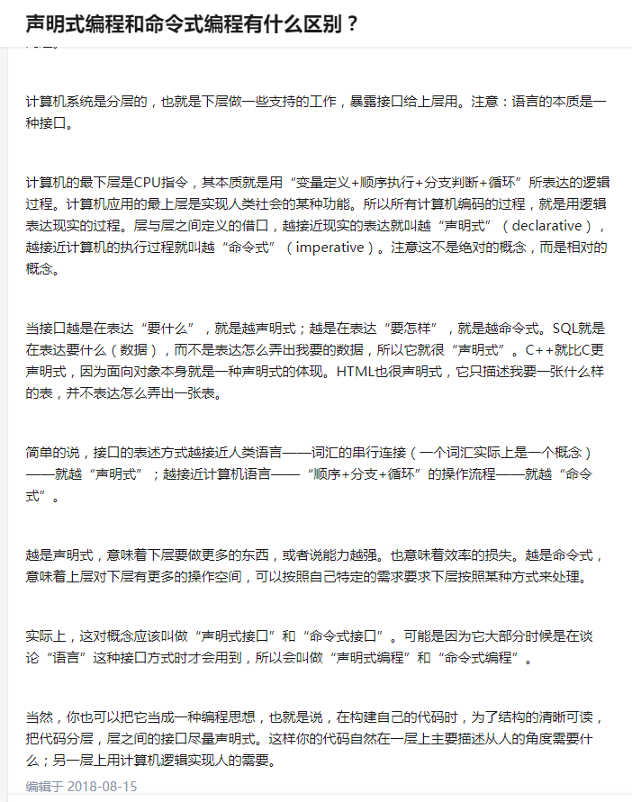

pp就是我，第一人称，我怎么做，每一步其实都可以翻译成独立的一套指令，对机器最为友好，机器最喜欢这种范式了，人怎么做机器就怎么做，所以这是指令式编程

oop就是第三人称，他，他怎么做，oop需要先找到主语，然后才是谓语动词，java里面所有的方法都要被放在一个具体的class里面，用的时候，都要先找到这个主语，也就是class/object，名词，然后才能用这个名词的动作，oop是描述性质的paradigm，写起来就像是一篇小说，有主语有谓语，很完整

fp就是第二人称，你，你去做，fp讲究把代码全部封装成函数，函数就是动词，一个纯粹只有动词的语句就是祈使句，就是命令句式，这种句式一般是很不礼貌的，居高临下的，骂人基本上都是这种句式，所以使用这种句式的时候，请注意委婉表达，最好加上称谓否则很容易翻脸，很多国人初到国外时候，外语不太好，操起动词就说……，为了委婉表达这种说法，还是说是声明式，因为毕竟你去命令别人，会让人觉得被冒犯了，所以说我要做什么，我要翻转一个二叉树，直接表达你的目的，怎么做，你不用管

----------

--------

类比spring ioc

new：业务代码调用通用代码（根据业务调用通用的new操作，产生对象）

ioc：通用代码调用业务代码（根据配置把对象给我，不关心怎么创建的对象）

-----------

函数式编程：

 

函数式编程和声明式编程是有所关联的，因为他们思想是一致的：即只关注做什么而不是怎么做。但函数式编程不仅仅局限于声明式编程。

函数式编程最重要的特点是“函数第一位”，即函数可以出现在任何地方，比如你可以把函数作为参数传递给另一个函数，不仅如此你还可以将函数作为返回值。大部分常见的编程语言一半都已经提供了对这种编程方式的支持，比如 JavaScript，再有 C# 中的 LINQ 和 Java 中的 Lambda 和闭包的概念。

Java 8 最大的一个对函数式编程支持的更新就是 Stream API，感兴趣的可以了解下，官方文档地址：https://docs.oracle.com/javase/8/docs/api/java/util/stream/package-summary.html

 

相比于以前的命令式编程，在 Java 中我个人现在更倾向于函数式编程的方法，它可以让代码的逻辑更清晰更优雅，比如同样的逻辑用 Java 8 的 Stream 方式写就是：

-------------

函数式编程强调没有”副作用”，意味着函数要保持独立，所有功能就是返回一个新的值，没有其他行为，尤其是不得修改外部变量的值。

所谓”副作用”（side effect），指的是函数内部与外部互动（最典型的情况，就是修改全局变量的值），产生运算以外的其他结果。(详细了解函数式编程请看阮一峰的函数编程初探文章)

---------

本质上都是java编程语言，主要区别在于编程风格和思考逻辑的不同

--------

函数式编程与并发编程
随着计算机硬件多核的普及，为了尽可能地利用硬件平台的能力，并发编程显得尤为重要。与传统的命令式编程范式相比，函数式编程范式由于其天然的无状态特性，在并发编程中有着独特的优势。以 Java 平台来说，相信很多开发人员都对 Java 的多线程和并发编程有所了解。可能最直观的感受是，Java 平台的多线程和并发编程并不容易掌握。这主要是因为其中所涉及的概念太多，从 Java 内存模型，到底层原语 synchronized 和 wait/notify，再到 java.util.concurrent 包中的高级同步对象。由于并发编程的复杂性，即使是经验丰富的开发人员，也很难保证多线程代码不出现错误。很多错误只在运行时的特定情况下出现，很难排错和修复。在学习如何更好的进行并发编程的同时，我们可以从另外一个角度来看待这个问题。多线程编程的问题根源在于对共享变量的并发访问。如果这样的访问并不需要存在，那么自然就不存在多线程相关的问题。在函数式编程范式中，函数中并不存在可变的状态，也就不需要对它们的访问进行控制。这就从根本上避免了多线程的问题。