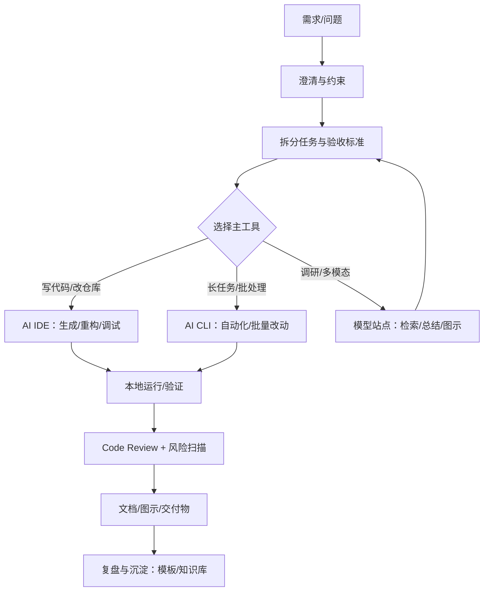
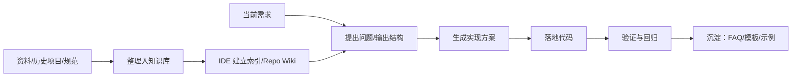
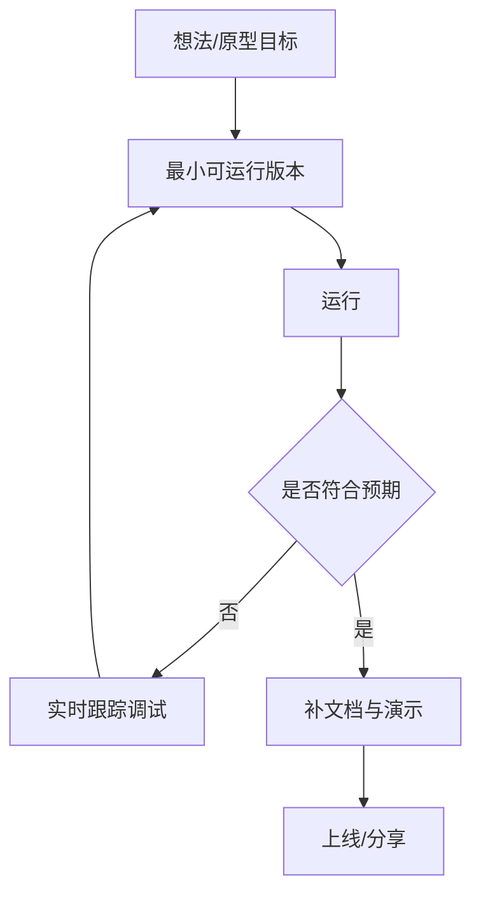

# AI工具使用指南（基于个人体验的可落地手册）

> **定位**：这是一份面向“日常工作/学习场景”的 AI 工具组合使用指南，基于你的真实体验做结构化整理，并补齐：功能模块表格、操作流程示意图、案例、SWOT、场景评估与优化建议。
>
> **适用人群**：研发（前后端/全栈/架构）、产品/运营、技术写作者、学习者。

---

## 目录

- [1. 快速开始：怎么选工具](#1-快速开始怎么选工具)
- [2. 工具全景：功能模块总览表](#2-工具全景功能模块总览表)
- [3. AI IDE 使用指南](#3-ai-ide-使用指南)
- [4. AI CLI 使用指南](#4-ai-cli-使用指南)
- [5. AI 模型/网站/垂类工具使用指南](#5-ai-模型网站垂类工具使用指南)
- [6. 操作流程示意图（Mermaid）](#6-操作流程示意图mermaid)
- [7. 实际应用案例（可复用脚本）](#7-实际应用案例可复用脚本)
- [8. 任务规划：制作/落地 todolist（含时间节点与优先级）](#8-任务规划制作落地-todolist含时间节点与优先级)
- [9. SWOT 分析](#9-swot-分析)
- [10. 使用场景评估（场景 → 工具组合）](#10-使用场景评估场景--工具组合)
- [11. 优化建议（效率/质量/成本/安全）](#11-优化建议效率质量成本安全)
- [附录 A：通用提示词模板（Prompt Pack）](#附录-a通用提示词模板prompt-pack)
- [附录 B：交付前检查清单](#附录-b交付前检查清单)

---

## 1. 快速开始：怎么选工具

### 1.1 三句话选型

- **要写代码并和仓库深度交互**：优先用 **AI IDE**（索引/上下文/重构/运行调试）。
- **要补“能力上限”或批量自动化**：用 **AI CLI**（脚本化、串联 git/构建/测试、长任务）。
- **要调研/总结/图示/PPT/多模态**：用 **模型/网站/垂类工具**（检索、总结、图片/视频/3D）。

> **重点**：理想组合通常是 “AI IDE（主）+ AI CLI（补强）+ 模型站点（信息/多模态）”。

### 1.2 推荐默认工作流

- **方案阶段**：模型站点（调研/对齐）→ IDE（落地结构）
- **实现阶段**：IDE（实现/重构/调试）→ CLI（批处理/补强）
- **交付阶段**：IDE（整理/文档）→ 模型站点（图示/PPT/总结）

---

## 2. 工具全景：功能模块总览表

> 说明：下表把工具按“模块”归类，便于你按任务挑选，不要求全用。

### 2.1 功能模块表（系统整理）

| 模块 | 代表工具（含你已使用） | 核心价值 | 典型产出 | 适合人群/场景 | 成本与门槛 | 注意事项 |
| --- | --- | --- | --- | --- | --- | --- |
| AI IDE（主战场） | Cursor、Trae、Qoder、Codebuddy、Kiro、（其他：VS Code + Copilot 等） | 项目内上下文、重构、代码生成、调试协同 | 可运行代码/PR/原型 | 日常开发、需求交付、原型构建 | 通常需订阅；需要配置项目索引 | 注意隐私与仓库权限；避免“盲改” |
| AI CLI（补强层） | Claude Code、Gemini CLI、Qwen CLI、Codex CLI（如有）、opencode | 上限能力、批处理、自动化流水线 | 批量改动、脚本化重构、报告 | 大改动、紧急排障、长上下文调研 | 通常需要 API/账号；适合熟悉命令行的人 | 注意命令安全；控制改动范围 |
| 模型/网站（对话/检索） | OpenAI、Claude、Gemini、Perplexity、DeepSeek、Kimi 等 | 调研/总结/对齐/润色/问答 | 方案、总结、对比、问题列表 | 方案设计、技术选型、学习 | 多为订阅或免费额度 | 需要验证来源与时效 |
| 多模态图示/知识梳理 | Nano Banana、NotebookLM | 架构图/示意图、资料消化、多格式输出 | 图、PPT、音频/视频摘要 | 汇报、教学、沉淀知识 | 依赖素材质量 | 注意保密资料上传 |
| 智能体/自动化编排 | Coze（智能体） | 任务分解、日程/信息收集、工具编排 | Agent 工作流、自动提醒 | 个人助理、信息整理、轻流程自动化 | 需要一定配置 | 清晰边界：别让 Agent 直接改生产 |
| 垂类工具 | 氢离子（医学）、Meshy/混元3D（3D） | 垂直领域更强的结果 | 医学答疑、3D 资产 | 特定场景 | 可能有付费与合规要求 | 医学建议需谨慎核验 |

### 2.2 你的当前使用偏好（从原文提炼）

- **Cursor**：日常工作、方案设计、结合本地知识库；但价格偏高。
- **Trae**：Cursor 的高性价比替代；Solo 适合快速原型 + 实时跟踪调试。
- **Qoder**：优势是 repo wiki；适合中大型后端项目与工作需求开发。
- **Codebuddy**：便宜且与腾讯云/轻量环境集成好；适合小页面/文章型站点并快速部署。
- **Kiro**：spec 驱动但偏重量级，交付物过大，后续迭代不便。

---

## 3. AI IDE 使用指南

### 3.1 通用上手步骤（适用于大多数 AI IDE）

1. **建立项目上下文**：打开仓库 → 等待索引（或开启 repo wiki/知识库）。
2. **明确边界**：告诉 AI “改哪些目录/文件、不要动哪些、输出到哪里”。
3. **先设计后改代码**：先要设计/接口/数据结构，再要实现，最后要测试与说明。
4. **小步提交**：每次只做一件事，改动可审查、可回滚。

> **重点**：在 IDE 里最容易翻车的是“让 AI 一次改太多”。把需求拆成 3~7 个子任务，成功率会显著提升。

### 3.2 工具侧重点与选型建议（IDE）

| 工具 | 你给出的体验要点 | 更适合 | 不太适合 | 建议使用方式 |
| --- | --- | --- | --- | --- |
| Cursor | 功能最全；贵；结合本地知识库做方案设计/日常工作 | 需要通用能力与稳定交付 | 预算敏感且需求简单 | 方案→实现→review 一体化；让它做“主 IDE” |
| Trae | Cursor 平替；Solo 适合快速原型；实时跟踪便于调试 | 原型/小应用/轻后端/快速验证 | 超大仓库、复杂流程治理 | 以“快速闭环”为目标：生成→运行→修→再生成 |
| Qoder | repo wiki 优势；后端开发能力强；适合中大型项目 | 中大型后端、需求开发、维护存量 | 极小项目（搭建成本可能偏高） | 先让它产出 repo 关键路径，再做定点修改 |
| Codebuddy | 便宜；与腾讯云等轻量环境集成好；适合小页面 | 小页面、文章教程、快速部署 | 深度复杂重构 | 用它做“交付/部署加速器”而非大脑 |
| Kiro | spec 驱动但重；交付物庞大，难迭代 | 强流程团队/一次性交付型项目 | 需要频繁调试迭代 | 用在“需要规格与审计”的场景，别用来快速试错 |
| Antigravity | 你目前不清楚优势 | 先观望/轻量体验 | 关键交付 | 先用它做：小任务对比测试（同一需求跑三次） |

### 3.3 其他主流 AI IDE（补充清单，便于你后续体验对比）

> 说明：这一小节给出“常见选择”，用于你后续补充体验；不强行评价优劣，建议用同一套小任务做横向对比。

| 类别 | 工具/产品 | 你可以重点体验的点（建议对比维度） |
| --- | --- | --- |
| VS Code 生态 | VS Code + GitHub Copilot | 补全/聊天/代码解释；是否能稳定读懂项目；重构与 diff 质量 |
| JetBrains 生态 | JetBrains AI Assistant | 与 IDE 导航/重构/调试联动体验；对 Java/Kotlin 等语言链路理解 |
| “AI 原生 IDE” | Windsurf（Codeium） | 任务执行闭环、跨文件修改一致性、与终端/运行联动 |
| 代码检索/仓库理解 | Sourcegraph Cody | 大仓库语义检索、跨仓库理解、引用与溯源体验 |
| 本地可控/自建 | Continue（VS Code/JetBrains 插件） | 本地模型/自选模型接入、可控性与安全边界、团队共享配置 |
| 其他补全类 | Tabnine 等 | 补全质量与隐私策略；对特定语言的提升幅度 |

**建议的对比方式（10 分钟版）**：

- 用同一个小需求（例如“新增一个接口 + 单元测试 + README”）在不同 IDE 跑一遍。
- 记录 3 个指标：
  - **一次成功率**：第一次生成能跑通的概率
  - **返工次数**：你需要纠正多少次
  - **可维护性**：命名/结构/注释是否像“团队代码”

---

## 4. AI CLI 使用指南

### 4.1 你当前的定位（从原文提炼）

- CLI 是 **IDE 的补充**：
  - **Claude Code**：能力最强，但贵，只在关键方案中用。
  - **Gemini CLI**：有免费额度，适合长上下文方案调研。
  - **Qwen CLI**：有免费额度，适合中小项目开发。

### 4.2 CLI 的 3 类高收益用法

- **批量改动**：统一命名/替换/补注释/补文档/批量生成模板。
- **质量兜底**：让 CLI 做 review、找边界条件、生成测试清单。
- **长任务**：让它持续跑“分析→计划→实施→总结”，你只在关键节点介入。

> **重点**：CLI 最大价值不是“写一段代码”，而是“把一个大任务拆开并持续推进”。

### 4.3 CLI 工作模式建议

- **模式 A：补上限**（高风险/高收益）
  - IDE 做方案与落地
  - CLI 用最强模型做：风险点扫描、回归点、重构建议
- **模式 B：省成本**（低风险/高频）
  - 日常调研/总结优先用免费额度 CLI
  - 关键交付再切换高质量模型

### 4.4 其他 CLI/命令行补充（用于扩展你的工具箱）

| 类别 | 例子 | 适合做什么 |
| --- | --- | --- |
| Git/变更管理 | `git` + diff 工具 | 约束变更范围、回滚、生成变更摘要 |
| 构建与测试 | 语言/框架自带 CLI | 快速验证、回归、生成覆盖清单 |
| 代码质量 | lint/format 工具 | 让 AI 改动更“像团队规范” |
| 文档/站点生成 | 静态站点/文档工具链 | 把 AI 输出固化成可发布产物 |

> **重点**：AI CLI 并不是“替代这些工具”，而是把它们串成一条 **自动化流水线**（分析→改动→验证→总结）。

---

## 5. AI 模型/网站/垂类工具使用指南

### 5.1 你已使用工具的“最佳用途”提炼

| 工具 | 你给出的用途 | 推荐强化用法（可复制） |
| --- | --- | --- |
| OpenAI | 日常调研 | 用它做“问题树 + 资料清单 + 反例”三件套 |
| Claude | 日常方案设计 | 用它做“方案对齐 + 边界条件 + 质量门槛（DoD）” |
| Gemini | 日常方案设计 | 用它做长文档消化与跨文档对比 |
| Nano Banana（Gemini 子项） | 生成架构图/示意图，效果好 | 用“输入：组件列表 + 交互说明 + 约束”让图更稳定 |
| NotebookLM | 生成示意图、PPT、视频/音频等 | 用它做：资料导入 → 结构化摘要 → 输出 PPT 大纲 |
| Qwen / Doubao | 日常生成图片、海报等 | 建一套固定风格词（品牌色/字体/比例） |
| Perplexity | 日常调研 | 用它做“带引用的快速综述”，再回到 IDE 落地 |
| DeepSeek | 日常搜索资料 | 用它做“快速排障线索”，再人工复核 |
| Coze | 搭建智能体：咨询收集/日程辅助 | 把 Agent 约束成“只建议/不执行”，避免越权 |
| 氢离子 | 医学问题 | 永远以专业医生建议为准，工具只做信息整理 |
| Kimi | 方案调研 | 适合长文档/长对话，输出成“可执行清单” |

---

## 6. 操作流程示意图（Mermaid）

> 说明：以下示意图可以直接贴进支持 Mermaid 的笔记/文档/知识库。

### 6.1 从需求到交付：AI 工具组合闭环

### 6.2 “知识库 + IDE”工作流（你提到的高频场景）

### 6.3 原型快速迭代（Trae/Solo 风格）

---

## 7. 实际应用案例（可复用脚本）

> 说明：案例不是“讲概念”，而是给你一个可复用的执行套路。

### 案例 1：用 AI IDE 做“方案设计 → 落地实现”

- **目标**：把一个模糊需求变成可交付代码（适合 Cursor）。
- **输入**：需求描述 + 约束（时间/范围/不允许改动的目录）。
- **步骤**：
  1. 在 IDE 对话里让 AI 先输出：**需求澄清问题**（5~10 条）+ **验收标准**。
  2. 让 AI 给出：**模块拆分**（3~7 个）+ 每个模块的 **接口/数据结构**。
  3. 只选一个模块让它实现，并要求：**改动列表 + 影响面**。
  4. 本地运行验证后，再进入下一个模块。
- **产出**：可运行代码 + 变更说明 + 验收 checklist。

### 案例 2：用 Qoder/Repo Wiki 做存量后端需求开发

- **目标**：在中大型后端仓库中快速定位业务路径并安全改动。
- **输入**：需求（What/Why）+ 影响范围（业务域/接口/表）。
- **步骤**：
  1. 先让 AI 输出：**关键链路图**（请求入口 → service → repo → DB/外部依赖）。
  2. 让它列出：**最可能需要改动的 5~10 个文件**，并说明原因。
  3. 选择最小改动路径实现，要求补齐：日志、错误码、边界条件。
  4. 让 CLI/第二模型做 review：风险点、回归点、兼容性。
- **产出**：低风险 PR + 回归建议。

### 案例 3：用 NotebookLM/Nano Banana 做“汇报型交付物”

- **目标**：把资料变成可讲清楚的架构图 + PPT 大纲。
- **输入**：资料（文档/链接/笔记）+ 目标受众（技术/非技术）。
- **步骤**：
  1. 先生成：**一页结论**（TL;DR）+ **问题树**。
  2. 生成：**架构图/流程图**（组件列表 + 数据流 + 约束）。
  3. 输出 PPT 大纲：每页标题 + 3 个要点 + 一张图建议。
- **产出**：图 + PPT 大纲 + 演讲稿要点。

---

## 8. 任务规划：制作/落地 todolist（含时间节点与优先级）

> 说明：这里的 todolist 是“把这份指南做成可持续维护资产”的计划；你也可以用同样结构规划任何 AI 项目。

### 8.1 阶段计划表

| 阶段 | 时间节点（建议） | 优先级 | 目标 | 输出物 |
| --- | --- | --- | --- | --- |
| 0. 定义范围与受众 | Day 0（0.5h） | P0 | 明确要解决的问题与边界 | 受众/场景列表 + 不做清单 |
| 1. 工具盘点与对齐 | Day 0（1h） | P0 | 把现有体验结构化 | 模块表 + 选型原则 |
| 2. 流程固化 | Day 1（1h） | P0 | 把“怎么用”变成流程 | 3 张流程图 + checklist |
| 3. 案例沉淀 | Day 1（2h） | P1 | 产出可复用套路 | 3 个案例脚本 |
| 4. SWOT/场景评估 | Day 2（1h） | P1 | 提升可决策性 | SWOT + 场景矩阵 |
| 5. 迭代与维护机制 | Day 2（0.5h） | P2 | 让文档可持续更新 | 更新规则 + 版本记录 |

> **优先级定义**：P0（必须有，缺了就不好用）；P1（显著增值）；P2（长期维护）。

### 8.2 细化 todolist（可直接复制到任务管理工具）

- **P0**：补齐“工具全景表”，每个工具至少 1 个明确场景
- **P0**：补齐“通用上手步骤”与“交付前检查清单”
- **P0**：补齐 3 张 Mermaid 流程图（闭环/知识库/原型）
- **P1**：把真实项目中的一个任务改造成案例（含输入/输出/风险）
- **P1**：补齐 SWOT 与场景评估矩阵，支持快速决策
- **P2**：加入价格/订阅变化的“更新时间戳”与“来源备注”（如需）

---

## 9. SWOT 分析

> 分析对象：**AI 工具组合（IDE + CLI + 模型站点）** 在日常工作/学习中的使用。

| 维度 | 内容 |
| --- | --- |
| Strengths（优势） | 1) 提升产出速度（方案/代码/文档）；2) 降低切换成本（从调研到实现）；3) 可把隐性经验模板化（Prompt/Checklist） |
| Weaknesses（劣势） | 1) 容易“看起来对但其实错”；2) 大改动风险高；3) 成本（订阅/API）与上下文管理成本；4) 依赖素材质量（文档/知识库） |
| Opportunities（机会） | 1) 将个人方法论产品化（可复用资产）；2) 通过 Agent/自动化编排把重复劳动消灭；3) 以图示/多模态提升沟通效率 |
| Threats（威胁） | 1) 隐私/合规风险（代码、数据、客户信息）；2) 过度依赖导致能力退化；3) 工具/模型快速变化造成流程失效；4) 团队一致性不足（提示词/规范不统一） |

---

## 10. 使用场景评估（场景 → 工具组合）

| 场景 | 目标 | 首选工具 | 辅助工具 | 风险点 | 建议验收方式 |
| --- | --- | --- | --- | --- | --- |
| 方案设计/技术选型 | 对齐方向与约束 | Claude/Gemini/OpenAI | IDE（落地结构） | 结论缺少证据 | 产出“对比表 + 风险清单” |
| 快速原型 | 48 小时内可跑 | Trae / Cursor | 模型站点（文案/图示） | 代码质量与可维护性 | Demo + 最小测试清单 |
| 中大型后端需求 | 安全改动存量 | Qoder（Repo Wiki） | CLI（review/批量） | 影响面评估不足 | 关键链路回归清单 |
| 故障排查 | 缩短定位时间 | DeepSeek/Perplexity（线索） | IDE（读代码） | 幻觉导致误判 | 复现实验 + 日志证据 |
| 文档/汇报 | 讲清楚并可复用 | NotebookLM/Nano Banana | 模型站点（润色） | 图与事实不一致 | 图示与接口/日志对齐 |
| 学习/知识沉淀 | 形成长期资产 | NotebookLM | IDE（例子） | 只看总结不做练习 | 练习题 + 复盘笔记 |

---

## 11. 优化建议（效率/质量/成本/安全）

### 11.1 效率：把“对话”变成“流程”

- **建立固定模板**：需求澄清模板、验收标准模板、变更说明模板。
- **强制小步快跑**：每次只改一个模块；每一步都可运行/可回滚。

### 11.2 质量：对抗“看似正确”

- **让 AI 先给反例**：要求列出 3 个可能失败的边界条件。
- **双模型交叉审查**：IDE 生成 → CLI/第二模型做 review。

### 11.3 成本：用“分层策略”控制预算

- **免费额度做高频**：调研/总结/草稿。
- **高价模型做关键路径**：上线前、关键设计评审、复杂重构。

### 11.4 安全与合规：默认保守

- **敏感信息不上云**：客户数据、密钥、未公开代码，先脱敏再使用。
- **权限与隔离**：工作/个人账号分离；不同仓库使用不同策略。

---

## 附录 A：通用提示词模板（Prompt Pack）

> 说明：以下模板适用于 IDE/CLI/模型站点。把方括号内容替换即可。

### A.1 需求澄清（5 分钟把模糊变清晰）

- 你是[角色]，我要做[目标]。
- 背景是[现状]，约束是[时间/范围/技术栈/不可修改目录]。
- 请输出：
  1) 需要我确认的 8 个问题
  2) 验收标准（DoD）
  3) 风险点与规避策略

### A.2 代码改动（强约束小步）

- 只允许修改：[目录/文件]；禁止修改：[目录/文件]。
- 先输出：将要修改的文件清单与原因。
- 每次只实现一个子任务，并在最后输出：变更摘要 + 可能影响的功能点。

### A.3 Review（让 AI 当“挑刺的同事”）

- 请用“最苛刻 code review”的视角审查：
  - 边界条件、并发、错误处理、回滚策略
  - 性能与可维护性
  - 安全与合规
- 输出：必须改（P0）/建议改（P1）/可选（P2）。

---

## 附录 B：交付前检查清单

- **功能**：核心路径可用；异常路径有明确提示。
- **可回滚**：改动可定位、可撤销。
- **可维护**：关键模块有注释/README；命名一致。
- **风险**：列出 3 个已知风险 + 规避方式。
- **文档**：有使用方式、示意图、案例或截图（至少一种）。

---

## 版本记录

- v0.1（2026-01-28）：基于个人体验整理的初版指南，补齐表格/流程/案例/评估与优化建议。
