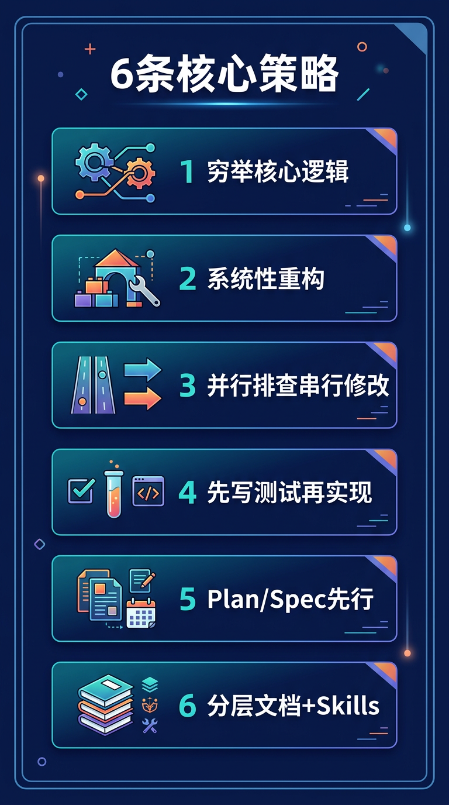
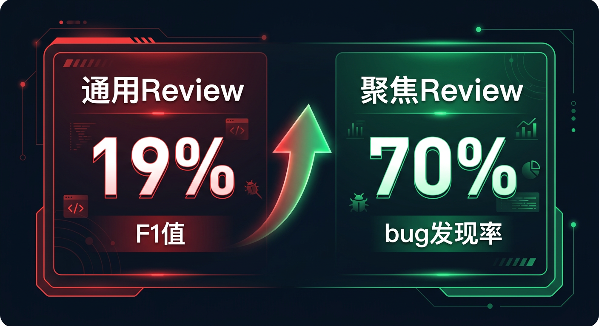
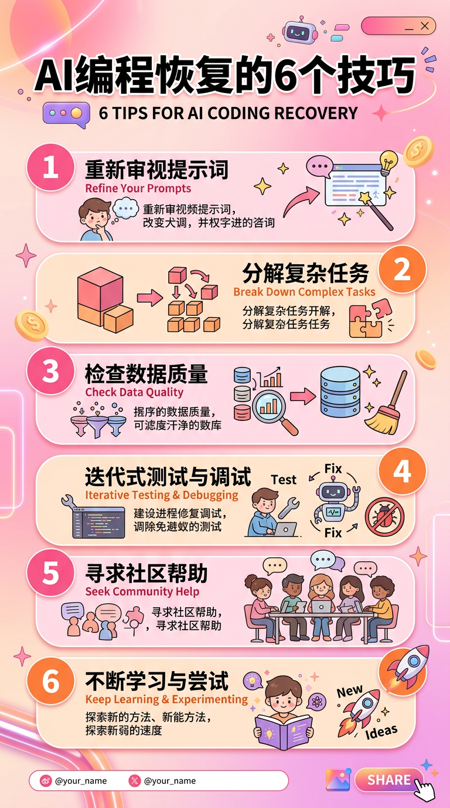
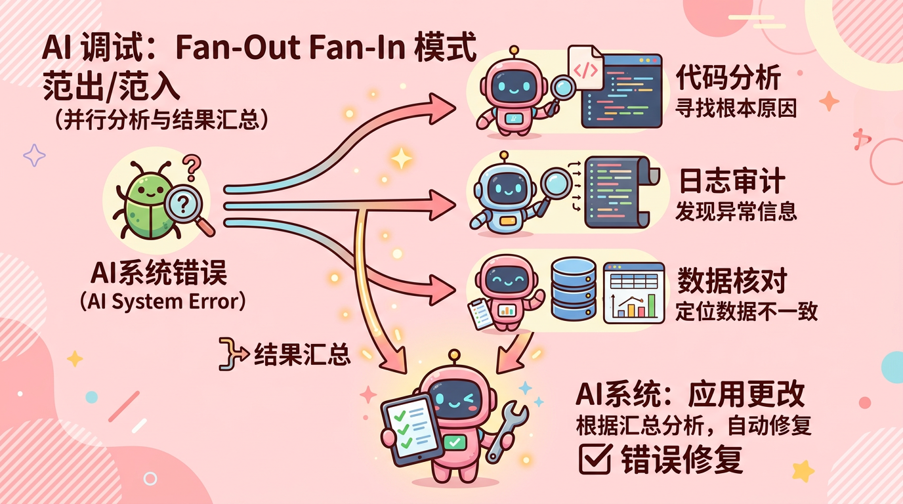
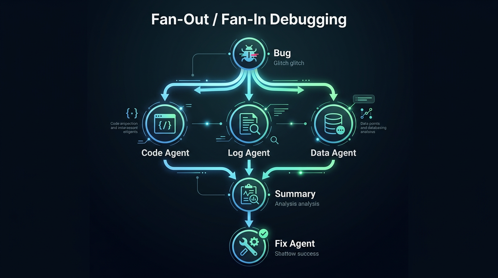

# Vibe Coding 翻车补救 — 多平台发布版

---

## 一、微信公众号（精华浓缩版）

> 定位：独立成文的精华版，保留核心框架和金句，引导读者收藏转发。约 2500 字。

---

**标题（三选一）：**
- Vibe Coding 翻车后怎么办？6 条血泪经验 + 10 个可复用的 AI Skills
- 用 AI 写了个大项目，烂尾了——我的系统性补救手册
- AI 写代码翻车实录：从越改越烂到系统性补救的全过程

**摘要：**
Vibe Coding 小项目很爽，大项目必翻车。这篇是我的踩坑复盘：为什么 case by case 修补只会越改越烂？正确的补救路径是什么？附 10 个可直接复用的 AI Skills 模板。

---

你用 AI 写了一个大型项目，刚开始很顺利，后来 bug 越修越多，改一处坏一片，直到你意识到——这个项目已经失控了。

这就是 **Vibe Coding** 的典型翻车现场。

我最近的深刻体会是：**当 Vibe Coding 的大型项目出了严重问题时，继续 case by case 地让 AI 修补，只会越改越烂。**

### 为什么翻车？三个根因

**1. AI 是施工队，不是建筑师。** 它擅长局部实现，但缺乏全局视角。项目变大后，代码出现"架构漂移"——每一处局部合理，拼在一起就乱了。

**2. 理解力债务在悄悄积累。** AI 生成代码的速度远超你阅读理解的速度。有调研显示，开发者自我感觉效率提升了 20%，实际上反而慢了 19%——39 个百分点的认知偏差。

**3. 80% 问题。** AI 能快速搞定 80% 的代码，但剩下 20% 涉及架构取舍和边界情况，才是决定项目质量的部分。

### 为什么逐个修 bug 不管用？

阿里巴巴的 SWE-CI 基准测试发现，**75% 的 AI 模型在维护代码时会破坏原本正常工作的功能**。AI 在错误假设上层层搭建，等你发现时错误已蔓延到多个模块。

### 正确的补救路径：4 步走

**第一步：自己读代码，判定每个模块的去留。**

对每个模块做出判定——保留、重构、还是重写。判断标准是当前代码和合理设计之间的"距离"：距离小就重构，距离大就重写，不需要"全部救"或"全部重来"的二选一。

**第二步：写下合理的设计文档，穷举核心逻辑。**

这里有一条贯穿全文的核心洞察：

> **AI 最大的优势不是写代码，而是穷举。人定义"什么是对的"，AI 负责把所有情况都覆盖到。**

你写 10 条核心逻辑规则，让 AI 帮你穷举没想到的边界情况——它可能补出 20 条你没想到的场景。穷举结果变成四样东西：设计文档、流程图示、测试用例、验收标准。

**第三步：分阶段控制 AI 的上下文，系统性重构。**

不要把设计文档和烂代码一股脑全扔给 AI。分四个阶段：先让 AI 独立分析现状（不给设计文档）→ 制定方案 → 逐模块重构 → 验证。每个阶段精确控制 AI 看到什么、不看什么。

**第四步：建立质量护栏，防止退化。**

### 调试的核心原则：并行排查，串行修改

> 用多个 AI Agent 并行排查问题，但只用一个 Agent 串行修改代码。

开多个 Claude Code 实例分头查——一个查代码、一个查日志、一个查数据。但修改代码时必须收拢到一个 Agent，否则必出冲突。这就是 **Fan-Out 设计，Fan-In 执行**。

配合 MCP 打通日志和数据库，AI 可以自己查日志、查数据、对比期望值，整个调试闭环不需要人工介入。

### Review 要聚焦，不要泛泛

让 AI 做"大而全"的 review，只能发现格式问题。正确做法是分角度、多轮次审查——框架使用、接口流程、并发安全、错误传播、数据一致性，每次只看一个角度。

**宁可做 5 次各 10 分钟的聚焦审查，也不要做 1 次 50 分钟的泛泛审查。**

### 6 条核心策略

1. **先定义"对"，再动手**——穷举核心逻辑，写成文档和测试用例
2. **翻车后系统性重构**——判模块去留、分阶段喂上下文
3. **调试要并行排查、串行修改**——Fan-Out 分析，Fan-In 修改
4. **用 AI 的产出量守住底线**——先写测试再写实现
5. **从源头防翻车**——Plan/Spec 先行，过程文档落盘
6. **用工程体系对抗熵增**——分层文档、分域规则、Skills 沉淀流程

**AI 是最好的施工队，但建筑师必须是你自己。** 核心逻辑的穷举规则是蓝图，文档体系是施工手册，测试用例是验收标准——三者齐备，AI 才能真正发力。

完整版包含 10 个可直接复用的 AI Skills 模板（/spec、/plan、/review、/debug 等），见原文。

---

## 二、知乎（回答体/专栏）

> 定位：以"回答问题"的方式切入，数据翔实，逻辑链完整。适合在相关问题下回答，或作为专栏文章。约 1800 字。

---

**适合回答的问题：**
- "用 AI 写大型项目，代码质量越来越差怎么办？"
- "Vibe Coding 适合大型项目吗？"
- "AI 编程最大的坑是什么？"

**标题（专栏用）：** Vibe Coding 翻车复盘：大型项目的系统性补救策略

---

先说结论：**Vibe Coding 大型项目翻车后，继续 case by case 让 AI 修补是最差的选择。**

我在多个大型项目中验证了这一点，也找到了数据支撑：

- 阿里巴巴 SWE-CI 基准测试：**75% 的 AI 模型在维护代码时会破坏原本正常的功能**
- 开发者效率认知偏差：自我感觉提升 20%，实际慢了 19%，偏差达 39 个百分点
- Google 2025 DORA 报告：90% 的 AI 采用率提升对应 9% 的 bug 增长率、154% 的 PR 体积膨胀

为什么？因为 AI 是优秀的施工队，但不是建筑师。Addy Osmani 总结的两个概念精确地解释了这个现象：

- **Comprehension Debt（理解力债务）**：AI 生成代码的速度远超你理解的速度，你在透支未来维护系统的能力
- **80% 问题**：AI 搞定 80% 的代码很轻松，但决定项目质量的是它做不好的那 20%

**正确的补救路径是什么？**

核心只有一条原则：**先穷举正确逻辑，再让 AI 编码。**

具体分四步：

**1. 读代码，判定模块去留。** 对每个模块评估"距离"——当前代码和合理设计之间差多远。距离小重构，距离大重写。

**2. 写设计文档，穷举核心逻辑。** 不是模糊地说"处理支付"，而是明确每条规则。然后让 AI 帮你穷举边界情况。AI 最大的优势不是写代码，而是穷举——你写 10 条规则，它帮你补 20 条你没想到的。

**3. 分阶段喂上下文，系统性重构。** ETH Zurich 2026 年研究发现，AI 自动生成的上下文文件反而降低任务成功率 3%，推高推理成本 20%。所以要精确控制每个阶段 AI 看到什么。

**4. 建立质量护栏。** 特别是测试——Anthropic 红队用 Claude 在 Firefox 6000 个 C++ 文件中发现了 22 个 CVE 漏洞。AI 生成测试的能力远超你的想象。

**调试方法论：Fan-Out / Fan-In**

复杂 bug 排查，开多个 AI Agent 并行查（代码/日志/数据），但修改代码时收拢到一个 Agent 串行执行。Steve Yegge 的 Gas Town 和 Cursor BugBot 都验证了这个模式的有效性。

配合 MCP 打通 Sentry、数据库、日志系统，AI 可以自己完成从发请求到查日志到查数据库的全链路调试。

**一个被严重低估的实践：聚焦式 Review**

LLM 通用代码审查的 F1 值只有 19.38%。但 Cursor BugBot 用 8 轮并行聚焦审查把 bug 发现率提升到 70%+，Qodo Merge 用多 Agent 专家域审查达到 60.1% F1 值。

秘诀：每次只从一个角度切入——框架使用、接口流程、并发安全等。

---

**总结：AI 越强大，工程纪律越重要。** Karpathy 本人在 2026 年 2 月也从 Vibe Coding 进化到了 Agentic Engineering——有结构地编排 AI Agent 并提供人工监督。

我在实践中沉淀了 10 个 AI Skills 模板，覆盖规划（/spec、/plan）、开发（/review、/debug、/refactor、/test-core）、治理（/doc-sync、/doc-review、/doc-cleanup）全生命周期。感兴趣的可以看完整版。

---

## 三、小红书（干货笔记体）

> 定位：视觉化、碎片化、高信息密度。封面标题要吸睛，正文用 emoji + 编号 + 短句。适合保存/收藏。

---

**封面文案（图片上的大字）：**

```
AI 写代码翻车了？
6条救命经验
（附10个可复用模板）
```

**标题：** 用AI写大型项目翻车后，我总结了6条血泪教训｜附10个Skills模板

**正文：**

用 Cursor / Claude Code 写了个大项目
刚开始很爽，后来越改越烂
改一处坏一片，bug 修不完...

如果你也遇到了，别慌
这是我踩坑后总结的 6 条核心经验 👇

💡 核心认知
AI 最大的优势不是写代码，而是穷举
人定义"什么是对的"，AI 负责覆盖所有情况

📌 经验一：别逐个修bug，先做建筑师
停下来！读代码，判定每个模块的去留
距离小→重构 / 距离大→重写
不需要"全救"或"全重来"的二选一

📌 经验二：先穷举核心逻辑，再让AI编码
你写10条规则，让AI补20条你没想到的
穷举结果变成：文档 + 流程图 + 测试 + 验收标准

📌 经验三：调试用 Fan-Out / Fan-In
多个Agent并行排查（查代码/查日志/查数据）
但只用1个Agent串行修改代码！
千万别让多个AI同时改代码 ⚠️

📌 经验四：Review要聚焦，别让AI泛泛检查
❌ "帮我review一下" → 只能发现格式问题
✅ 分角度审查：框架/接口/并发/安全/数据
5次×10分钟聚焦 > 1次50分钟泛泛

📌 经验五：打通MCP，让AI自己查日志查数据库
连上 Sentry / PostgreSQL / 日志 MCP
AI 自己发请求→查日志→查数据库→定位问题
你只需要审核AI的调试报告 🤯

📌 经验六：文档分层管理，对抗信息腐烂
🔥 热记忆（<200行）：每次自动加载的核心规则
🟡 温记忆：当前迭代的设计文档，按需引用
🧊 冷记忆：历史方案，需要时检索

⭐ 还沉淀了10个AI Skills模板：
/spec /plan /review /review-focus
/debug /refactor /test-core
/doc-sync /doc-review /doc-cleanup
每个都是可直接复制使用的 Markdown 文件！

金句收藏 ✨
「AI是最好的施工队，但建筑师必须是你自己」
「穷举规则是蓝图，文档是施工手册，测试是验收标准」

#AICoding #VibeCoding #ClaudeCode #Cursor #AI编程 #程序员 #开发者工具 #编程干货 #AI工具 #效率提升

---

## 四、X / Twitter（推文串 Thread）

> 定位：英文为主（可中文），每条推文独立可读但串起来成体系。5-8 条，每条 < 280 字符。

---

**Thread 🧵**

**1/7**
I used AI to build a large project. Started great. Then bugs multiplied. Each fix broke something else. The project was out of control.

This is what happens when Vibe Coding meets scale.

Here are 6 lessons from my recovery 👇

**2/7**
Lesson 1: Stop fixing bugs one by one.

75% of AI models break working features when maintaining code (Alibaba SWE-CI benchmark).

Instead: Step back. Read the code. Decide what to keep, refactor, or rewrite. Be the architect first.

**3/7**
Lesson 2: AI's biggest strength isn't writing code — it's exhaustive enumeration.

You define 10 rules for your core logic. AI finds 20 edge cases you missed.

The output becomes: design docs + flow diagrams + test cases + acceptance criteria.

**4/7**
Lesson 3: Fan-Out investigation, Fan-In modification.

Debug with multiple AI agents in parallel:
- Agent A reads code
- Agent B checks logs
- Agent C queries the database

But only ONE agent modifies code. Single-writer pattern. Always.

**5/7**
Lesson 4: Focused review >> generic review.

LLM generic code review F1 score: 19.38%
Cursor BugBot's 8-pass focused review: 70%+ bug detection

Don't say "review this module." Say "check Spring Security usage" or "trace the /api/order/create call chain."

**6/7**
Lesson 5: Connect MCP tools (Sentry, PostgreSQL, logs) so AI can debug autonomously.

Prepare test payloads + API call chains → AI sends requests → checks responses → queries logs → finds root cause.

You go from "manually debugging" to "reviewing AI's debug report."

**7/7**
The meta-lesson:

The more powerful AI gets, the more engineering discipline matters.

AI is the best construction crew. But the architect must be you.

- Enumeration rules = blueprint
- Doc system = construction manual
- Test cases = acceptance criteria

Full article with 10 reusable AI Skills templates: [link]

---

## 五、各平台专属配图清单

已生成 13 张平台专属图片，存放于 `images/` 目录。

### 微信公众号（3 张专属 + 复用原文图）

| 图片 | 文件名 | 用途 |
|:-----|:-------|:-----|
|  | `wechat-cover.png` | 公众号封面头图（900x383 比例） |
|  | `wechat-6strategies.png` | 6 条核心策略竖版长图（适合文中插入） |
|  | `quote-exhaustive.png` | 核心观点金句卡（正文配图） |
|  | `quote-architect.png` | 结尾总结金句卡 |

### 知乎（2 张专属 + 复用原文图）

| 图片 | 文件名 | 用途 |
|:-----|:-------|:-----|
|  | `zhihu-header.png` | 专栏/回答头图 |
|  | `zhihu-review-data.png` | Review 数据对比图（19% vs 70%） |
|  | `quote-discipline.png` | 结尾金句卡 |

### 小红书（3 张专属 + 复用金句卡）

| 图片 | 文件名 | 用途 |
|:-----|:-------|:-----|
|  | `xiaohongshu-cover.png` | 封面图（3:4 竖版，粉橙色调） |
|  | `xiaohongshu-6tips.png` | 6 个技巧轮播长图 |
|  | `xiaohongshu-fanout.png` | Fan-Out/Fan-In 调试模式（可爱机器人风格） |
|  | `quote-review.png` | Review 对比卡（最适合小红书视觉风格） |

### X / Twitter（2 张专属 + 复用金句卡）

| 图片 | 文件名 | 用途 |
|:-----|:-------|:-----|
|  | `x-thread-header.png` | Thread 首推配图（英文，16:9） |
|  | `x-fanout-fanin.png` | Fan-Out/Fan-In 英文流程图（Lesson 3 配图） |
|  | `quote-exhaustive.png` | 核心观点配图（Lesson 2） |
|  | `quote-architect.png` | 结尾图（Lesson 7） |
