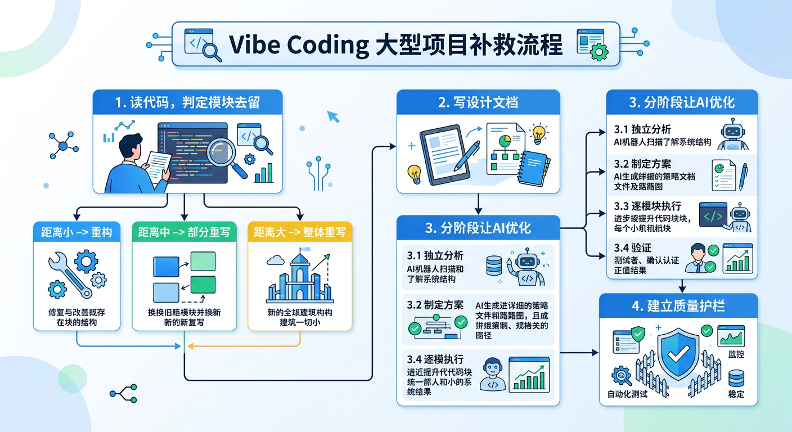
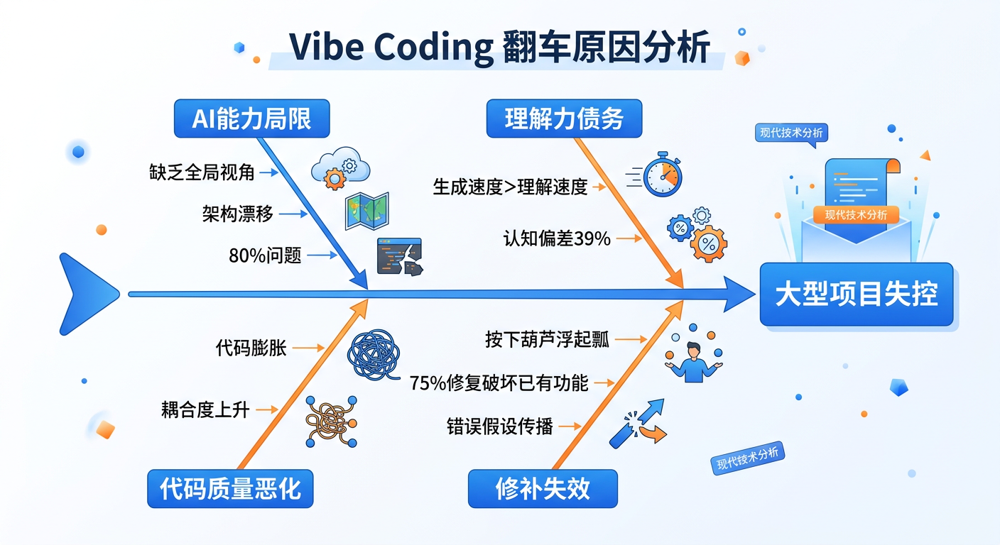
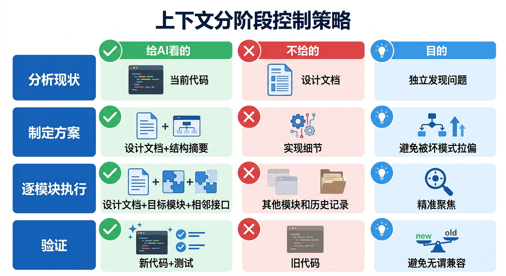
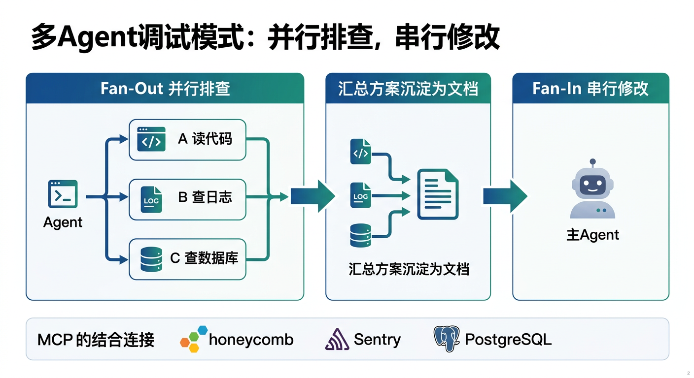
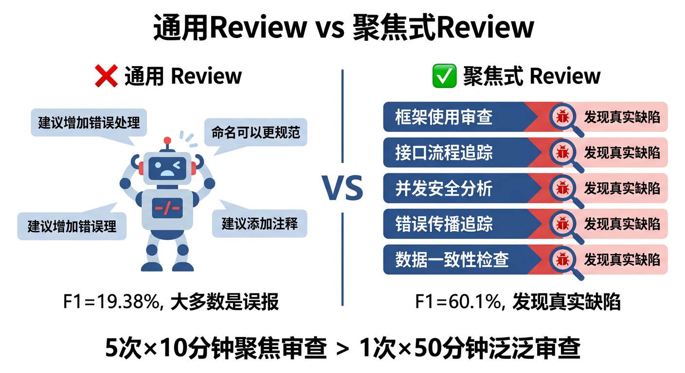
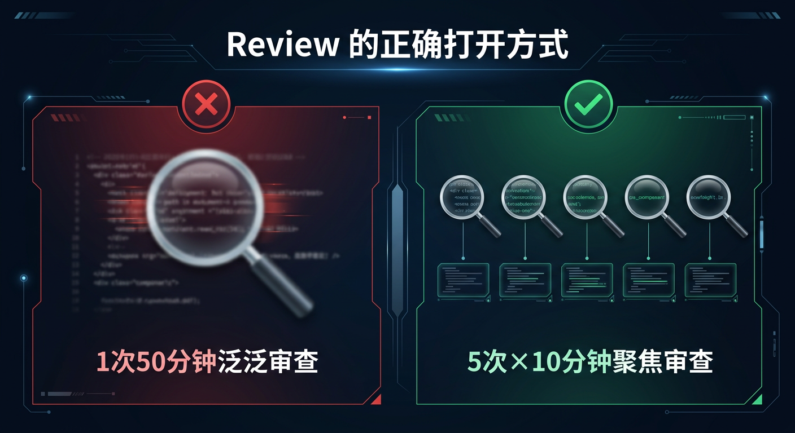
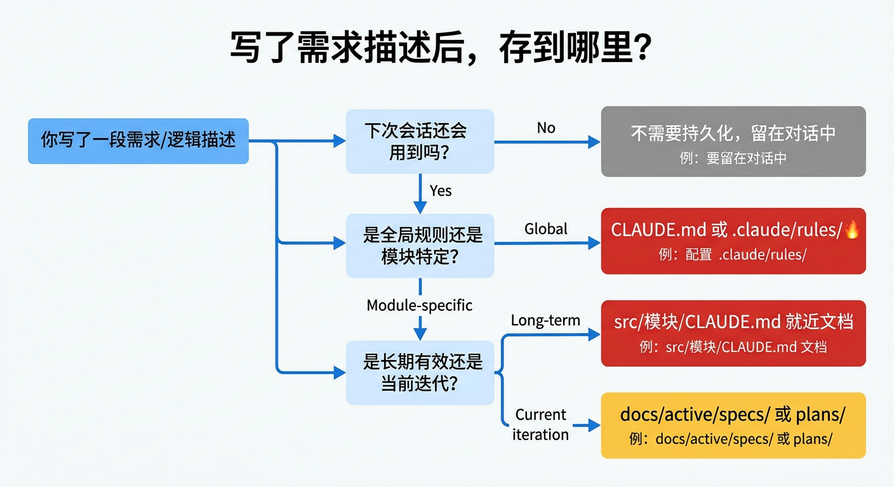
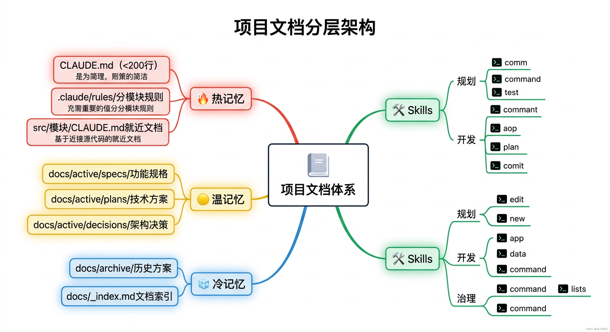
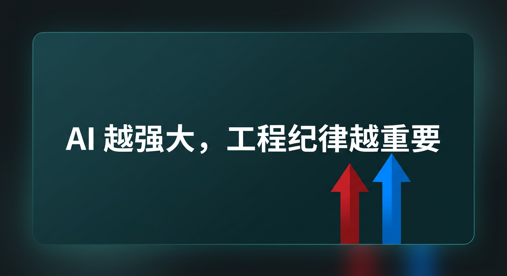

# Vibe Coding 翻车后怎么办？大型项目的补救策略与工程化实践

## 前言

你用 AI 写了一个大型项目，刚开始很顺利，后来 bug 越修越多，改一处坏一片，直到你意识到——这个项目已经失控了。

这就是 **Vibe Coding** 的典型翻车现场。这个概念由 Andrej Karpathy 在 2025 年 2 月提出，核心思想是"沉浸在氛围中，让 AI 帮你写一切"。小项目和快速原型中确实很爽，但当项目规模变大后，问题开始井喷。

我最近的深刻体会是：**当 Vibe Coding 的大型项目出了严重问题时，继续 case by case 地让 AI 修补，只会越改越烂。**

这篇文章是我的踩坑经验和系统性补救思路——从翻车急救到多 Agent 调试，从测试策略到文档治理，附带一套可直接复用的 10 个 AI Skills 工具箱。



## 一、Vibe Coding 在大型项目中为什么会翻车

### 1. AI 是优秀的"施工队"，但不是"建筑师"

AI 擅长局部实现：你说一个功能，它给你写出来。但它缺乏全局视角——不理解你的业务上下文、架构约束和长期规划。

当项目变大后，AI 生成的代码开始出现**架构漂移（Architectural Drift）**：每一处局部看起来合理，拼在一起就不一致了。命名风格混乱、模块职责不清、重复代码到处都是。

### 2. "理解力债务"在悄悄积累

Addy Osmani 提出了一个精准的概念——**Comprehension Debt（理解力债务）**：当 AI 生成代码的速度远超你阅读和理解的速度时，你其实是在透支未来维护这个系统的能力。

这就像信用卡——当下很爽，账单终会到来。有调研显示，开发者使用 AI 工具时**自我感觉效率提升了 20%，但实际上反而慢了 19%**，存在高达 39 个百分点的认知偏差。

### 3. 80% 问题

这也是 Addy Osmani 总结的：AI 能快速搞定 80% 的代码，但剩下的 20%——涉及上下文理解、架构取舍、边界情况处理——才是真正决定项目质量的部分。而恰恰是这 20%，AI 做不好。



## 二、Case by Case 修补为什么不管用

当项目已经出了较大问题时，很多人（包括之前的我）的第一反应是：继续让 AI 一个 bug 一个 bug 地修。但实践下来发现：

**1. 按下葫芦浮起瓢**

AI 修一个 bug 时，因为缺乏全局理解，经常引入新的问题。阿里巴巴的 SWE-CI 基准测试发现，**75% 的 AI 模型在维护代码时会破坏原本正常工作的功能**。

**2. 错误假设会传播**

AI 在早期如果对某个概念理解错了，会在这个错误假设上层层搭建。等你发现时，错误已经蔓延到多个模块，修不过来了。

**3. 代码膨胀**

AI 倾向于写更多的代码来解决问题——创建复杂的类层次结构来做一个函数就能搞定的事，该 100 行解决的问题写出 1000 行。每次修补都在增加复杂度。

## 三、正确的补救策略：先做建筑师，再让 AI 施工

当 Vibe Coding 的项目出了大问题，不要急着修 bug。**先停下来，重新做架构师。**

### 第一步：自己读代码，理清现状，判定每个模块的去留

这是最痛苦但最关键的一步。不要指望制造问题的工具能独自清理问题——你必须先理解现在的代码到底长什么样。

花时间梳理：
- 当前的模块划分是什么样的？
- 数据流是怎么走的？
- 哪些部分的设计是合理的，可以保留？
- 哪些部分是混乱的，需要重构？

**关键输出：对每个模块做出判定——保留、重构、还是重写。**

不是所有代码都值得救。读完代码后，你会对当前代码和合理设计之间的"距离"有感知。这个距离决定了处理策略：

| 距离 | 信号 | 现状特征 | 策略 |
|:-----|:-----|:--------|:-----|
| 🟢 小 | 能 30 分钟解释清楚数据流 | 结构基本合理，逻辑有偏差 | **重构**：在现有代码上按设计文档调整 |
| 🟡 中 | 数据模型与业务概念不对齐 | 核心数据模型错了，但边界逻辑可用 | **部分重写**：保留能用的部分，核心模块推倒重来 |
| 🔴 大 | 改一处坏一片已成常态 | 整体架构不可用，代码膨胀 3-10 倍 | **整体重写**：保留设计文档和业务理解，代码从头来 |

怎么判断"距离"大不大？几个信号：

- **你能不能在 30 分钟内向别人解释清楚这个模块的数据流？** 如果不能，说明理解力债务已经还不清了
- **核心数据模型是否和业务概念对齐？** 如果 AI 把一对多做成了多对多、把该分开的实体揉在一起，这是根基问题，重构解决不了
- **代码量是否远超合理规模？** AI 经常生成合理实现 3-10 倍的冗余代码，如果一个模块膨胀到推荐大小的数倍以上，重写比瘦身更快
- **修一个坏两个是否已成常态？** 如果每次改动都产生连锁反应，说明耦合度已经超出重构能处理的范围

做出这个判定后，不同模块可以走不同路径——能救的模块做系统性重构，救不了的模块清理掉重写。不需要"全部救"或"全部重来"的二选一。

### 第二步：写下合理的设计文档

这一步是关键中的关键。**把合理的架构和设计逻辑写成文档，保存到项目文件中。**

为什么要写成文件？
- AI 的上下文窗口有限，口头描述容易丢失
- 文档是持久化的"记忆"，每次对话都可以引用
- 团队协作时，文档就是共识

文档应该包含：
- **架构概览**：模块划分、职责边界、依赖关系
- **核心数据模型**：关键实体的定义和关系
- **设计约束**：必须遵守的规则和规范
- **接口契约**：模块间的交互方式

但仅仅写出架构还不够。我在实践中发现，**最重要的是把核心逻辑写得足够明确——明确到每一种输入情况应该产生什么输出。**

#### 核心理念：先穷举正确逻辑，再让 AI 编码

这是贯穿全文的核心洞察：


> **AI 最大的优势不是写代码，而是穷举。人定义"什么是对的"，AI 负责把所有情况都覆盖到。**

具体来说：

**1. 你定义核心逻辑的规则**

不是模糊地说"处理支付"，而是明确地写出每一条规则：
- 订单金额 > 0 且 < 100万 → 正常支付
- 订单金额 = 0 → 拒绝，返回错误码 E001
- 用户有未完成订单 → 排队等待，不创建新支付
- 第三方回调超时 > 30s → 标记 pending，触发主动查询
- ...

**2. 让 AI 帮你穷举你没想到的情况**

你写了 10 条规则，然后问 AI："基于这些核心逻辑，还有哪些边界情况和异常场景我没有覆盖到？" AI 非常擅长这种穷举式思考——它可能帮你补出 20 条你没想到的情况（并发重复提交、金额精度溢出、时区差异导致的日期错位...）。

**3. 穷举结果变成四样东西**

- **设计文档**：完整的逻辑规则表，保存到项目文件中
- **流程图示**：用 AI 生成可视化的流程图、状态机图，让逻辑一目了然
- **测试用例**：每条规则对应一个或多个测试（第五章会详细展开）
- **验收标准**：重构或开发完成后，逐条核对

**4. 用图示让逻辑可视化**

文字规则写得再清楚，复杂的分支和状态流转仍然不够直观——无论是给团队成员看，还是给 AI 看。

更好的做法是：**让 AI 基于核心逻辑文档，生成对应的流程图和状态图。** 现在的 AI 工具已经可以直接生成高质量的图示（通过 MCP 集成的图表服务、Mermaid 图表、或 AI 图片生成），一条命令就能把文字规则变成可视化的流程图。

这么做有三个好处：

- **降低理解门槛**：新成员 5 分钟看完图就能理解核心逻辑，不用读完所有文档
- **暴露逻辑漏洞**：画图的过程本身就是一次审查——当你发现某个分支"画不出来"或"箭头指向不明"，说明逻辑本身就没想清楚
- **AI 也能读图**：把流程图放在模块的 `CLAUDE.md` 中，AI 访问该模块时会自动加载，相比纯文字描述，图示能更快帮 AI 建立正确的心智模型

实操中，可以在穷举完核心逻辑后，直接让 AI 生成：

```
"基于以下支付状态机规则，生成一张状态流转图，标注每个转换的触发条件和校验规则"
```

AI 会输出 Mermaid 代码或直接生成图片，你确认无误后保存到对应模块的文档中。**文字定义精确性，图示提供直观性——两者配合才是完整的核心逻辑文档。**

这个流程的本质是：**用人的判断力定义"对"的标准，用 AI 的穷举力覆盖所有情况，用图示让逻辑可视化，再用 AI 的生产力去实现和验证。**

写设计文档时，不要只写架构图和模块划分——那些是骨架。**核心逻辑的穷举规则 + 可视化图示才是灵魂。** 有了它，AI 在后续的编码、调试、测试中都有了明确的"对错标准"，不再是凭感觉写代码。

实际操作中，可以使用项目级规则文件来承载这些约束，比如 `CLAUDE.md`、`AGENTS.md` 或 `.cursorrules`，让 AI 在每次会话中自动加载这些上下文。

### 第三步：让 AI 基于设计文档进行系统性优化

有了清晰的设计文档后，不要再一个一个修 bug，而是让 AI 基于合理的架构对整个链路做系统性优化。



#### 上下文喂法：分阶段控制 AI 看到什么

这里有一个容易踩的坑：把设计文档和一堆烂代码一股脑全扔给 AI，让它自己搞。

结果往往是 AI 会**不自觉地向现有代码妥协**。比如你的设计文档说"错误处理统一用 Result 模式"，但现有代码到处 try-catch，AI 重构时很可能写出一种混合体——部分 Result、部分 try-catch。因为它"看到了"旧的模式，会潜意识延续。

更好的做法是**分阶段控制 AI 的上下文**：

**阶段一：独立分析现状（不给设计文档）**

先让 AI 独立阅读现有代码，说出它发现的问题。这一步**不要给你的设计文档**——如果先给了"标准答案"，AI 会倾向于附和你，而不是独立发现你可能忽略的问题。

让 AI 先说完，你再对比自己的设计文档，往往能发现更多盲点。

**阶段二：制定重构方案（给设计文档 + 代码结构摘要）**

把你的设计文档给 AI，同时给当前代码的**结构摘要**（模块划分、核心类/函数签名、数据模型），而非完整实现。

这样 AI 能看到"目标是什么"和"现状的骨架"，制定出从 A 到 B 的改造路径，但不会被实现细节中的坏模式拉偏。

**阶段三：逐模块执行重构（给设计文档 + 目标模块代码 + 相邻接口）**

到了实际动手改代码的阶段，给 AI 看：
- 你的设计文档（北极星）
- 当前要改的模块的完整代码
- 相邻模块的**接口签名**（不给实现，只给交互契约）

不该给的：
- 其他模块的实现细节（会污染上下文）
- 历史调试记录和废弃方案（噪音）
- 旧版本的代码（避免 AI 做不必要的向后兼容）

**阶段四：验证（给重构后的代码 + 测试）**

验证阶段只给 AI 重构后的新代码和测试文件，不要带上旧代码做对比。

汇总一下：

| 阶段 | 给 AI 看的 | 不给的 | 目的 |
|:-----|:-----------|:-------|:-----|
| ① 分析现状 | 当前代码 | 设计文档 | 让 AI 独立发现问题 |
| ② 制定方案 | 设计文档 + 代码结构摘要 | 实现细节 | 避免被坏模式拉偏 |
| ③ 执行重构 | 设计文档 + 目标模块 + 相邻接口 | 其他模块实现、历史记录 | 精准聚焦 |
| ④ 验证 | 新代码 + 测试 | 旧代码 | 避免无谓兼容 |

#### 执行纪律

- **以模块为单位重构**：不是改一行两行，而是以一个完整模块为粒度
- **每个模块完成后立即验证**：跑通测试，确认符合设计文档的要求
- **每次 AI 改动前打 Git 检查点**：`git commit -m "checkpoint: before refactoring X"`，验证通过再提交正式 commit，不通过就 `git checkout .` 回滚
- **增量推进，不要一口吃成胖子**

### 第四步：建立质量护栏，防止退化

系统性重构完成后，要防止重蹈覆辙：
- **自动化测试**：核心逻辑必须有测试覆盖
- **静态分析和 Lint**：自动捕获代码规范问题
- **版本控制纪律**：每个功能一个分支，改动前打 checkpoint
- **设计文档与代码同步更新**：文档不是一次性的



## 四、调试阶段：并行排查，串行修改

补救过程中，调试是最耗时的环节——找到问题往往比修复问题花费更多时间。这一章涵盖完整的调试方法论：多 Agent 并行排查、MCP 数据源直连、聚焦式 Review、调试上下文持久化，以及如何让 AI 自己跑完调试闭环。

核心原则：

> **用多个 AI Agent 并行排查问题，但只用一个 Agent 串行修改代码。**

### 多 Agent 并行排查：分工比单打独斗快得多

当遇到复杂 bug 时，不要只开一个 Claude Code 慢慢查。**同时开多个实例，让它们从不同角度并行排查：**

- **一个专注代码**：阅读相关模块源码，分析逻辑链路，定位可疑代码段
- **一个专注日志**：分析运行时日志、错误堆栈、请求链路，找出异常模式
- **一个专注数据**：查数据库状态、检查数据一致性、验证中间态是否符合预期

这不是我的独创——Anthropic 用 16 个并行 Claude Agent 构建了一个 **10 万行的 C 编译器**，Agent 之间通过文件锁协调任务分配。Simon Willison 也记录了自己在多个终端窗口同时运行 Claude Code 实例的工作流，每个实例在独立的 `/tmp` 目录中工作。

2026 年初，Claude Code 已经原生支持了 **Agent Teams**，多个 Claude 实例通过共享任务列表和消息信箱直接通信。Cursor 2.0 也支持在云端虚拟机上同时运行 10-20 个并行 Agent。

并行排查的关键是**隔离**：每个 Agent 在独立的 git worktree 或独立目录中工作，互不干扰。Claude Code 在 2026 年 2 月已原生支持 worktree 隔离。

### 单 Agent 串行修改：谁都别抢方向盘

排查可以并行，但**修改代码时必须收拢到一个 Agent**。

为什么？如果多个 Agent 同时改代码，哪怕改的是不同文件，也会遇到：
- **合并冲突**：两个 Agent 改了相关联的文件，合并时逻辑对不上
- **隐式依赖破坏**：Agent A 改了接口签名，Agent B 还在用旧签名写调用方代码
- **状态不一致**：两个 Agent 对同一个问题有不同的理解，各自按自己的理解改，结果互相矛盾

Steve Yegge 的开源项目 **Gas Town** 专门解决这个问题——它实现了严格的层级模型：一个 "Mayor" Agent 拆解任务，多个 "Worker" Agent 并行执行，但通过"精炼厂"（Refinery）合并队列确保修改不冲突。本质上就是**单写者模式**。

Google 的 2025 DORA 报告也印证了这一点：90% 的 AI 采用率提升，对应的是 **9% 的 bug 增长率、91% 的代码审查时间增加、154% 的 PR 体积膨胀**——协调不好，多 Agent 只会添乱。

### 最佳实践：Fan-Out 设计，Fan-In 执行

把上面两条经验合在一起，就是一个清晰的模式：

```
┌─────────────────────────────────────────────┐
│              问题发现                        │
└──────────────────┬──────────────────────────┘
                   │
        ┌──────────┼──────────┐
        ▼          ▼          ▼
   ┌─────────┐ ┌─────────┐ ┌─────────┐
   │ Agent A │ │ Agent B │ │ Agent C │   ← Fan-Out：并行排查
   │ 读代码  │ │ 查日志  │ │ 查数据  │
   └────┬────┘ └────┬────┘ └────┬────┘
        │          │          │
        ▼          ▼          ▼
   ┌─────────────────────────────────────┐
   │  各自输出分析报告，沉淀为文档        │   ← 汇总：方案沉淀
   └──────────────────┬──────────────────┘
                      │
                      ▼
   ┌─────────────────────────────────────┐
   │     主 Agent 串行执行修改            │   ← Fan-In：单点修改
   │     基于汇总方案，逐步改代码         │
   └─────────────────────────────────────┘
```

Aaron Francis 开源的 **Counselors** 工具就实现了这个模式：把同一个 prompt 分发给多个 AI Agent（Claude、Codex、Gemini）并行处理，收集各自的独立分析，再由开发者或主 Agent 综合。VS Code 插件 **Mysti** 则更进一步，让两个 Agent 互相辩论，自动检测共识点后输出统一方案。

**关键操作流程：**

1. **Fan-Out**：多个 Agent 并行分析同一个问题，各自独立产出分析文档
2. **汇总**：人工或主 Agent 综合各方分析，形成统一修改方案，写入文档
3. **Fan-In**：一个主 Agent 读取方案文档，串行执行代码修改
4. **验证**：改完跑测试，不通过就回滚到 Git 检查点

### 打通 MCP：让 AI 自己查日志、查数据库

上面说的"一个 Agent 查日志、一个查数据"，前提是 AI 能**直接访问**这些数据源。

这就需要 **MCP（Model Context Protocol）集成**。2026 年，MCP 生态已经非常成熟（SDK 月下载量超 9700 万），关键的调试类 MCP 包括：

| MCP 服务 | 能力 | 调试场景 |
|:---------|:-----|:---------|
| **Honeycomb MCP** | 访问链路追踪、指标、日志 | 分析请求链路、定位性能瓶颈 |
| **Sentry MCP** | 获取错误信息、触发根因分析 | 自动分析异常堆栈、关联代码变更 |
| **PostgreSQL MCP** | 查询数据库、分析执行计划 | 检查数据状态、优化慢查询 |
| **日志文件 MCP** | 读取本地/远程日志文件 | 搜索错误模式、分析时序 |

打通之后，AI 的调试流程就从"你给它贴日志"变成了"**它自己去查日志、查数据库、看监控，然后告诉你问题在哪**"。

比如你怀疑某个接口的返回数据不对，AI 可以自己连数据库执行查询、对比期望值和实际值、检查外键关系和索引情况，整个过程不需要你手动复制粘贴任何数据。

**配置建议：**

```
# 在项目的 MCP 配置中添加调试相关的服务
# Claude Code: .claude/mcp_servers.json
# Cursor: .cursor/mcp.json

{
  "servers": {
    "postgres": {
      "command": "npx",
      "args": ["-y", "@anthropic/mcp-postgres", "postgresql://..."]
    },
    "sentry": {
      "command": "npx",
      "args": ["-y", "@sentry/mcp-server"]
    }
  }
}
```



### 聚焦式 Review：从具体角度切入，而非大而空的检查

还有一个容易踩的坑：让 AI 做"大而全"的代码审查。

你对 AI 说"帮我 review 一下这个模块"，它会给你一堆泛泛的建议——"建议增加错误处理"、"命名可以更规范"、"建议添加注释"。这些反馈看起来有道理，但**几乎发现不了真正的 bug**。

学术研究也证实了这一点：LLM 在通用代码审查任务上的 F1 值只有 **19.38%**，精确率极低，大量误报让开发者花更多时间去验证 AI 的错误发现，而不是修复真正的问题。

**问题的本质是**：通用 review 要求 AI 同时扮演安全工程师、性能专家、架构师和产品经理，但 AI 在每个角色上都只能做到浅层分析。就像让一个人同时看五本书，每本都只能翻几页。

#### 正确做法：分角度、多轮次审查

把一次大的 review 拆成多个聚焦的小 review，每次只从一个具体角度切入：

| 审查角度 | 具体 prompt 示例 | 能发现什么 |
|:---------|:----------------|:----------|
| **框架使用** | "检查这个模块对 Spring Security 的使用是否符合最佳实践" | 框架 API 误用、废弃方法、配置遗漏 |
| **接口流程** | "追踪 `/api/order/create` 从入口到数据库的完整调用链" | 数据丢失、类型不匹配、中间态异常 |
| **并发安全** | "分析这个模块的所有共享状态，检查是否存在竞态条件" | 线程安全问题、锁粒度不当 |
| **错误传播** | "如果第三方支付回调超时，追踪错误会如何传播到上层" | 异常吞没、状态不一致、用户体验断裂 |
| **数据一致性** | "检查订单状态机的所有转换路径，是否存在非法状态" | 状态泄漏、缺失的边界检查 |

Cursor 的 **BugBot** 就是用这个思路做到了极高的 bug 捕获率——它对每个 PR 执行 **8 轮并行审查**，每轮用**随机化的 diff 排列**推动模型从不同角度推理，再通过多数投票过滤误报。这种多轮聚焦式方法让 bug 发现率从 52% 提升到 **70% 以上**。

Qodo Merge 的做法更激进：用多 Agent 架构将审查分解为安全、性能、架构、测试、逻辑等**专家域**，每个域由专门的 Agent 负责，最后综合输出。在 580 个问题的基准测试中达到了 **60.1% 的 F1 值**——远超通用审查的 19.38%。

#### 把多角度 Review 沉淀为 Skills

既然聚焦式 review 效果远好于通用 review，就应该把常用的审查角度模板化：

```markdown
# .claude/commands/review-focus.md
从 $ARGUMENTS 指定的角度审查代码：

支持的角度：
- "framework <框架名>"：检查框架 API 使用是否正确、是否用了废弃方法
- "flow <接口路径>"：追踪接口的完整调用链，检查数据转换和错误处理
- "security"：聚焦认证、授权、注入、数据泄露
- "concurrency"：分析共享状态、锁、竞态条件
- "error-propagation <触发场景>"：模拟异常场景，追踪错误传播路径

执行步骤：
1. 根据指定角度，确定审查范围和关注点
2. 阅读相关代码，从该角度逐一检查
3. 只报告该角度下的实际问题，不做泛泛建议
4. 对每个问题给出：位置、风险等级、具体修复建议
5. 输出结构化审查报告
```

使用示例：
- `/review-focus framework SpringSecurity src/auth/`
- `/review-focus flow /api/order/create`
- `/review-focus error-propagation "支付回调超时"`



**核心原则：宁可做 5 次各 10 分钟的聚焦审查，也不要做 1 次 50 分钟的泛泛审查。前者能发现真 bug，后者只能发现格式问题。**

### 调试上下文持久化：别让 AI 反复问你同样的事

调试过程中，你会反复用到一些工具和参数——数据库连接串、测试账号、日志路径、特定环境的 API 地址、复现 bug 的请求参数等。每次新开会话都要重新告诉 AI 这些信息，非常浪费时间。

**解决方案：把调试相关的参数和数据集中存到一个文件中，并在 Skill 里定义读取规范。**

```markdown
# .claude/debug-context.md
## 环境信息
- 测试数据库：postgresql://test-db:5432/orders
- 日志路径：/var/log/app/order-service/
- 测试账号：user_id=10086, token=xxx

## 复现参数
- 支付超时问题：POST /api/pay {"order_id": "ORD-2026-0311", "amount": 99.9}
- 状态机异常：order_id=ORD-2026-0287，卡在 pending 状态

## 常用调试命令
- 查看订单状态：SELECT status, updated_at FROM orders WHERE id = $1
- 查看支付回调日志：grep "callback" /var/log/app/payment/*.log | tail -50
```

关键是**在 Skill 中定义读取规范**，让 AI 知道要先读这个文件：

```markdown
# .claude/commands/debug.md（更新版）
调试 $ARGUMENTS 描述的问题：

0. **先读取 .claude/debug-context.md**，获取环境信息、复现参数和常用命令
1. 复现：根据问题描述和 debug-context 中的参数定位相关代码
2. 定界：通过日志和断点缩小问题范围
3. 根因：分析根本原因
4. 修复：给出修复方案
5. 防退化：为此 bug 编写回归测试
6. **更新 debug-context.md**：如果本次调试产生了新的有用参数或发现，追加到文件中
```

注意第 0 步和第 6 步——**Skill 不仅定义了从哪里读，还定义了往哪里写**。这样调试上下文会随着项目推进不断积累，而不是每次从零开始。

这个文件不适合放在 `CLAUDE.md`（那是全局规则，不是调试数据），也不适合放在 `docs/`（那是设计文档）。放在 `.claude/` 目录下是最合适的——它是 AI 工作流的一部分，按需加载，不污染其他上下文。

### 终极目标：让 AI 自己完成调试闭环

把前面几条经验串在一起，会发现一个终极形态：**如果你提前准备好了全流程的测试报文、接口调用链，再配合日志和数据库的 MCP 连接——AI 就可以自己完成整个调试过程，不需要你手动介入。**

具体来说，你需要提前准备三样东西：

**1. 全流程测试报文**

把核心业务链路的请求和响应报文都准备好，存到 debug-context 中：

```markdown
# .claude/debug-context.md（补充测试报文部分）

## 全流程测试报文
### 正常下单流程
1. 创建订单：POST /api/order/create
   请求：{"user_id": 10086, "product_id": "P001", "quantity": 1}
   期望响应：{"order_id": "ORD-xxx", "status": "pending"}

2. 发起支付：POST /api/pay
   请求：{"order_id": "ORD-xxx", "method": "wechat"}
   期望响应：{"pay_url": "...", "status": "paying"}

3. 支付回调：POST /api/pay/callback
   请求：{"transaction_id": "TXN-xxx", "status": "success"}
   期望响应：{"order_status": "paid"}

### 异常场景
- 重复支付：对已 paid 的订单再次调用 /api/pay → 期望 400 + E002
- 超时回调：回调延迟 > 30s → 期望 order 状态为 pending_query
```

**2. 接口调用链文档**

写清楚每个接口经过哪些服务、哪些中间件、数据怎么流转：

```
用户请求 → Gateway → AuthFilter → OrderController → OrderService
  → PaymentClient(外部) → OrderRepository(DB) → MQ(异步通知)
```

**3. MCP 工具链已连通**

日志 MCP、数据库 MCP、Sentry MCP 等调试工具已配置好（前面已介绍）。

三者齐备后，AI 的调试流程就变成了全自动：

```
AI 读取测试报文 → 按流程逐步发送请求 → 对比实际响应和期望响应
  → 发现偏差 → 自动查日志定位错误点 → 查数据库验证中间状态
  → 定位根因 → 给出修复方案
```

**你从"手动调试"变成了"审核 AI 的调试报告"。** 这不是理论设想——当测试报文足够全面、MCP 工具链打通后，AI 排查问题的效率远超人工，因为它可以在几秒内完成"发请求 → 查日志 → 查数据库 → 比对"的全链路，而人工至少需要十几分钟。

### 调试也要沉淀：给排查过程留痕

每次复杂调试的结论，都应该沉淀下来：

- **根因写入模块文档**：如果是某个模块的设计缺陷导致的 bug，把根因和修复逻辑写入该模块的 `CLAUDE.md`
- **回归测试必须跟上**：基于正确逻辑编写全面的单元测试，覆盖刚才发现的所有边界情况
- **调试 Skill 复用**：`/debug` Skill 自动读取调试上下文，流程标准化

## 五、用 AI 的长处守住底线：大规模单元测试

架构修好了，调试方法论有了，但怎么确保重构后的代码真的对了？靠人肉验证不现实——**测试才是最实在的防线**。

而且这恰好是 AI 最擅长的事之一。

### 核心思路：用 AI 的产出量验证 AI 的正确性

AI 写代码容易出 bug——CodeRabbit 的分析显示 AI 代码的逻辑错误率是人类的 **1.75 倍**。但 AI 同时有一个人类不具备的优势：**它可以在一小时内生成 17,000 行测试代码**。

这意味着一种非对称策略：让 AI 帮你写代码的同时，也让 AI 帮你生成大量测试来验证这些代码。用 AI 的产出量，对冲 AI 的出错率。

关键前提是：**测试要围绕核心逻辑，模拟真实的系统输入**。不是随便生成能跑过的用例凑覆盖率，而是覆盖各种边界情况、异常路径和真实场景。

### 先写测试，再让 AI 实现

比起"先写代码再补测试"，更有效的做法是反过来——**先定义测试用例，再让 AI 写实现代码**。

Google 2025 年 DORA 报告调查了近 5000 名开发者，发现了一个关键结论：**AI 是放大器，不是修复器**。有 TDD 基础的团队，AI 能放大他们的质量优势；没有测试习惯的团队，AI 只会放大他们的问题。

具体工作流：

```
1. 根据需求，写出核心逻辑的测试用例（定义"什么是对的"）
2. 让 AI 阅读测试，实现代码使测试通过
3. 让 AI 补充更多边界情况的测试
4. 验证所有测试通过
5. 用变异测试检查测试质量（不只是覆盖率）
```

这个流程的本质是：**测试就是规格说明**。你通过测试用例告诉 AI 要做什么，比自然语言描述精确得多。

### AI 生成测试的正确姿势

不是所有 AI 生成的测试都有价值。GitHub Copilot 的 TestPilot 研究发现，**在没有已有测试上下文的情况下，92.45% 的 AI 生成的测试是失败的**。

让 AI 生成高质量测试的关键：

**1. 给示例，不给抽象指令**

提供一个写好的测试用例作为示例，比说"帮我写全面的测试"效果好得多。AI 会模仿你的断言风格、测试粒度和命名规范。

**2. 分步引导，先识别边界再写测试**

不要直接说"生成测试"，而是先让 AI 分析："这个函数有哪些边界情况、异常输入和极端场景？" 然后再让它针对每个场景写测试。链式思维（Chain-of-Thought）方法能显著提升边界情况的覆盖。

**3. 显式要求负向测试**

AI 默认倾向于写"验证正确行为"的测试。你需要明确要求："哪些输入应该抛出异常？哪些状态转换是被禁止的？哪些并发场景会出问题？"

**4. 用变异测试衡量质量，而非行覆盖率**

一个测试套件可以有 100% 的行覆盖率，但变异测试得分只有 4%——意味着它执行了每一行代码，但会漏掉 96% 的潜在 bug。**覆盖率是必要条件，变异测试才是充分条件**。

### 实战案例：AI 发现人类找不到的 Bug

这不只是理论。Anthropic 红队用 Claude 对 Firefox 的近 **6000 个 C++ 文件**做了安全测试，两周内提交了 112 份 bug 报告，其中 **22 个被确认为 CVE 漏洞**（14 个高危）。这些是传统 fuzzer 没发现的逻辑错误，每份报告都附带了最小复现测试用例。

Anthropic 还构建了一个基于属性的测试 Agent，在 100 多个 Python 热门库上运行，**56% 的 bug 报告是有效 bug，32% 值得向维护者上报**。它发现了 numpy.random.wald 会返回负数这样的微妙数值错误——一个存在多年但传统测试从未捕获的问题。

Meta 用 LLM 进行变异引导的测试生成，在 **10,795 个 Android Kotlin 类**上生成了 9,095 个变异体和 571 个测试用例，工程师接受率达到 **73%**。

### 测试也要沉淀为 Skills

和前面文档治理一样，测试生成也可以沉淀为可复用的 Skills：

```markdown
# .claude/commands/test-core.md
为 $ARGUMENTS 指定的模块生成全面的单元测试：

1. 阅读模块代码，识别核心逻辑和公共接口
2. 分析边界情况：
   - 空值/零值/极大值/极小值
   - 并发和竞态条件
   - 状态转换的非法路径
   - 第三方依赖的异常响应（超时、错误码、空返回）
3. 对每个边界情况生成测试用例
4. 生成模拟真实系统输入的集成测试
5. 运行所有测试，确保通过
6. 报告覆盖率和未覆盖的分支
```

### 测试策略速查

| 测试类型 | AI 擅长度 | 使用场景 | 注意事项 |
|:---------|:---------|:--------|:--------|
| 单元测试 | ⭐⭐⭐⭐⭐ | 核心业务逻辑 | 给示例 + 要求负向测试 |
| 边界测试 | ⭐⭐⭐⭐ | 输入校验、数值计算 | 先让 AI 列出边界再写测试 |
| 集成测试 | ⭐⭐⭐ | 模块间交互 | 需要提供架构上下文 |
| 属性测试 | ⭐⭐⭐⭐ | 数学函数、序列化 | AI 很擅长推导不变量 |
| 回归测试 | ⭐⭐⭐⭐⭐ | 修 bug 后防复发 | 每个 bug fix 必须附带测试 |
| 性能测试 | ⭐⭐ | 基准测试 | AI 生成框架，人定阈值 |

## 六、更好的起点：先出技术方案，再动手编码

上面聊的都是翻车后怎么补救。但更好的做法是——**从一开始就别让它翻车**。

这一章内容最多，因为"预防"比"急救"涉及的工程实践更广：从技术方案制定到文档分层管理，从 Rules 规则设计到 Skills 命令沉淀，再到文档生命周期治理。

核心经验是：Vibe Coding 大型项目时，应当先通过 Plan 和 Spec 模式制定技术方案，而不是上来就让 AI 写代码。

### Spec-Driven Development：先写规格，再写代码

这个理念在 2025-2026 年已经形成了完整的方法论，叫 **Spec-Driven Development（SDD，规格驱动开发）**。

GitHub 开源了 **Spec Kit** 工具包，定义了标准流程：

1. **Specify（规格）**：你描述要做什么、为什么做，AI 生成完整的功能规格
2. **Plan（计划）**：你给出技术方向，AI 生成详细的实现计划
3. **Tasks（任务）**：AI 将计划拆解为可执行的任务列表
4. **Implement（实现）**：AI 逐个执行任务

关键原则：**每个阶段完成后必须经过人工审核，才能进入下一阶段。**

AWS 的 Kiro IDE 则原生内置了 SDD 流程，自动生成三个文档：`requirements.md`（需求）、`design.md`（设计）、`tasks.md`（任务）。

在 Claude Code 中，你可以用 `/plan` 命令让 AI 先做规划；在 Cursor 中，Agent Mode 也会先生成计划再执行。用好这些工具的"先规划"能力，能大幅减少后期返工。

### 技术方案要落盘：过程文档是资产，不是废纸

这是我踩坑后最大的感悟之一：**AI 生成的技术方案和设计文档，一定要保存下来。**

很多人（包括之前的我）把 AI 生成的 plan 看完就扔了，觉得代码才是产出。但实际上，这些文档的价值体现在：

- **后续会话的上下文**：AI 没有长期记忆，下次对话时你得重新给它背景。有文档就能快速恢复语境
- **架构的"快照"**：记录了为什么这么设计，当时的权衡和取舍是什么
- **重构的基线**：当代码需要重构时，原始设计意图是最重要的参考



### 随时落盘：写了就要存，存了要放对地方

还有一个容易忽略的场景：你在和 AI 对话时，写了一大段需求描述、逻辑约束或设计要求。AI 理解了，代码也写出来了——但如果你不把这些描述保存到文件里，**一旦上下文窗口溢出或开启新会话，这些信息就彻底消失了**。下次你得从头再写一遍。

这不是小问题。在大型项目中，一段核心业务逻辑的描述可能你打了 20 分钟才想清楚、写明白，丢了就是真金白银的时间浪费。

**核心原则：只要你写了超过 5 行的需求描述或逻辑约束，立刻存到文件里。**

但存到哪里？不是随便扔一个文件就行。放错了位置，要么 AI 每次都被无关信息干扰，要么需要时找不到。结合前面的分层架构，判断逻辑是：

| 你写的内容 | 应该放到 | 原因 |
|:-----------|:---------|:-----|
| 🔥 全局必须遵守的规则（"所有金额用 BigDecimal"） | `CLAUDE.md` 或 `.claude/rules/` | 每次会话自动加载，永远生效 |
| 📌 某个模块的特定业务逻辑（"支付状态机流转规则"） | `src/payments/CLAUDE.md` | AI 操作该模块时自动加载，不污染其他模块 |
| 🟡 当前迭代的功能设计和技术方案 | `docs/active/specs/` 或 `plans/` | 按需引用的温记忆，迭代结束后归档 |
| 💬 一次性的调试思路或临时约束 | 对话中的临时指令，不需要持久化 | 避免文档膨胀 |

**一个实用的判断标准：** 如果这段描述在下一次会话中还会用到，就必须存下来。如果只是当前这一次用，可以不存。拿不准的时候，宁可多存——后面可以清理，但丢失了就找不回来。

但"多存"不等于"乱存"——存太多同样会出问题。

### 但要克制：文档膨胀是真正的敌人

AI 很擅长生成大段文档，但如果不加控制，docs 目录会迅速膨胀到没人看——真正有价值的架构设计和核心逻辑被调试日志、方案草稿、临时笔记淹没。

这个问题有两个层面：

- **Context Dilution（上下文稀释）**：斯坦福研究发现，当检索文档超过 20 篇时，LLM 准确率从 70-75% 暴跌到 55-60%。文档越多，AI 反而越迷糊
- **Context Rot（上下文腐烂）**：过时的信息不会自动消失，而是像噪音一样持续干扰 AI 的判断

苏黎世联邦理工（ETH Zurich）2026 年 2 月的研究更是发现了反直觉的结论：**AI 自动生成的上下文文件反而降低了任务成功率（低 3%），同时推高推理成本 20% 以上**。

所以文档管理的核心不是"多写"，而是**设计一套结构，让高价值信息始终突出，低价值信息及时退场**。



### 分层文档架构：让 AI 每次都看到最重要的东西

参考苏黎世联邦理工 Codified Context 论文中在 10.8 万行 C# 分布式系统上的实践经验，我推荐按"热度"对项目文档做三层管理：

| 层级 | 定位 | 内容 | 加载时机 | 体量控制 |
|:-----|:-----|:-----|:--------|:--------|
| 🔥 **热记忆** | 宪法 | 架构约束、核心规则、编码规范 | 每次会话**自动**加载 | < 200 行 |
| 🟡 **温记忆** | 工作台 | 当前迭代的 spec、plan、任务列表 | 按任务**手动**引用 | 按模块拆分 |
| 🧊 **冷记忆** | 档案馆 | 历史方案、归档文档、参考资料 | 需要时**检索** | 不限，但要有索引 |

核心原则：**热记忆要极度克制，温记忆要精准聚焦，冷记忆要有索引可查。**

对应的目录结构：

```
your-project/
├── CLAUDE.md                      # 🔥 热记忆：< 200 行，每次自动加载
│
├── .claude/
│   ├── rules/                     # 🔥 热记忆：分模块的规则文件
│   │   ├── frontend.md            # 前端开发规则
│   │   ├── backend.md             # 后端开发规则
│   │   ├── testing.md             # 测试规范
│   │   └── security.md            # 安全约束
│   │
│   └── commands/                  # 🛠️ Skills：可复用的命令模板
│       ├── review.md              # /review 通用代码审查
│       ├── review-focus.md        # /review-focus 聚焦式审查
│       ├── refactor.md            # /refactor 重构指南
│       ├── debug.md               # /debug 调试流程
│       ├── doc-review.md          # /doc-review 文档审查
│       ├── doc-cleanup.md         # /doc-cleanup 文档清理
│       └── doc-sync.md            # /doc-sync 文档同步
│
├── src/
│   ├── auth/
│   │   ├── CLAUDE.md              # 📌 就近文档：认证模块的特定逻辑
│   │   └── ...
│   ├── payments/
│   │   ├── CLAUDE.md              # 📌 就近文档：支付模块的业务规则
│   │   └── ...
│   └── ...
│
├── docs/
│   ├── active/                    # 🟡 温记忆：当前活跃的设计文档
│   │   ├── specs/                 # 当前迭代的功能规格
│   │   ├── plans/                 # 当前的技术方案
│   │   └── decisions/             # 架构决策记录（ADR）
│   │
│   ├── archive/                   # 🧊 冷记忆：已完成的历史方案
│   │   ├── 2026-01/
│   │   └── 2026-02/
│   │
│   └── _index.md                  # 📋 文档清单：所有文档的索引和状态
```

### 就近原则：把特定逻辑写在代码旁边

除了集中管理的 `docs/` 目录外，还有一类文档适合**直接放在对应的代码模块中**——那些和特定模块紧密绑定的业务逻辑、设计意图、注意事项。

比如支付模块有复杂的状态机逻辑，你可以在 `src/payments/CLAUDE.md` 里写清楚：

```markdown
# 支付模块

## 状态机
订单状态流转：pending → paid → shipped → completed
                  ↓                        ↓
              cancelled              refunded

## 关键约束
- 退款只能在 shipped 之后触发，pending 状态取消走 cancel 流程
- 所有金额计算使用 BigDecimal，禁止 float/double
- 第三方回调必须做幂等校验，key 为 transaction_id
```

**为什么这样做有效？**

Claude Code 的加载机制是：当 AI 访问某个目录下的文件时，会自动加载该目录及其父目录中的 `CLAUDE.md`。所以 `src/payments/CLAUDE.md` 只在 AI 操作支付相关代码时才会被读取——不会污染其他模块的上下文。

**什么内容适合就近放置：**

- 模块特有的业务规则和约束（如上面的状态机）
- 与第三方 API 交互的注意事项（超时、重试、幂等）
- 该模块历史遗留的坑和 workaround 说明
- 模块内部的数据流和调用关系

**什么内容不适合就近放置：**

- 全局架构约束（放根级 `CLAUDE.md`）
- 跨模块的接口契约（放 `docs/active/specs/`）
- 临时方案和调试记录（放 `docs/active/plans/`，完成后归档）

这个"就近原则"和代码中的就近声明原则是一样的——**信息应该离它被使用的地方尽可能近**。

### Rules 指南：用分层规则替代单一大文件

很多人把所有规则堆在一个 `CLAUDE.md` 里，结果文件越写越长，AI 反而开始丢失重要规则。更好的做法是**分层 + 分域**。

**第一层：根级规则（全局生效）**

`CLAUDE.md` 只放所有模块都必须遵守的全局约束，控制在 200 行以内：

```markdown
# CLAUDE.md
## 构建命令
- npm run build / npm run test / npm run lint

## 架构约束
- 所有 API 必须通过 gateway 层，禁止直连数据库
- 错误处理统一使用 Result 模式，不抛异常

## 不要做的事
- 不要修改 core/ 目录下的文件，除非明确要求
- 不要引入新的第三方依赖，除非先讨论
```

**第二层：模块级规则（按需加载）**

把模块特定的规则放到 `.claude/rules/` 或子目录的 `CLAUDE.md` 中。AI 只有在操作对应模块时才会加载：

```markdown
# .claude/rules/frontend.md
- 组件使用 Composition API，不使用 Options API
- 状态管理统一使用 Pinia，不引入额外状态库
- 所有页面组件必须有加载态和错误态
```

Cursor 中对应的机制是 `.cursor/rules/*.mdc` 文件，通过 YAML frontmatter 中的 `globs` 字段控制生效范围：

```yaml
---
description: 后端 API 开发规范
globs: ["src/api/**/*.py"]
alwaysApply: false
---
```

**分层的好处**：AI 每次只看到与当前任务相关的规则，不会被无关信息干扰。这比"把 500 行规则全部塞给 AI"效果好得多。

### Skills 指南：把反复执行的流程沉淀为可复用命令

在开发过程中，有些操作你会反复执行——代码审查、调试排查、重构模块、写测试。每次都重新描述一遍 prompt 很浪费。

更好的做法是把这些流程沉淀为 **Skills（技能文件）**，让 AI 一键执行。

在 Claude Code 中，在 `.claude/commands/` 目录下创建 Markdown 文件即可注册为斜杠命令：

```markdown
# .claude/commands/review.md
---
allowed-tools: ["Read", "Grep", "Bash"]
---

审查 $ARGUMENTS 中的代码变更：
1. 检查是否符合 CLAUDE.md 中的架构约束
2. 检查安全漏洞（注入、越权、数据泄露）
3. 检查性能问题（N+1 查询、缺失索引、无界循环）
4. 检查边界情况和错误处理
5. 输出结构化审查报告，按严重级别排列
```

使用时直接 `/review src/api/user.py`，AI 就会按照预定义的流程执行审查。

以下是我在实践中沉淀的全套 Skills，覆盖开发、测试和文档治理三个环节。

**`/debug`：结构化调试**（第四章已展示含 debug-context 集成的增强版模板）

**`/refactor`：模块重构**

```markdown
# .claude/commands/refactor.md
重构 $ARGUMENTS 指定的模块：

1. 阅读当前代码，绘制模块内部的依赖关系和数据流
2. 对照 CLAUDE.md 中的架构约束，识别违反设计原则的部分
3. 制定重构计划（列出每一步的改动和预期效果），等待确认
4. 确认后逐步执行，每步完成后运行测试确保不破坏现有功能
5. 清理：删除死代码、合并重复逻辑、统一命名规范
6. 输出重构摘要：改了什么、为什么改、测试结果
```

**`/spec`：生成功能规格**

```markdown
# .claude/commands/spec.md
为 $ARGUMENTS 描述的功能生成技术规格文档：

1. 梳理功能需求：用户故事、核心场景、验收标准
2. 设计数据模型：涉及的实体、字段、关系
3. 定义接口契约：输入/输出格式、错误码、状态码
4. 标注约束条件：性能要求、安全边界、兼容性
5. 列出依赖和风险：需要哪些现有模块配合、有哪些技术风险
6. 将规格文档保存到 docs/active/specs/ 目录
```

**`/plan`：生成实现计划**

```markdown
# .claude/commands/plan.md
基于 $ARGUMENTS 指定的 spec 文档，生成实现计划：

1. 阅读 spec，拆解为可执行的任务列表
2. 为每个任务标注：涉及的文件、预估改动量、依赖顺序
3. 识别技术风险点，给出应对方案
4. 生成任务清单（带优先级和依赖关系）
5. 将计划文档保存到 docs/active/plans/ 目录
```

**`/test-core`：核心逻辑测试生成**（第五章已展示完整模板）

**`/review-focus`：聚焦式代码审查**（第四章已展示完整模板）

Skills 的价值在于：**把你的工程经验编码化了**。即使换了 AI 工具、换了团队成员，这些流程依然可以复用。

### 文档治理 Skills：让 AI 帮你管文档

既然文档会膨胀、会腐烂，那能不能让 AI 自己来治理文档？答案是可以的——把文档治理本身也沉淀为 Skills。

**`/doc-review`：文档健康检查**

```markdown
# .claude/commands/doc-review.md
审查 $ARGUMENTS 目录下的文档健康度：

1. 检查所有 .md 文件中引用的文件路径是否存在于代码库中
2. 检查描述的函数名、类名、API 端点是否与实际代码一致
3. 检查是否存在内容重复的文档（相似度 > 70%）
4. 检查文档的最后更新时间 vs 对应代码的最后修改时间
5. 输出健康报告：
   | 文件 | 状态 | 问题 | 建议操作 |
   |------|------|------|---------|
```

**`/doc-cleanup`：文档清理**

```markdown
# .claude/commands/doc-cleanup.md
对 docs/ 目录执行清理：

1. 盘点所有文档文件，标注状态（活跃/过时/孤立）
2. 识别可合并的文档（内容重叠的多个文件）
3. 识别应归档的文档（对应功能已上线超过 30 天）
4. 执行非破坏性操作（更新、合并）
5. 破坏性操作（删除、大幅改动）列出清单，等待人工确认
```

**`/doc-sync`：文档与代码同步**

```markdown
# .claude/commands/doc-sync.md
检查最近的代码变更是否需要更新文档：

1. 运行 git diff --name-only HEAD~10 获取最近变更的文件
2. 对每个变更的代码文件，查找关联的文档
3. 比对文档描述的行为与实际代码行为
4. 生成漂移报告：
   - 哪些文档需要更新
   - 哪些变更可以自动修复
   - 哪些需要人工判断
5. 经确认后执行自动修复
```

**使用节奏建议：**

| 命令 | 频率 | 触发时机 |
|:-----|:-----|:--------|
| `/doc-sync` | 🔄 每次大功能合并后 | PR merge 之后 |
| `/doc-review` | 📅 每周一次 | 周五花 10 分钟 |
| `/doc-cleanup` | 🗓️ 每月一次 | 月初整理归档 |

这三个 Skills 形成一个闭环：`/doc-sync` 保证文档跟上代码变化，`/doc-review` 发现潜在问题，`/doc-cleanup` 执行清理归档。

### Skills 全景图

汇总全部 10 个 Skills，分三类覆盖完整的开发生命周期：

| 类别 | 命令 | 用途 | 触发时机 |
|:-----|:-----|:-----|:--------|
| 📐 **规划** | `/spec` | 生成功能规格文档 | 开始新功能前 |
| | `/plan` | 生成实现计划 | spec 审核通过后 |
| 🔧 **开发** | `/review` | 通用代码审查 | 每次提交前 |
| | `/review-focus` | 聚焦式多角度审查 | 复杂模块、关键链路 |
| | `/debug` | 结构化调试（含 debug-context） | 遇到难以定位的 bug |
| | `/refactor` | 模块重构 | 代码质量下降时 |
| | `/test-core` | 核心逻辑测试生成 | 功能实现后、重构前 |
| 📄 **治理** | `/doc-sync` | 文档与代码同步检查 | 每次大功能合并后 |
| | `/doc-review` | 文档健康检查 | 每周一次 |
| | `/doc-cleanup` | 文档清理归档 | 每月一次 |

这套 Skills 体系的设计逻辑是：**开发有规划、质量有保障、文档有治理**。每个环节都不依赖人的记忆力，而是靠可复用的流程来保底。

### 文档生命周期管理：从草稿到归档的流转

文档不是写完就扔在那里的。设计一个清晰的生命周期，让文档自然地从"活跃"流转到"归档"：

```
草稿 Draft → 活跃 Active → 归档 Archive
   |              |              |
docs/active/   docs/active/   docs/archive/
drafts/        specs/         2026-03/
               plans/
               decisions/
```

**具体操作：**

- **新建功能时**：在 `docs/active/specs/` 创建 spec 文档，在 `docs/active/plans/` 创建技术方案
- **开发过程中**：spec 和 plan 是"温记忆"，按需引用给 AI。架构决策记录（ADR）同步写入 `docs/active/decisions/`
- **功能完成后**：把 spec 和 plan 移入 `docs/archive/YYYY-MM/`，ADR 保留在 active 中（因为决策长期有效）
- **定期清理**：每周用 10 分钟扫一遍 `docs/active/`，该归档的归档，该合并的合并

### 防腐机制：对抗文档的自然衰变

即使有了好的结构，文档也会随时间腐烂——引用了已删除的文件、描述了已废弃的模式、与实际代码不一致。

**实用的防腐策略：**

- **写入前先问一句**：这条信息 AI 能通过读代码自己发现吗？如果能，就不要写进文档。Addy Osmani 的建议是：只写 AI 无法从代码中推断出的信息
- **维护文档索引**：在 `docs/_index.md` 中列出所有文档的标题、状态（active/archive）、最后更新日期。AI 先读索引再决定要不要读全文，避免盲目检索
- **用 AI 自查文档新鲜度**：定期让 AI 检查文档中的文件路径、API 名称是否还存在于代码中，自动标记过时内容
- **单条规则只写一遍**：如果同一条规则出现在 CLAUDE.md 和 rules 文件中，删掉一处。重复不会强化规则，只会浪费 token

> Anthropic 官方的建议是："如果 AI 在没有这条指令的情况下已经做对了，那就删掉它，或者改成 hook 自动化执行。"

## 七、从 Vibe Coding 到 Agentic Engineering

值得一提的是，Karpathy 本人在 2026 年 2 月也更新了他的观点，提出了 **Agentic Engineering** 的概念——从"随意地和 AI 聊天写代码"进化到"有结构地编排 AI Agent 并提供人工监督"。

核心转变是引入 **PEV 循环**：
- **Plan（规划）**：先设计，再编码
- **Execute（执行）**：让 AI 在明确约束下实现
- **Verify（验证）**：人工审查，确保符合预期

这和我自己摸索出的"先做设计文档，再让 AI 系统性优化"的思路不谋而合。行业共识正在形成：**AI 越强大，工程纪律越重要**。



## 八、实操速查表

### 补救与重构

| 场景 | 错误做法 | 正确做法 |
|:-----|:--------|:--------|
| 发现多个 bug | 让 AI 逐个修 | 先分析根因，可能是架构问题 |
| 代码越改越乱 | 继续 patch | 停下来写设计文档，系统性重构 |
| 新功能加不进去 | 硬塞进现有代码 | 先调整架构再添加功能 |
| AI 写的代码"差不多对"但总有 bug | 模糊地描述需求 | 先穷举每种情况的正确逻辑，再让 AI 基于明确规则编码 |
| 复杂逻辑别人看不懂 | 只写文字文档 | 让 AI 生成流程图/状态图，文字 + 图示配合才完整 |

### 调试与排查

| 场景 | 错误做法 | 正确做法 |
|:-----|:--------|:--------|
| 复杂 bug 排查不动 | 一个 Agent 死磕 | 多个 Agent 并行排查：代码/日志/数据分工 |
| 多人同时改代码出冲突 | 多个 Agent 各改各的 | 并行设计方案，收拢到一个 Agent 串行修改 |
| 调试时手动复制粘贴日志 | 人工搬运数据给 AI | 打通 MCP 让 AI 直连日志/数据库自行查询 |
| AI review 总说废话 | "帮我 review 这个模块" | 分角度审查：框架使用、接口流程、并发安全等 |
| 每次调试都要重复告诉 AI 环境参数 | 口头反复描述 | 集中存到 `.claude/debug-context.md`，Skill 定义读写规范 |
| 调试耗时占开发的一半以上 | 人工逐步排查 | 准备好全流程测试报文 + MCP 工具链，让 AI 自己跑完调试闭环 |

### 测试与质量

| 场景 | 错误做法 | 正确做法 |
|:-----|:--------|:--------|
| 不确定 AI 代码是否正确 | 手动跑几个用例 | 让 AI 批量生成边界测试 + 变异测试验证 |
| 修了一个 bug 又冒新 bug | 只修代码不加测试 | 每个 fix 必须附带回归测试 |
| 核心逻辑重构后不敢上线 | 靠人工回归 | 先让 AI 生成全面的核心逻辑测试再重构 |

### 规划与预防

| 场景 | 错误做法 | 正确做法 |
|:-----|:--------|:--------|
| 开始大型功能 | 直接让 AI 写代码 | 先用 Plan/Spec 模式生成技术方案 |
| AI 总是不理解意图 | 换更长的 prompt | 把约束写入项目规则文件 |
| 项目交接困难 | 口头说明 | 维护架构文档和设计决策记录 |
| 同样的审查做了很多遍 | 每次重写 prompt | 沉淀为 Skills 命令，一键复用 |

### 文档与规则

| 场景 | 错误做法 | 正确做法 |
|:-----|:--------|:--------|
| 写了很多需求描述，新会话又得重写 | 只在对话里说，不存文件 | 超过 5 行的描述立刻落盘，按分层规则放到对的位置 |
| docs 越来越多 | 全堆在一个目录 | 分层管理 + 生命周期流转 + 定期清理 |
| 规则文件越来越长 | 全写在一个文件里 | 拆分为全局规则 + 模块级规则 |

## 总结

Vibe Coding 没有错，它是强大的快速开发方式。但对于大型项目，"纯 Vibe"是不够的。

核心原则只有一条：

> **先穷举正确逻辑，再让 AI 编码。人定义"什么是对的"，AI 负责把所有情况都覆盖到。**

这条原则贯穿了本文的所有策略：

1. **先定义"对"，再动手**——读代码、理清核心逻辑、用 AI 穷举所有情况的正确行为，写成设计文档和测试用例
2. **翻车后系统性重构**——判模块去留、分阶段喂上下文，不要在混乱中逐个打补丁
3. **调试要并行排查、串行修改**——Fan-Out 分析，Fan-In 修改，打通 MCP 让 AI 自己查日志查数据
4. **用 AI 的产出量守住底线**——先写测试再写实现，大规模边界测试 + 变异测试，让 AI 自己验证 AI
5. **从源头防翻车**——Plan/Spec 先行，过程文档落盘，少而精胜过多而全
6. **用工程体系对抗熵增**——热/温/冷分层文档、Rules 分域加载、Skills 沉淀流程、生命周期管理防腐烂


AI 是最好的施工队，但建筑师必须是你自己。核心逻辑的穷举规则是蓝图，文档体系是施工手册，测试用例是验收标准——三者齐备，AI 才能真正发力。

---

*以上是我在多个大型 Vibe Coding 项目中积累的实战经验，包含 10 个可直接复用的 AI Skills 模板。如果你也在用 AI 做大型项目开发，欢迎交流你的踩坑故事和应对策略。*
