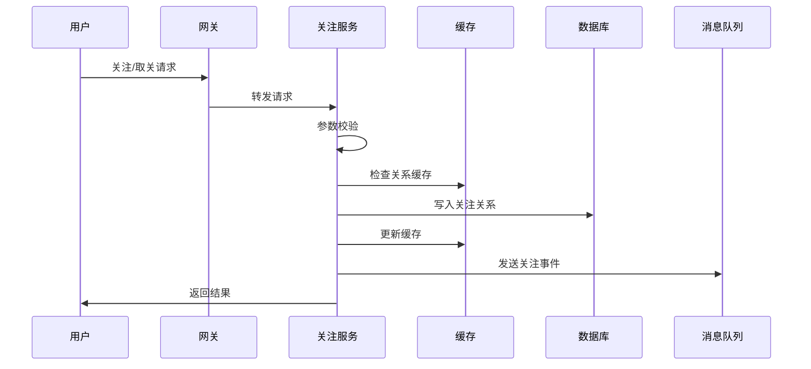
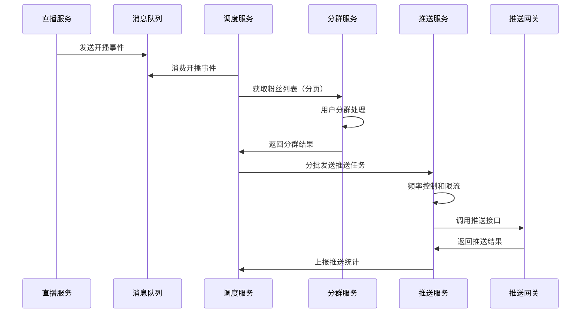

# 小红书题整理 - 思路总结

## 1. 字符串的最长无重复字符子串长度

**核心思路**：使用滑动窗口算法维护一个无重复字符的窗口，通过左右指针动态调整窗口范围。

**关键步骤**：
1. 右指针向右移动，扩大窗口范围
2. 当遇到重复字符时，左指针向右移动，缩小窗口直到去除重复字符
3. 记录每次窗口的最大长度

**优化点**：使用哈希表记录字符最后出现位置，可以直接跳转到重复字符后一个位置，避免逐个移动左指针。

**时间复杂度**：O(n)，空间复杂度：O(min(m,n))，其中m为字符集大小。
```java
public int lengthOfLongestSubstring(String s) {
    Map<Character, Integer> map = new HashMap<>();
    int left = 0, maxLength = 0;

    for (int right = 0; right < s.length(); right++) {
        char c = s.charAt(right);
        if (map.containsKey(c)) {
            // 直接跳到重复字符的下一个位置
            left = Math.max(left, map.get(c) + 1);
        }
        map.put(c, right);
        maxLength = Math.max(maxLength, right - left + 1);
    }

    return maxLength;
}
```

### 代码实现
```java
public int lengthOfLongestSubstring(String s) {
    Set<Character> set = new HashSet<>();
    int left = 0, maxLength = 0;

    for (int right = 0; right < s.length(); right++) {
        while (set.contains(s.charAt(right))) {
            set.remove(s.charAt(left));
            left++;
        }
        set.add(s.charAt(right));
        maxLength = Math.max(maxLength, right - left + 1);
    }

    return maxLength;
}
```
 
## 2. 字符串的全子集

**核心思路**：对于长度为n的字符串，有2^n个子集。每个字符都有选或不选两种状态。

**三种主要方法**：
1. **位运算**：用0到(2^n-1)的整数表示所有子集，二进制位对应字符选择状态
2. **递归回溯**：从左到右遍历每个字符，递归处理选择和不选择的情况
3. **迭代构建**：从空集开始，每次添加一个字符，生成新的子集

**去重处理**：对字符串排序，跳过连续重复字符，确保子集不重复。

**时间复杂度**：O(2^n * n)，空间复杂度：O(2^n * n)。

## 3. 数组最大连续子序列和

**核心思路**：使用动态规划，定义dp[i]为以第i个元素结尾的最大连续子序列和。

**状态转移**：dp[i] = max(dp[i-1] + nums[i], nums[i])，表示要么延续前面的子序列，要么从当前元素重新开始。

**Kadane算法优化**：空间复杂度可优化到O(1)，直接在原数组上进行迭代，维护当前最大和和全局最大和。

**分治法思路**：将数组分成两半，最大子序列和可能完全在左边、完全在右边，或跨越中点的子序列。

**变体问题**：
- **环形数组**：考虑跨越数组边界的子序列，通过计算最小子序列和来间接得到
- **返回位置信息**：在Kadane算法基础上记录起始和结束位置

**时间复杂度**：O(n)，空间复杂度：O(1)。

## 4. LeetCode 494 目标和

**核心思路**：每个数字前都可以添加正号或负号，求结果等于target的不同表达式数目。

**数学转化**：设选择加号的数字和为P，选择减号的数字和为N，则P + N = sum，P - N = target，解得P = (sum + target) / 2。

**问题转化**：求从数组中选择若干数字使其和为P的组合数。

**三种解法**：
1. **回溯法**：递归枚举每种符号选择，指数时间复杂度
2. **动态规划**：dp[j]表示和为j的组合数，0-1背包问题变体
3. **记忆化搜索**：在回溯基础上添加缓存，避免重复计算

**优化策略**：提前进行可行性检查，剪枝优化，空间压缩。

**时间复杂度**：动态规划O(n * sum)，空间复杂度：O(sum)。

## 5. synchronized与ReentrantLock区别

### 主要区别详解

#### 1. 实现层面
- **synchronized**：Java关键字，由JVM实现
  - 底层通过monitorenter/monitorexit指令实现
  - 锁信息存储在对象头mark word中

- **ReentrantLock**：java.util.concurrent包下的类
  - 基于AQS（AbstractQueuedSynchronizer）实现
  - 使用state变量表示锁状态

#### 2. 锁的获取方式
- **synchronized**：非公平锁
- **ReentrantLock**：
  - 默认非公平锁：`new ReentrantLock()`
  - 可设置为公平锁：`new ReentrantLock(true)`

#### 3. 等待可中断
- **synchronized**：不可中断
- **ReentrantLock**：支持可中断等待
```java
  lock.lockInterruptibly(); // 可被中断
  ```

#### 4. 超时机制
- **synchronized**：不支持超时
- **ReentrantLock**：支持超时等待
  ```java
  boolean locked = lock.tryLock(5, TimeUnit.SECONDS);
  ```

#### 5. 释放方式
- **synchronized**：自动释放（异常也会释放）
- **ReentrantLock**：需要手动释放，必须在finally块中
  ```java
  lock.lock();
  try {
      // 业务逻辑
  } finally {
      lock.unlock();
  }
  ```

#### 6. 条件变量
- **synchronized**：使用Object的wait()/notify()/notifyAll()
  - 只能有一个条件队列
  - 容易出错（wait要先获取锁）

- **ReentrantLock**：使用Condition接口
  ```java
  Condition condition = lock.newCondition();
  condition.await();     // 等待
  condition.signal();    // 唤醒一个
  condition.signalAll(); // 唤醒所有
  ```

#### 7. 锁的粒度控制
- **synchronized**：锁住整个方法或代码块
- **ReentrantLock**：可以更精确地控制锁的范围

### 性能对比

#### 在JDK 1.6之前
- synchronized性能较差，需要用户态到内核态切换
- ReentrantLock性能更好

#### 在JDK 1.6之后（锁优化）
- synchronized引入了锁升级机制：
  1. **偏向锁**：只有一个线程访问时，无锁竞争
  2. **轻量级锁**：通过CAS避免重量级锁
  3. **重量级锁**：使用monitor

- 在大多数情况下，synchronized性能与ReentrantLock相当

#### 性能测试结果（简化版）
```java
public class LockPerformanceTest {
    private static final int THREAD_COUNT = 10;
    private static final int LOOP_COUNT = 100000;

    public static void main(String[] args) throws InterruptedException {
        testSynchronized();
        testReentrantLock();
    }

    static void testSynchronized() throws InterruptedException {
        Counter counter = new SynchronizedCounter();
        long start = System.nanoTime();

        Thread[] threads = new Thread[THREAD_COUNT];
        for (int i = 0; i < THREAD_COUNT; i++) {
            threads[i] = new Thread(() -> {
                for (int j = 0; j < LOOP_COUNT; j++) {
                    counter.increment();
                }
            });
        }

        for (Thread t : threads) t.start();
        for (Thread t : threads) t.join();

        long end = System.nanoTime();
        System.out.println("Synchronized: " + (end - start) / 1000000 + "ms");
    }

    // 类似测试ReentrantLock
}
```

### 代码示例

#### synchronized使用
```java
public class SynchronizedExample {
    private int count = 0;

    // 同步方法
    public synchronized void increment() {
        count++;
    }

    // 同步代码块
    public void add(int value) {
        synchronized (this) {
            count += value;
        }
    }

    // 等待/通知模式
    public synchronized void waitForCondition() throws InterruptedException {
        while (count == 0) {
            wait();
        }
    }

    public synchronized void signalCondition() {
        count = 1;
        notifyAll();
    }
}
```

#### ReentrantLock使用
```java
public class ReentrantLockExample {
    private final ReentrantLock lock = new ReentrantLock();
    private final Condition condition = lock.newCondition();
    private int count = 0;

    public void increment() {
        lock.lock();
        try {
            count++;
        } finally {
            lock.unlock();
        }
    }

    // 可中断的锁获取
    public void incrementInterruptibly() throws InterruptedException {
        lock.lockInterruptibly();
        try {
            count++;
        } finally {
            lock.unlock();
        }
    }

    // 超时获取锁
    public boolean incrementWithTimeout() throws InterruptedException {
        boolean locked = lock.tryLock(1, TimeUnit.SECONDS);
        if (locked) {
            try {
                count++;
            } finally {
                lock.unlock();
            }
        }
        return locked;
    }

    // 条件变量
    public void waitForCondition() throws InterruptedException {
        lock.lock();
        try {
            while (count == 0) {
                condition.await();
            }
        } finally {
            lock.unlock();
        }
    }

    public void signalCondition() {
        lock.lock();
        try {
            count = 1;
            condition.signalAll();
        } finally {
            lock.unlock();
        }
    }

    // 公平锁
    private final ReentrantLock fairLock = new ReentrantLock(true);

    public void fairIncrement() {
        fairLock.lock();
        try {
            count++;
        } finally {
            fairLock.unlock();
        }
    }
}
```

### 使用建议

#### 选择synchronized的情况
- 代码简单，锁竞争不激烈
- 单线程访问或读多写少场景
- 不需要高级锁功能

#### 选择ReentrantLock的情况
- 需要公平锁
- 需要可中断、可超时的锁获取
- 需要多个条件变量
- 需要精确控制锁的范围
- 高并发场景下的性能优化

#### 最佳实践
1. **优先使用synchronized**：简单场景下性能相当，代码更简洁
2. **正确释放锁**：ReentrantLock必须在finally中释放
3. **避免死锁**：获取多个锁时注意顺序
4. **合理选择锁类型**：根据具体需求选择公平锁还是非公平锁

## 6. G1和CMS垃圾回收器区别

### CMS (Concurrent Mark Sweep) 详解

#### 工作原理
CMS采用**标记-清除**算法，分为以下阶段：

1. **初始标记 (Initial Mark)**：STW，标记GC Roots直接引用的对象
2. **并发标记 (Concurrent Mark)**：并发执行，标记所有可达对象
3. **重新标记 (Remark)**：STW，修正并发标记阶段因程序运行产生的变动
4. **并发清除 (Concurrent Sweep)**：并发执行，清除死亡对象

#### 适用场景
- 低延迟要求的应用（如Web服务）
- CPU资源相对充足
- 堆内存不是特别大（一般不超过8GB）

#### 优点
- 响应时间优先，停顿时间短
- 大部分工作与应用线程并发执行

#### 缺点
- **内存碎片**：标记-清除算法产生大量碎片
- **CPU资源消耗大**：并发阶段需要额外的CPU资源
- **浮动垃圾**：并发清理阶段产生的垃圾无法处理
- **Full GC触发条件复杂**：可能在不适宜的时候触发

### G1 (Garbage First) 详解

#### 核心特性
G1将堆内存划分为多个**Region**（默认1MB-32MB），每个Region可以是：
- Eden区
- Survivor区
- Old区
- Humongous区（存储大对象）

#### 工作原理
G1采用**标记-整理**算法，主要阶段：

1. **初始标记 (Initial Mark)**：STW，标记GC Roots直接引用的对象
2. **并发标记 (Concurrent Mark)**：并发执行，标记所有可达对象
3. **最终标记 (Final Mark)**：STW，处理SATB记录
4. **筛选回收 (Live Data Counting and Evacuation)**：选择回收价值最高的Region，进行整理

#### 垃圾回收类型
1. **Young GC**：回收年轻代Region
2. **Mixed GC**：回收年轻代和部分老年代Region
3. **Full GC**：退化为单线程的Serial GC

#### 适用场景
- 大堆内存应用（8GB以上）
- 对停顿时间有严格要求
- 追求可预测的GC停顿

### 详细对比

#### 分代方式对比
| 特性 | CMS | G1 |
|------|-----|----|
| 年轻代 | 固定大小 | 动态Region集合 |
| 老年代 | 连续内存空间 | Region集合 |
| 分代边界 | 物理分代 | 逻辑分代 |

#### 垃圾回收算法对比
| 特性 | CMS | G1 |
|------|-----|----|
| 年轻代 | 复制算法 | 复制算法 |
| 老年代 | 标记-清除 | 标记-整理 |
| 内存整理 | 不整理（产生碎片） | 主动整理 |

#### 停顿时间控制
- **CMS**：无法精确控制停顿时间，只能尽量减少
- **G1**：可设置最大停顿时间目标（`-XX:MaxGCPauseMillis`）

#### 内存碎片处理
- **CMS**：产生碎片，Full GC时整理（很耗时）
- **G1**：Region内标记-清除，Region间整理，避免大碎片

### 参数配置

#### CMS配置示例
```bash
# 启用CMS
-XX:+UseConcMarkSweepGC

# 设置并行GC线程数
-XX:ParallelGCThreads=4

# 设置CMS并发线程数（默认CPU核心数的1/4）
-XX:ConcGCThreads=2

# CMS触发阈值
-XX:CMSInitiatingOccupancyFraction=75

# 启用CMS预清理
-XX:+CMSScavengeBeforeRemark

# Full GC前执行Minor GC
-XX:+CMSScavengeBeforeRemark
```

#### G1配置示例
```bash
# 启用G1
-XX:+UseG1GC

# 设置最大停顿时间（默认200ms）
-XX:MaxGCPauseMillis=200

# 设置GC线程数
-XX:ParallelGCThreads=4
-XX:ConcGCThreads=2

# 设置堆内存
-Xms4g -Xmx4g

# G1 Region大小（默认堆大小的1/2000）
-XX:G1HeapRegionSize=16m

# 混合GC触发阈值
-XX:G1MixedGCLiveThresholdPercent=65

# 老年代占用率阈值
-XX:G1OldCSetRegionThresholdPercent=10
```

### 性能对比

#### 吞吐量
- **CMS**：一般更高，因为GC时间更短
- **G1**：稍低，但停顿更可预测

#### 延迟
- **CMS**：大部分时间延迟低，但Full GC可能很长
- **G1**：整体延迟更稳定，可预测

#### 内存利用率
- **CMS**：受碎片影响，可能浪费内存
- **G1**：更好的内存利用率

### 选择建议

#### 选择CMS的情况
- 堆内存小于8GB
- CPU资源充足
- 对短暂停顿不敏感
- 应用能接受Full GC的长时间停顿

#### 选择G1的情况
- 堆内存大于8GB
- 对GC停顿时间有严格要求
- 希望GC停顿时间可预测
- 大对象较多

#### 迁移建议
- 从CMS迁移到G1时，需要调整堆大小和停顿时间目标
- 建议逐步调整参数，观察GC日志
- 可以使用`-XX:+PrintGCDetails -XX:+PrintGCTimeStamps`观察效果

### 监控和调优

#### 关键指标
1. **GC停顿时间**
2. **吞吐量**（应用运行时间占比）
3. **内存使用率**
4. **Full GC频率**

#### 调优策略
1. **增大堆内存**：减少GC频率
2. **调整停顿时间目标**：G1可设置更短的停顿时间
3. **增加GC线程数**：提高并发处理能力
4. **调整Region大小**：平衡停顿时间和吞吐量

## 7. SQL：找出三天连续登录的用户

### 表结构
```sql
CREATE TABLE user_login (
    user_id BIGINT NOT NULL,
    login_date DATE NOT NULL,
    PRIMARY KEY (user_id, login_date),  -- 确保每天最多登录一次
    INDEX idx_user_date (user_id, login_date),
    INDEX idx_date_user (login_date, user_id)
);

-- 假设每天最多登录一次
-- login_date格式：'2024-01-01'
```

### 问题分析
找出连续三天（或更多天）都登录的用户。连续登录的定义：
- 用户在三天内的每一天都有登录记录
- 三天是连续的自然日（不考虑时分秒）

### 解题思路详解

#### 方法比较
| 方法 | 优点 | 缺点 | 适用版本 |
|------|------|------|----------|
| 自连接 | 兼容性好，逻辑清晰 | 性能较差，扩展性差 | 所有版本 |
| 窗口函数 | 性能好，易扩展 | 需要MySQL 8.0+ | MySQL 8.0+ |
| 日期计算 | 灵活性高 | 代码复杂 | 所有版本 |
| 子查询 | 逻辑简单 | 性能一般 | 所有版本 |

### SQL实现方案

#### 方法1：自连接（传统方式）
```sql
-- 基础三表连接
SELECT DISTINCT a.user_id
FROM user_login a
JOIN user_login b ON a.user_id = b.user_id
    AND b.login_date = DATE_SUB(a.login_date, INTERVAL 1 DAY)
JOIN user_login c ON a.user_id = c.user_id
    AND c.login_date = DATE_SUB(a.login_date, INTERVAL 2 DAY);

-- 优化版：减少重复计算
SELECT DISTINCT a.user_id
FROM user_login a
INNER JOIN user_login b ON a.user_id = b.user_id
    AND DATEDIFF(a.login_date, b.login_date) = 1
INNER JOIN user_login c ON a.user_id = c.user_id
    AND DATEDIFF(a.login_date, c.login_date) = 2;
```

#### 方法2：窗口函数（MySQL 8.0+）
```sql
-- 使用ROW_NUMBER计算连续天数
WITH login_streak AS (
    SELECT user_id, login_date,
           DATE_SUB(login_date, INTERVAL ROW_NUMBER() OVER (
               PARTITION BY user_id ORDER BY login_date
           ) DAY) AS group_date
    FROM user_login
)
SELECT user_id
FROM login_streak
GROUP BY user_id, group_date
HAVING COUNT(*) >= 3;

-- 另一种窗口函数写法
WITH ranked_logins AS (
    SELECT user_id, login_date,
           ROW_NUMBER() OVER (PARTITION BY user_id ORDER BY login_date) AS rn
    FROM user_login
),
date_diff AS (
    SELECT user_id, login_date,
           DATEDIFF(login_date, DATE_SUB(login_date, INTERVAL rn - 1 DAY)) AS diff
    FROM ranked_logins
)
SELECT user_id
FROM date_diff
GROUP BY user_id, diff
HAVING COUNT(*) >= 3;
```

#### 方法3：子查询 + 日期生成
```sql
-- 使用子查询生成连续三天的数据
SELECT DISTINCT t1.user_id
FROM user_login t1
WHERE EXISTS (
    SELECT 1 FROM user_login t2
    WHERE t2.user_id = t1.user_id
    AND t2.login_date = DATE_SUB(t1.login_date, INTERVAL 1 DAY)
)
AND EXISTS (
    SELECT 1 FROM user_login t3
    WHERE t3.user_id = t1.user_id
    AND t3.login_date = DATE_SUB(t1.login_date, INTERVAL 2 DAY)
);

-- 优化：使用IN子查询
SELECT user_id
FROM user_login
GROUP BY user_id
HAVING COUNT(*) >= 3
AND SUM(
    CASE WHEN login_date IN (
        DATE_SUB(login_date, INTERVAL 1 DAY),
        DATE_SUB(login_date, INTERVAL 2 DAY)
    ) THEN 1 ELSE 0 END
) >= 2;
```

#### 方法4：动态SQL（可配置连续天数）
```sql
-- 存储过程方式，支持任意连续天数
DELIMITER //
CREATE PROCEDURE find_consecutive_logins(IN days INT)
BEGIN
    SET @sql = CONCAT('
        SELECT DISTINCT a.user_id
        FROM user_login a
    ');

    -- 动态生成JOIN
    SET @i = 1;
    WHILE @i < days DO
        SET @sql = CONCAT(@sql, '
        JOIN user_login b', @i, ' ON a.user_id = b', @i, '.user_id
            AND b', @i, '.login_date = DATE_SUB(a.login_date, INTERVAL ', @i, ' DAY)
        ');
        SET @i = @i + 1;
    END WHILE;

    PREPARE stmt FROM @sql;
    EXECUTE stmt;
    DEALLOCATE PREPARE stmt;
END //
DELIMITER ;
```

#### 方法5：使用临时表（大数据量优化）
```sql
-- 为大数据量场景优化
CREATE TEMPORARY TABLE user_dates AS
SELECT user_id, login_date,
       @row_num := IF(@prev_user = user_id, @row_num + 1,
                     IF(@prev_user := user_id, 1, 1)) AS row_num
FROM user_login,
     (SELECT @row_num := 0, @prev_user := NULL) r
ORDER BY user_id, login_date;

SELECT user_id
FROM user_dates
GROUP BY user_id, DATE_SUB(login_date, INTERVAL row_num DAY)
HAVING COUNT(*) >= 3;
```

### 性能优化

#### 索引优化
```sql
-- 复合索引：用户ID + 登录日期
CREATE INDEX idx_user_login_date ON user_login (user_id, login_date);

-- 单独日期索引（用于范围查询）
CREATE INDEX idx_login_date ON user_login (login_date);

-- 复合索引：日期 + 用户ID
CREATE INDEX idx_date_user ON user_login (login_date, user_id);
```

#### 查询优化技巧
1. **使用EXISTS替代JOIN**：减少数据传输
2. **添加日期范围过滤**：避免全表扫描
3. **使用覆盖索引**：让查询只访问索引

#### 优化后的查询
```sql
-- 添加时间范围限制
SELECT DISTINCT a.user_id
FROM user_login a
JOIN user_login b ON a.user_id = b.user_id
    AND b.login_date = DATE_SUB(a.login_date, INTERVAL 1 DAY)
JOIN user_login c ON a.user_id = c.user_id
    AND c.login_date = DATE_SUB(a.login_date, INTERVAL 2 DAY)
WHERE a.login_date >= '2024-01-01'  -- 最近一个月
  AND a.login_date <= '2024-01-31';
```

### 扩展问题

#### 1. 找出N天连续登录的用户
```sql
-- 参数化版本
SET @consecutive_days = 5;

WITH user_consecutive AS (
    SELECT user_id, login_date,
           DATE_SUB(login_date, INTERVAL ROW_NUMBER() OVER (
               PARTITION BY user_id ORDER BY login_date
           ) DAY) AS group_date
    FROM user_login
)
SELECT user_id, COUNT(*) as consecutive_days
FROM user_consecutive
GROUP BY user_id, group_date
HAVING COUNT(*) >= @consecutive_days;
```

#### 2. 找出最近7天内连续登录3天的用户
```sql
WITH recent_logins AS (
    SELECT user_id, login_date
    FROM user_login
    WHERE login_date >= DATE_SUB(CURDATE(), INTERVAL 7 DAY)
),
login_streak AS (
    SELECT user_id, login_date,
           DATE_SUB(login_date, INTERVAL ROW_NUMBER() OVER (
               PARTITION BY user_id ORDER BY login_date
           ) DAY) AS group_date
    FROM recent_logins
)
SELECT user_id, COUNT(*) as max_consecutive
FROM login_streak
GROUP BY user_id, group_date
HAVING COUNT(*) >= 3;
```

#### 3. 统计用户的最大连续登录天数
```sql
WITH login_streak AS (
    SELECT user_id, login_date,
           DATE_SUB(login_date, INTERVAL ROW_NUMBER() OVER (
               PARTITION BY user_id ORDER BY login_date
           ) DAY) AS group_date
    FROM user_login
),
streak_count AS (
    SELECT user_id, COUNT(*) as streak_length
    FROM login_streak
    GROUP BY user_id, group_date
)
SELECT user_id, MAX(streak_length) as max_consecutive_days
FROM streak_count
GROUP BY user_id;
```

### 注意事项
1. **日期格式**：确保login_date是DATE类型，不是DATETIME
2. **时区问题**：考虑时区转换可能导致的日期计算错误
3. **数据质量**：处理重复登录记录的情况
4. **性能监控**：大表查询时注意执行计划和索引使用情况

## 8. DDD领域驱动设计

### 核心概念详解

#### 1. 领域（Domain）
- 业务问题的核心范围
- 组织的核心竞争力所在
- 示例：电商领域的"订单处理"、"库存管理"、"物流配送"

#### 2. 子域（Subdomain）
**核心子域（Core Domain）**：
- 企业核心竞争力所在
- 需要重点投入和创新
- 示例：对于电商平台，"商品推荐算法"是核心子域

**支撑子域（Supporting Domain）**：
- 为核心子域提供支持
- 重要但非核心竞争力
- 示例："用户管理"、"权限控制"

**通用子域（Generic Domain）**：
- 通用功能，可外包或购买
- 示例："邮件发送"、"日志记录"

#### 3. 限界上下文（Bounded Context）
- 领域模型的边界
- 通用语言的有效范围
- 不同上下文间通过防腐层（Anti-Corruption Layer）通信

#### 4. 领域对象
**实体（Entity）**：
- 有唯一标识的对象
- 具有生命周期
- 示例：Order（订单）、User（用户）

**值对象（Value Object）**：
- 无唯一标识，通过属性值判断相等
- 不可变
- 示例：Address（地址）、Money（金额）

**领域服务（Domain Service）**：
- 无状态的服务
- 处理跨实体的业务逻辑
- 示例：PricingService（价格计算服务）

#### 5. 聚合（Aggregate）
- 相关对象的集合
- 通过聚合根访问内部对象
- 保证数据一致性的边界

**聚合根（Aggregate Root）**：
- 聚合的入口点
- 唯一对外暴露的实体
- 负责维护聚合内部的不变性

### 架构层次

#### 分层架构
```
┌─────────────────────────────────────┐
│         User Interface Layer        │  ← 表现层
│   (Controllers, DTOs, Views)        │
├─────────────────────────────────────┤
│        Application Layer            │  ← 应用层
│  (Application Services, Commands)   │
├─────────────────────────────────────┤
│          Domain Layer               │  ← 领域层
│   (Entities, Value Objects, Domain  │
│    Services, Repositories)          │
├─────────────────────────────────────┤
│       Infrastructure Layer          │  ← 基础设施层
│  (Database, External APIs, Frameworks)│
└─────────────────────────────────────┘
```

#### 各层职责
**表现层（Presentation Layer）**：
- 处理用户请求和响应
- 数据转换（DTO ↔ Domain Object）
- 路由和视图渲染

**应用层（Application Layer）**：
- 协调领域对象完成业务用例
- 处理跨领域的逻辑
- 事务管理

**领域层（Domain Layer）**：
- 核心业务逻辑
- 领域模型和规则
- 不依赖外部框架

**基础设施层（Infrastructure Layer）**：
- 技术实现细节
- 数据库访问、外部服务调用
- 框架集成

### 实际案例：电商订单系统

#### 领域分析
**核心概念**：
- Order（订单）：聚合根
- OrderItem（订单项）：实体
- Product（商品）：值对象（在订单上下文中）
- Address（地址）：值对象
- Money（金额）：值对象

**业务规则**：
- 订单总金额不能为负数
- 订单项数量必须大于0
- 订单一旦确认不能修改商品信息

#### 代码结构示例
```java
// 领域层
public class Order extends AggregateRoot<OrderId> {
    private OrderId id;
    private CustomerId customerId;
    private List<OrderItem> items;
    private Money totalAmount;
    private OrderStatus status;
    private Address shippingAddress;

    // 业务方法
    public void addItem(Product product, int quantity) {
        // 验证业务规则
        if (status != OrderStatus.DRAFT) {
            throw new OrderModificationException();
        }

        OrderItem item = new OrderItem(product, quantity);
        items.add(item);
        recalculateTotal();
    }

    public void confirm() {
        if (items.isEmpty()) {
            throw new EmptyOrderException();
        }
        status = OrderStatus.CONFIRMED;
        // 发布领域事件
        addDomainEvent(new OrderConfirmedEvent(id));
    }

    private void recalculateTotal() {
        totalAmount = items.stream()
            .map(OrderItem::getSubtotal)
            .reduce(Money.ZERO, Money::add);
    }
}

public class OrderItem extends Entity<OrderItemId> {
    private Product product;
    private int quantity;
    private Money unitPrice;

    public Money getSubtotal() {
        return unitPrice.multiply(quantity);
    }
}

// 值对象
public class Money {
    private BigDecimal amount;
    private Currency currency;

    public static Money ZERO = new Money(BigDecimal.ZERO, Currency.CNY);

    public Money add(Money other) {
        // 验证货币类型一致
        return new Money(amount.add(other.amount), currency);
    }
}

// 领域服务
public interface PricingService {
    Money calculatePrice(Product product, int quantity);
}

public class OrderPricingService implements PricingService {
    @Override
    public Money calculatePrice(Product product, int quantity) {
        // 复杂的定价逻辑
        // 考虑折扣、促销等
        return product.getBasePrice().multiply(quantity);
    }
}

// 应用服务
@Service
public class OrderApplicationService {
    @Autowired
    private OrderRepository orderRepository;
    @Autowired
    private PricingService pricingService;

    @Transactional
    public OrderId createOrder(CreateOrderCommand command) {
        // 创建订单
        Order order = new Order(
            command.getCustomerId(),
            command.getShippingAddress()
        );

        // 添加订单项
        for (OrderItemRequest item : command.getItems()) {
            Product product = productRepository.findById(item.getProductId());
            Money price = pricingService.calculatePrice(product, item.getQuantity());
            order.addItem(product, item.getQuantity(), price);
        }

        // 保存订单
        orderRepository.save(order);

        return order.getId();
    }
}

// 仓储接口（领域层）
public interface OrderRepository {
    Order findById(OrderId id);
    void save(Order order);
    List<Order> findByCustomerId(CustomerId customerId);
}

// 基础设施实现
@Repository
public class JpaOrderRepository implements OrderRepository {
    @Autowired
    private OrderJpaRepository jpaRepository;
    @Autowired
    private DomainEventPublisher eventPublisher;

    @Override
    public void save(Order order) {
        OrderEntity entity = orderMapper.toEntity(order);
        jpaRepository.save(entity);

        // 发布领域事件
        for (DomainEvent event : order.getDomainEvents()) {
            eventPublisher.publish(event);
        }
        order.clearDomainEvents();
    }
}
```

### 实施步骤

#### 阶段1：战略设计
1. **识别核心域和子域**
   - 与业务专家讨论，识别核心业务
   - 划分核心域、支撑域、通用域

2. **定义限界上下文**
   - 为每个子域定义边界
   - 建立上下文映射图

3. **建立通用语言**
   - 创建领域词汇表
   - 确保团队使用一致的术语

#### 阶段2：战术设计
1. **识别聚合和聚合根**
   - 分析对象间的关系
   - 确定聚合边界

2. **设计实体和值对象**
   - 定义领域对象的属性和方法
   - 实现业务规则

3. **定义领域服务**
   - 处理跨聚合的业务逻辑

4. **设计仓储接口**
   - 定义数据访问契约

#### 阶段3：架构实现
1. **分层架构实现**
   - 实现各层职责分离
   - 遵循依赖倒置原则

2. **基础设施实现**
   - 实现仓储接口
   - 集成外部服务

3. **领域事件处理**
   - 实现事件发布和订阅
   - 处理跨限界上下文通信

#### 阶段4：演进和重构
1. **持续重构**
   - 基于反馈调整模型
   - 重构代码以反映领域理解

2. **性能优化**
   - 优化聚合设计
   - 引入读写分离

### 设计模式在DDD中的应用

#### 工厂模式（Factory）
```java
public class OrderFactory {
    public static Order createOrder(CustomerId customerId, Address address) {
        Order order = new Order(customerId, address);
        // 初始化逻辑
        return order;
    }
}
```

#### 策略模式（Strategy）
```java
public interface DiscountStrategy {
    Money applyDiscount(Money originalPrice);
}

public class PercentageDiscount implements DiscountStrategy {
    private BigDecimal percentage;

    @Override
    public Money applyDiscount(Money originalPrice) {
        return originalPrice.multiply(1 - percentage);
    }
}
```

#### 规范模式（Specification）
```java
public interface Specification<T> {
    boolean isSatisfiedBy(T candidate);
}

public class OrderTotalSpecification implements Specification<Order> {
    private Money minTotal;

    @Override
    public boolean isSatisfiedBy(Order order) {
        return order.getTotalAmount().compareTo(minTotal) >= 0;
    }
}
```

### 常见误区和解决方案

#### 误区1：把DDD当作银弹
**问题**：盲目应用DDD导致过度设计
**解决**：根据项目规模选择合适的复杂度

#### 误区2：领域模型贫血
**问题**：实体只有getter/setter，没有业务逻辑
**解决**：将业务逻辑移到领域对象中

#### 误区3：聚合设计过大
**问题**：聚合包含太多对象，影响性能
**解决**：合理划分聚合边界

#### 误区4：忽略通用语言
**问题**：技术人员和业务人员使用不同术语
**解决**：建立和维护通用语言词汇表

### 优势和局限性

#### 优势
1. **业务理解深入**：通过建模加深对业务的理解
2. **代码可维护性**：清晰的分层和职责分离
3. **需求变更应对**：领域模型能更好地适应变化
4. **团队协作**：通用语言促进沟通

#### 局限性
1. **学习成本高**：需要团队成员理解DDD概念
2. **实施复杂度**：前期设计和建模需要时间
3. **项目规模要求**：小型项目可能过度设计
4. **技术栈依赖**：需要合适的技术栈支持

### 适用场景
- **大型复杂系统**：业务逻辑复杂，需要长期维护
- **业务需求多变**：需要灵活应对需求变化
- **团队规模较大**：需要清晰的架构指导
- **领域专家可参与**：有业务专家参与建模

不适用场景：
- **小型CRUD应用**
- **业务逻辑简单**
- **需求稳定不变**
- **时间紧迫的项目**

## 9. MySQL隔离级别及并发问题、主键递增好处

### 事务隔离级别详解

#### 1. READ UNCOMMITTED（读未提交）
- **允许读取**：其他事务未提交的数据
- **问题**：脏读、不可重复读、幻读
- **性能**：最高，但数据一致性最差
- **使用场景**：很少使用，主要用于测试

#### 2. READ COMMITTED（读已提交）
- **只读取**：已提交的数据
- **问题**：不可重复读、幻读
- **实现**：每次查询都从数据库重新读取
- **数据库**：Oracle、SQL Server默认

#### 3. REPEATABLE READ（可重复读）
- **保证**：同一事务中多次读取同一数据结果一致
- **问题**：幻读（MySQL通过Next-Key Lock解决）
- **实现**：MVCC + 间隙锁
- **默认**：MySQL的默认隔离级别

#### 4. SERIALIZABLE（串行化）
- **最高隔离**：事务完全串行化执行
- **问题**：无并发问题
- **性能**：最差，相当于单线程
- **使用场景**：数据一致性要求极高

### 并发问题详细分析

#### 1. 脏读（Dirty Read）
**定义**：事务A读取了事务B未提交的数据，如果事务B回滚，事务A就读取了错误的数据

**示例**：
```sql
-- 事务A
SET SESSION TRANSACTION ISOLATION LEVEL READ UNCOMMITTED;
START TRANSACTION;
SELECT balance FROM account WHERE id = 1; -- 读取到1000

-- 事务B (同时执行)
START TRANSACTION;
UPDATE account SET balance = balance - 100 WHERE id = 1; -- balance变为900
-- 事务B还未提交

-- 事务A再次读取
SELECT balance FROM account WHERE id = 1; -- 读取到900 (脏数据)

-- 事务B回滚
ROLLBACK;

-- 此时事务A读取到的是错误数据
```

#### 2. 不可重复读（Non-Repeatable Read）
**定义**：同一事务中多次读取同一数据，结果不一致

**示例**：
```sql
-- 事务A
SET SESSION TRANSACTION ISOLATION LEVEL READ COMMITTED;
START TRANSACTION;
SELECT balance FROM account WHERE id = 1; -- 读取到1000

-- 事务B (同时执行并提交)
START TRANSACTION;
UPDATE account SET balance = balance - 100 WHERE id = 1;
COMMIT;

-- 事务A再次读取
SELECT balance FROM account WHERE id = 1; -- 读取到900 (结果不一致)
```

#### 3. 幻读（Phantom Read）
**定义**：同一事务中多次查询，结果集不一致（插入或删除了行）

**示例**：
```sql
-- 事务A
SET SESSION TRANSACTION ISOLATION LEVEL REPEATABLE READ;
START TRANSACTION;
SELECT COUNT(*) FROM account WHERE balance > 500; -- 返回5

-- 事务B (同时执行并提交)
START TRANSACTION;
INSERT INTO account (id, balance) VALUES (6, 600);
COMMIT;

-- 事务A再次查询
SELECT COUNT(*) FROM account WHERE balance > 500; -- 在MySQL中仍返回5 (Next-Key Lock阻止了幻读)
```

### 隔离级别与并发问题对应关系

| 隔离级别 | 脏读 | 不可重复读 | 幻读 | 性能 |
|---------|------|-----------|------|------|
| READ UNCOMMITTED | √ | √ | √ | 最高 |
| READ COMMITTED | × | √ | √ | 高 |
| REPEATABLE READ | × | × | √ (MySQL解决) | 中 |
| SERIALIZABLE | × | × | × | 最低 |

### MySQL MVCC实现原理

#### 多版本并发控制（MVCC）
- **Read View**：事务开始时创建的快照
- **版本链**：通过undo log维护历史版本
- **可见性规则**：根据事务ID判断数据版本可见性

#### InnoDB行记录格式
```sql
-- 每个行记录包含
DB_TRX_ID    -- 最后修改该行的事务ID
DB_ROLL_PTR  -- 回滚指针，指向undo log
```

#### Read View结构
```java
class ReadView {
    long m_low_limit_id;    // 高水位：大于此ID的事务不可见
    long m_up_limit_id;     // 低水位：小于此ID的事务可见
    long[] m_ids;          // 创建Read View时活跃事务ID列表
}
```

#### 可见性判断规则
1. 如果DB_TRX_ID == 当前事务ID，可见
2. 如果DB_TRX_ID < m_up_limit_id，可见
3. 如果DB_TRX_ID >= m_low_limit_id，不可见
4. 如果DB_TRX_ID在m_ids列表中，不可见

### 锁机制详解

#### 1. 记录锁（Record Lock）
- **锁定**：索引记录
- **作用**：防止其他事务修改或删除该记录

#### 2. 间隙锁（Gap Lock）
- **锁定**：索引记录间的间隙
- **作用**：防止插入操作
- **RR级别**：自动添加间隙锁

#### 3. Next-Key Lock
- **组合锁**：记录锁 + 间隙锁
- **作用**：解决幻读问题
- **范围**：(前一条记录, 当前记录]

#### 锁示例
```sql
-- 示例表
CREATE TABLE user_score (
    id INT PRIMARY KEY,
    user_id INT,
    score INT,
    INDEX idx_user_score (user_id, score)
);

-- Next-Key Lock示例
START TRANSACTION;
SELECT * FROM user_score WHERE user_id = 1 AND score > 80 FOR UPDATE;
-- 锁定条件：user_id=1 AND score>80的所有记录
-- 以及这些记录间的间隙
```

### 主键递增的好处详解

#### 1. B+树结构优化
**页分裂减少**：
- 自增主键：新记录总是插入到最后
- 随机主键：可能导致页中间插入，触发页分裂

```sql
-- 好的主键设计
CREATE TABLE orders (
    id BIGINT AUTO_INCREMENT PRIMARY KEY,
    user_id BIGINT,
    order_time DATETIME,
    INDEX idx_user_time (user_id, order_time)
) ENGINE=InnoDB;

-- 不好的主键设计 (随机UUID)
CREATE TABLE orders_bad (
    id VARCHAR(36) PRIMARY KEY, -- UUID
    user_id BIGINT,
    order_time DATETIME
) ENGINE=InnoDB;
```

#### 2. 插入性能提升
**顺序I/O vs 随机I/O**：
```sql
-- 顺序插入（快）
INSERT INTO orders (user_id, order_time) VALUES (1, NOW());
INSERT INTO orders (user_id, order_time) VALUES (2, NOW());

-- 随机插入（慢）
INSERT INTO orders_bad (id, user_id, order_time) VALUES (UUID(), 1, NOW());
INSERT INTO orders_bad (id, user_id, order_time) VALUES (UUID(), 2, NOW());
```

#### 3. 缓存局部性原理
**内存预读**：相邻数据更可能在同一内存页中

#### 4. 索引维护简化
**减少重组**：自增主键减少B+树调整开销

### 实际代码演示

#### 设置隔离级别
```sql
-- 查看当前隔离级别
SELECT @@transaction_isolation;

-- 设置会话隔离级别
SET SESSION TRANSACTION ISOLATION LEVEL REPEATABLE READ;

-- 设置全局隔离级别
SET GLOBAL TRANSACTION ISOLATION LEVEL READ COMMITTED;
```

#### 演示并发问题
```sql
-- 准备测试数据
CREATE TABLE account (
    id INT PRIMARY KEY,
    balance DECIMAL(10,2)
);
INSERT INTO account VALUES (1, 1000.00);

-- 终端1：演示脏读
SET SESSION TRANSACTION ISOLATION LEVEL READ UNCOMMITTED;
START TRANSACTION;
SELECT balance FROM account WHERE id = 1; -- 1000

-- 终端2：修改数据但不提交
START TRANSACTION;
UPDATE account SET balance = balance - 100 WHERE id = 1;
-- balance现在是900，但未提交

-- 终端1：读取到未提交数据
SELECT balance FROM account WHERE id = 1; -- 900 (脏读)

-- 终端2：回滚
ROLLBACK;

-- 终端1：再次读取，现在是正确数据
SELECT balance FROM account WHERE id = 1; -- 1000
```

#### 演示锁竞争
```sql
-- 终端1：排他锁
START TRANSACTION;
SELECT * FROM account WHERE id = 1 FOR UPDATE;

-- 终端2：尝试获取锁（会被阻塞）
START TRANSACTION;
SELECT * FROM account WHERE id = 1 FOR UPDATE; -- 等待

-- 终端1：提交事务
COMMIT;

-- 终端2：现在可以获取锁
-- 获取成功
```

### 解决方案和最佳实践

#### 1. 选择合适的隔离级别
```sql
-- 生产环境推荐配置
[mysqld]
transaction-isolation = REPEATABLE-READ  # MySQL默认

-- 或者
transaction-isolation = READ-COMMITTED   # 更宽松
```

#### 2. 锁优化
```sql
-- 1. 使用索引避免表锁
CREATE INDEX idx_user_id ON orders (user_id);

-- 2. 减少锁范围
UPDATE orders SET status = 'paid'
WHERE id = 123 AND status = 'pending'; -- 使用主键

-- 3. 使用乐观锁避免阻塞
ALTER TABLE orders ADD version INT DEFAULT 0;

UPDATE orders
SET status = 'paid', version = version + 1
WHERE id = 123 AND version = 1; -- 乐观锁
```

#### 3. 死锁处理
```sql
-- 查看死锁信息
SHOW ENGINE INNODB STATUS;

-- 设置死锁超时时间
SET GLOBAL innodb_lock_wait_timeout = 10;

-- 死锁检测
SET GLOBAL innodb_deadlock_detect = ON;
```

#### 4. 主键设计最佳实践
```sql
-- 推荐的主键设计
CREATE TABLE orders (
    id BIGINT UNSIGNED AUTO_INCREMENT PRIMARY KEY,
    -- 业务字段
    user_id BIGINT NOT NULL,
    order_no VARCHAR(32) UNIQUE NOT NULL, -- 业务主键
    amount DECIMAL(10,2) NOT NULL,
    status TINYINT NOT NULL DEFAULT 0,
    created_at TIMESTAMP DEFAULT CURRENT_TIMESTAMP,

    -- 索引设计
    INDEX idx_user_status (user_id, status),
    INDEX idx_created_at (created_at)
) ENGINE=InnoDB DEFAULT CHARSET=utf8mb4;

-- UUID主键（特殊场景）
CREATE TABLE logs (
    id CHAR(36) PRIMARY KEY DEFAULT (UUID()),
    level VARCHAR(10),
    message TEXT,
    created_at TIMESTAMP DEFAULT CURRENT_TIMESTAMP,

    INDEX idx_level_time (level, created_at)
) ENGINE=InnoDB DEFAULT CHARSET=utf8mb4;
```

#### 5. 监控和诊断
```sql
-- 查看锁等待情况
SELECT * FROM information_schema.INNODB_LOCK_WAITS;

-- 查看当前锁
SELECT * FROM information_schema.INNODB_LOCKS;

-- 查看事务状态
SELECT * FROM information_schema.INNODB_TRX;

-- 慢查询分析
SELECT sql_text, exec_count, avg_timer_wait/1000000000 avg_sec
FROM performance_schema.events_statements_summary_by_digest
WHERE avg_timer_wait > 1000000000 -- 超过1秒
ORDER BY avg_timer_wait DESC;
```

## 10. RocketMQ延迟消息实现逻辑

### 架构概览

#### 系统架构图
```
┌─────────────────────────────────────────────────────────────┐
│                    RocketMQ 延迟消息架构                    │
├─────────────────────────────────────────────────────────────┤
│  ┌─────────────┐    ┌─────────────┐    ┌─────────────┐     │
│  │  Producer   │───▶│  NameServer │───▶│   Broker    │     │
│  │             │    │             │    │             │     │
│  └─────────────┘    └─────────────┘    └─────────────┘     │
│                                                            │
│  ┌─────────────┐    ┌─────────────┐    ┌─────────────┐     │
│  │ DelayQueue  │    │ TimerWheel  │    │ Schedule    │     │
│  │   Manager   │    │             │    │  Service    │     │
│  └─────────────┘    └─────────────┘    └─────────────┘     │
│                                                            │
│  ┌─────────────┐    ┌─────────────┐    ┌─────────────┐     │
│  │ Consumer    │◀───│   Target    │◀───│  Deliver    │     │
│  │             │    │   Queue     │    │  Service    │     │
│  └─────────────┘    └─────────────┘    └─────────────┘     │
└─────────────────────────────────────────────────────────────┘
```

### 核心组件详解

#### 1. 延迟队列管理器（DelayQueue Manager）
- **职责**：管理所有延迟队列
- **实现**：基于时间轮算法的环形队列
- **特点**：O(1)时间复杂度添加和移除任务

#### 2. 时间轮（TimerWheel）
- **结构**：环形数组，每个slot代表时间刻度
- **精度**：默认1ms
- **层级**：多层时间轮处理不同时间范围

#### 3. 调度服务（Schedule Service）
- **职责**：定时扫描到期任务
- **线程**：独立线程池处理调度
- **频率**：高频扫描保证时效性

#### 4. 投递服务（Deliver Service）
- **职责**：将到期消息投递到目标队列
- **异步**：异步处理保证性能
- **重试**：失败重试机制

### 实现原理详解

#### 时间轮算法
```java
public class TimerWheel {
    private final long tickMs;           // 时间轮刻度（毫秒）
    private final int wheelSize;         // 时间轮大小
    private final long interval;         // 时间轮总间隔
    private final TimerTaskList[] wheel; // 时间轮数组

    // 添加定时任务
    public void addTimerTask(TimerTask task) {
        long expiration = task.getExpirationMs();
        long currentTime = System.currentTimeMillis();

        if (expiration < currentTime) {
            // 立即执行
            task.run();
            return;
        }

        // 计算延迟时间
        long delayMs = expiration - currentTime;

        // 计算时间轮位置
        long ticks = delayMs / tickMs;
        int slot = (int) (ticks % wheelSize);

        // 添加到对应slot
        wheel[slot].addTask(task);
    }
}
```

#### 多层时间轮设计
```
第一层时间轮：1ms  * 512 slots = 512ms
第二层时间轮：512ms * 512 slots = 262s (4.3分钟)
第三层时间轮：262s * 512 slots = 134分钟
第四层时间轮：134分钟 * 512 slots = 4.5天
```

#### 延迟级别实现
RocketMQ预定义18个延迟级别：
```java
public class MessageDelayLevel {
    // 延迟级别对应的延迟时间（毫秒）
    private static final long[] DELAY_LEVEL_TIME = {
        0,      // level 0: 不延迟
        1000,   // level 1: 1秒
        5000,   // level 2: 5秒
        10000,  // level 3: 10秒
        30000,  // level 4: 30秒
        60000,  // level 5: 1分钟
        120000, // level 6: 2分钟
        180000, // level 7: 3分钟
        240000, // level 8: 4分钟
        300000, // level 9: 5分钟
        360000, // level 10: 6分钟
        420000, // level 11: 7分钟
        480000, // level 12: 8分钟
        540000, // level 13: 9分钟
        600000, // level 14: 10分钟
        1200000,// level 15: 20分钟
        1800000,// level 16: 30分钟
        3600000,// level 17: 1小时
        7200000 // level 18: 2小时
    };
}
```

### 消息流程详解

#### 1. 生产者发送延迟消息
```java
public class DelayMessageProducer {
    public void sendDelayMessage() {
        Message message = new Message("topic", "tag", "delay message".getBytes());

        // 设置延迟级别
        message.setDelayTimeLevel(3); // 10秒后投递

        // 发送消息
        producer.send(message);
    }
}
```

#### 2. Broker处理延迟消息
```java
public class DelayMessageProcessor {
    public void processDelayMessage(Message message) {
        // 1. 获取延迟级别
        int delayLevel = message.getDelayTimeLevel();

        // 2. 计算延迟时间
        long delayTime = getDelayTime(delayLevel);

        // 3. 设置投递时间
        long deliverTime = System.currentTimeMillis() + delayTime;
        message.putUserProperty("DELIVER_TIME", String.valueOf(deliverTime));

        // 4. 存储到延迟队列
        storeInDelayQueue(message, deliverTime);

        // 5. 返回成功响应（不立即投递）
        return SendResult.success();
    }
}
```

#### 3. 调度服务扫描到期消息
```java
public class ScheduleService {
    private final ScheduledExecutorService scheduler;

    public void start() {
        // 每10ms扫描一次
        scheduler.scheduleAtFixedRate(
            this::scanDelayQueue,
            0, 10, TimeUnit.MILLISECONDS
        );
    }

    private void scanDelayQueue() {
        long currentTime = System.currentTimeMillis();

        // 获取到期消息
        List<Message> expiredMessages = delayQueueManager.getExpiredMessages(currentTime);

        // 异步投递
        for (Message message : expiredMessages) {
            deliverService.deliverAsync(message);
        }
    }
}
```

#### 4. 投递服务处理消息
```java
public class DeliverService {
    private final ExecutorService executor;

    public void deliverAsync(Message message) {
        executor.submit(() -> {
            try {
                // 清除延迟属性
                message.clearProperty("DELIVER_TIME");

                // 投递到目标队列
                targetQueue.put(message);

            } catch (Exception e) {
                // 重试逻辑
                retryDeliver(message);
            }
        });
    }
}
```

### 高并发支持策略

#### 1. 多队列并行
```java
public class DelayQueueManager {
    private final int queueCount = 18; // 对应18个延迟级别
    private final DelayQueue[] delayQueues;

    public DelayQueueManager() {
        delayQueues = new DelayQueue[queueCount];
        for (int i = 0; i < queueCount; i++) {
            delayQueues[i] = new DelayQueue();
        }
    }

    // 根据延迟级别选择队列
    public void storeMessage(Message message, int delayLevel) {
        int queueIndex = delayLevel % queueCount;
        delayQueues[queueIndex].offer(message);
    }
}
```

#### 2. 批量处理优化
```java
public class BatchProcessor {
    private final int batchSize = 100;

    public void processBatch() {
        long currentTime = System.currentTimeMillis();

        // 批量获取到期消息
        List<Message> batch = delayQueue.drainExpired(currentTime, batchSize);

        if (!batch.isEmpty()) {
            // 批量投递
            deliverService.deliverBatch(batch);
        }
    }
}
```

#### 3. 异步处理架构
```java
public class AsyncDeliverService {
    private final ThreadPoolExecutor executor;

    public AsyncDeliverService() {
        // 配置线程池
        executor = new ThreadPoolExecutor(
            10, 50, 60, TimeUnit.SECONDS,
            new LinkedBlockingQueue<>(1000),
            new ThreadFactory() {
                @Override
                public Thread newThread(Runnable r) {
                    return new Thread(r, "DelayDeliver-" + counter.getAndIncrement());
                }
            }
        );
    }
}
```

### 容错和可靠性

#### 1. 消息持久化
- **存储介质**：CommitLog文件
- **同步刷盘**：SYNC_MASTER模式
- **主从复制**：保证数据不丢失

#### 2. 故障恢复
```java
public class FaultRecoveryService {
    public void recoverDelayMessages() {
        // 1. 扫描所有延迟队列
        for (DelayQueue queue : delayQueues) {
            List<Message> messages = queue.getAllMessages();
            for (Message message : messages) {
                // 2. 重新计算剩余延迟时间
                long deliverTime = getDeliverTime(message);
                long remainingTime = deliverTime - System.currentTimeMillis();

                if (remainingTime <= 0) {
                    // 立即投递
                    deliverService.deliver(message);
                } else {
                    // 重新加入时间轮
                    timerWheel.addTimerTask(new DelayTask(message, remainingTime));
                }
            }
        }
    }
}
```

#### 3. 消息去重
- **唯一标识**：消息ID + 延迟级别
- **状态记录**：记录已投递消息
- **幂等处理**：防止重复投递

### 性能优化策略

#### 1. 内存优化
```java
public class MemoryOptimizedDelayQueue {
    // 使用环形缓冲区
    private final DelayMessage[] buffer;
    private int head;
    private int tail;

    // 延迟消息对象池
    private final ObjectPool<DelayMessage> messagePool;
}
```

#### 2. 索引优化
```java
public class DelayMessageIndex {
    // 时间索引：快速查找到期消息
    private final ConcurrentSkipListMap<Long, List<Message>> timeIndex;

    // 消息ID索引：支持快速查找和去重
    private final ConcurrentHashMap<String, DelayMessage> idIndex;
}
```

#### 3. 并发优化
```java
public class ConcurrentDelayQueue {
    // 分段锁：减少锁竞争
    private final SegmentLock[] segmentLocks;

    // 无锁队列：使用Disruptor框架
    private final RingBuffer<DelayMessage> ringBuffer;
}
```

### 监控和运维

#### 关键指标监控
```java
public class DelayMessageMetrics {
    // 消息积压数量
    private AtomicLong pendingMessages = new AtomicLong(0);

    // 处理延迟统计
    private Histogram deliverDelayHistogram = new Histogram();

    // 错误计数
    private Counter errorCounter = new Counter();

    // 吞吐量统计
    private Meter throughputMeter = new Meter();
}
```

#### 配置参数调优
```properties
# Broker配置
# 延迟队列数量
delayQueueCount=18

# 调度线程数
scheduleThreadCount=4

# 投递线程池大小
deliverThreadMin=10
deliverThreadMax=50

# 批量处理大小
batchSize=100

# 扫描间隔（毫秒）
scanInterval=10
```

### 扩展应用场景

#### 1. 订单超时取消
```java
// 发送延迟消息，30分钟后检查订单状态
Message delayMsg = new Message("order-topic", "cancel", orderId.getBytes());
delayMsg.setDelayTimeLevel(16); // 30分钟
producer.send(delayMsg);

// 消费者处理：检查订单是否仍未支付
public void handleDelayMessage(Message message) {
    String orderId = new String(message.getBody());
    Order order = orderService.getOrder(orderId);

    if (order.getStatus() == OrderStatus.UNPAID) {
        orderService.cancelOrder(orderId);
    }
}
```

#### 2. 缓存预热
```java
// 热点数据延迟加载
Message preheatMsg = new Message("cache-topic", "preheat", dataKey.getBytes());
preheatMsg.setDelayTimeLevel(1); // 1秒后预热
producer.send(preheatMsg);
```

#### 3. 定时任务调度
```java
// 替代传统定时任务
Message taskMsg = new Message("task-topic", "backup", "".getBytes());
taskMsg.setDelayTimeLevel(17); // 1小时后执行
producer.send(taskMsg);
```

### 优势和局限性

#### 优势
1. **高性能**：时间轮算法O(1)复杂度
2. **高可靠**：持久化存储 + 主从复制
3. **高可用**：自动故障恢复
4. **易扩展**：水平扩展支持

#### 局限性
1. **延迟精度**：固定级别，精度有限
2. **内存占用**：大量延迟消息占用内存
3. **复杂性**：实现和维护相对复杂

#### 适用场景
- **电商**：订单超时、优惠券过期
- **金融**：账单提醒、还款通知
- **游戏**：道具过期、任务超时
- **IoT**：设备状态检查、报警延迟

## 11. 小红书笔记推送中AI的应用

### 内容生成模块

#### 1. 智能标题生成
**技术方案**：
```python
class TitleGenerator:
    def __init__(self):
        # 使用预训练的BERT模型
        self.tokenizer = BertTokenizer.from_pretrained('bert-base-chinese')
        self.model = BertForMaskedLM.from_pretrained('bert-base-chinese')

        # 标题模板库
        self.templates = [
            "[场景]的[主题]，[亮点]分享",
            "为什么[对象]会[现象]？[答案]",
            "[数字][单位]的[经历]，[感受]",
            "[问题]怎么解决？[方法]告诉你"
        ]

    def generate_title(self, content: str) -> List[str]:
        # 1. 内容关键词提取
        keywords = self.extract_keywords(content)

        # 2. 内容分类
        category = self.classify_content(content)

        # 3. 模板匹配和填充
        titles = []
        for template in self.templates:
            title = self.fill_template(template, keywords, category)
            titles.append(title)

        # 4. 质量排序
        ranked_titles = self.rank_titles(titles, content)

        return ranked_titles[:5]  # 返回Top5标题

    def extract_keywords(self, content: str) -> List[str]:
        # 使用TF-IDF和TextRank结合
        tfidf_keywords = self.tfidf_extractor.extract(content, top_k=10)
        textrank_keywords = self.textrank_extractor.extract(content, top_k=10)

        # 融合两种方法的结果
        combined_keywords = self.fuse_keywords(tfidf_keywords, textrank_keywords)
        return combined_keywords
```

**实现流程**：
1. **内容预处理**：分词、去停用词、实体识别
2. **关键词提取**：TF-IDF + TextRank + 领域词典
3. **模板选择**：基于内容类型选择合适的标题模板
4. **生成和排序**：生成多个候选标题，按吸引力排序

#### 2. 内容优化建议
**质量评估模型**：
```python
class ContentQualityEvaluator:
    def __init__(self):
        # 多维度质量评估
        self.readability_model = ReadabilityScorer()
        self.engagement_model = EngagementPredictor()
        self.completeness_model = CompletenessChecker()

    def evaluate(self, content: str, images: List[str]) -> QualityReport:
        scores = {}

        # 可读性评分（1-10）
        scores['readability'] = self.readability_model.score(content)

        # 吸引力评分（1-10）
        scores['engagement'] = self.engagement_model.predict(content, images)

        # 完整性评分（1-10）
        scores['completeness'] = self.completeness_model.check(content)

        # 综合评分
        total_score = self.calculate_total_score(scores)

        # 生成改进建议
        suggestions = self.generate_suggestions(scores)

        return QualityReport(total_score, scores, suggestions)
```

**改进建议生成**：
- **可读性**：句子长度、段落结构、标点使用
- **吸引力**：开头设计、情感词汇、互动引导
- **完整性**：信息覆盖、逻辑连贯、举例说明

#### 3. 智能标签生成
**多标签分类模型**：
```python
class TagGenerator:
    def __init__(self):
        # 预训练的多标签分类模型
        self.classifier = MultiLabelClassifier(
            model_name='bert-base-chinese',
            num_labels=1000  # 1000个候选标签
        )

        # 标签层级结构
        self.tag_hierarchy = self.load_tag_hierarchy()

    def generate_tags(self, content: str, images: List[str]) -> List[Tag]:
        # 1. 文本特征提取
        text_features = self.extract_text_features(content)

        # 2. 图像特征提取
        image_features = self.extract_image_features(images)

        # 3. 融合特征
        combined_features = self.fuse_features(text_features, image_features)

        # 4. 多标签预测
        tag_probabilities = self.classifier.predict(combined_features)

        # 5. 标签筛选和排序
        selected_tags = self.select_and_rank_tags(tag_probabilities)

        # 6. 层级标签补全
        complete_tags = self.complete_hierarchy_tags(selected_tags)

        return complete_tags

    def extract_image_features(self, images: List[str]) -> np.ndarray:
        # 使用预训练的图像分类模型
        image_model = tf.keras.applications.ResNet50(weights='imagenet')

        features = []
        for image_path in images:
            img = self.preprocess_image(image_path)
            feature = image_model.predict(img)
            features.append(feature.flatten())

        # 融合多图特征
        return np.mean(features, axis=0)
```

### 个性化推荐系统

#### 1. 用户兴趣建模
**用户画像构建**：
```python
class UserProfileBuilder:
    def __init__(self):
        self.embedding_model = SentenceTransformer('paraphrase-multilingual-mpnet-base-v2')

    def build_user_profile(self, user_id: str) -> UserProfile:
        # 获取用户历史行为
        behaviors = self.get_user_behaviors(user_id)

        # 兴趣向量计算
        interest_vector = self.calculate_interest_vector(behaviors)

        # 兴趣标签提取
        interest_tags = self.extract_interest_tags(behaviors)

        # 时间衰减处理
        decayed_interests = self.apply_time_decay(interest_tags)

        # 社交影响力
        social_interests = self.calculate_social_influence(user_id)

        return UserProfile(
            user_id=user_id,
            interest_vector=interest_vector,
            interest_tags=interest_tags,
            social_interests=social_interests
        )

    def calculate_interest_vector(self, behaviors: List[Behavior]) -> np.ndarray:
        # 将用户的各种行为转换为向量表示
        behavior_texts = [b.content_description for b in behaviors]
        behavior_embeddings = self.embedding_model.encode(behavior_texts)

        # 加权聚合（不同行为类型权重不同）
        weights = [self.get_behavior_weight(b.behavior_type) for b in behaviors]

        # 加权平均
        weighted_sum = np.average(behavior_embeddings, weights=weights, axis=0)

        return weighted_sum
```

**行为类型权重**：
- 浏览：0.1
- 点赞：0.3
- 评论：0.5
- 收藏：0.7
- 分享：0.8
- 购买：1.0

#### 2. 内容匹配算法
**双塔模型架构**：
```python
class ContentMatchingModel:
    def __init__(self):
        # 用户塔
        self.user_tower = UserTower()

        # 内容塔
        self.content_tower = ContentTower()

        # 相似度计算
        self.similarity_calculator = CosineSimilarity()

    def predict_relevance(self, user_profile: UserProfile, content: Content) -> float:
        # 用户向量
        user_vector = self.user_tower.encode(user_profile)

        # 内容向量
        content_vector = self.content_tower.encode(content)

        # 计算相似度
        similarity = self.similarity_calculator(user_vector, content_vector)

        return similarity

class UserTower(nn.Module):
    def __init__(self):
        super().__init__()
        self.embedding_layer = nn.Embedding(num_users, embedding_dim)
        self.interest_encoder = nn.TransformerEncoder(...)
        self.pooling = nn.AdaptiveAvgPool1d(1)

    def forward(self, user_profile):
        # 用户基础嵌入
        user_emb = self.embedding_layer(user_profile.user_id)

        # 兴趣编码
        interest_emb = self.interest_encoder(user_profile.interest_vector)

        # 特征融合
        combined = torch.cat([user_emb, interest_emb], dim=-1)

        return self.pooling(combined)
```

#### 3. 时序推荐引擎
**考虑时间因素**：
```python
class TemporalRecommendationEngine:
    def __init__(self):
        self.base_recommender = CollaborativeFiltering()
        self.temporal_model = TemporalPatternModel()

    def recommend(self, user_id: str, current_time: datetime) -> List[Content]:
        # 基础推荐
        base_candidates = self.base_recommender.recommend(user_id)

        # 时间模式分析
        time_patterns = self.temporal_model.analyze_patterns(user_id, current_time)

        # 时间权重调整
        time_weighted_candidates = self.apply_time_weights(
            base_candidates, time_patterns, current_time
        )

        # 季节性调整
        seasonal_candidates = self.apply_seasonal_adjustment(
            time_weighted_candidates, current_time
        )

        # 趋势调整
        trend_candidates = self.apply_trend_boost(
            seasonal_candidates, current_time
        )

        return trend_candidates

    def apply_time_weights(self, candidates: List[Content],
                          time_patterns: TimePatterns,
                          current_time: datetime) -> List[Content]:

        for candidate in candidates:
            # 工作日vs周末权重
            if self.is_weekend(current_time):
                candidate.score *= time_patterns.weekend_boost

            # 时间段权重（早晨vs晚上）
            hour = current_time.hour
            if 6 <= hour <= 9:  # 早晨
                candidate.score *= time_patterns.morning_boost
            elif 18 <= hour <= 22:  # 晚上
                candidate.score *= time_patterns.evening_boost

        return sorted(candidates, key=lambda x: x.score, reverse=True)
```

### 内容审核系统

#### 1. 多模态审核
**文本审核**：
```python
class TextContentModerator:
    def __init__(self):
        self.sensitive_word_filter = SensitiveWordFilter()
        self.sentiment_analyzer = SentimentAnalyzer()
        self.topic_classifier = TopicClassifier()

    def moderate(self, text: str) -> ModerationResult:
        # 敏感词检测
        sensitive_words = self.sensitive_word_filter.detect(text)

        # 情感分析
        sentiment = self.sentiment_analyzer.analyze(text)

        # 主题分类
        topics = self.topic_classifier.classify(text)

        # 违规评分
        violation_score = self.calculate_violation_score(
            sensitive_words, sentiment, topics
        )

        # 审核结果
        if violation_score > 0.8:
            status = ModerationStatus.REJECTED
        elif violation_score > 0.3:
            status = ModerationStatus.REVIEW_NEEDED
        else:
            status = ModerationStatus.APPROVED

        return ModerationResult(status, violation_score, sensitive_words)
```

**图像审核**：
```python
class ImageContentModerator:
    def __init__(self):
        self.object_detector = ObjectDetectionModel()
        self.scene_classifier = SceneClassificationModel()
        self.face_recognizer = FaceRecognitionModel()

    def moderate(self, image_path: str) -> ModerationResult:
        # 物体检测
        objects = self.object_detector.detect(image_path)

        # 场景分类
        scene = self.scene_classifier.classify(image_path)

        # 敏感内容识别
        sensitive_content = self.identify_sensitive_content(objects, scene)

        # 质量评估
        quality_score = self.assess_image_quality(image_path)

        return ModerationResult(sensitive_content, quality_score)
```

#### 2. 原创性检测
**文本相似度检测**：
```python
class OriginalityChecker:
    def __init__(self):
        self.simhash_engine = SimHashEngine()
        self.embedding_model = SentenceTransformer('all-mpnet-base-v2')

    def check_originality(self, content: str) -> OriginalityReport:
        # SimHash指纹计算
        simhash_fingerprint = self.simhash_engine.calculate_fingerprint(content)

        # 向量表示
        content_vector = self.embedding_model.encode(content)

        # 与数据库中内容比较
        similar_contents = self.find_similar_content(simhash_fingerprint, content_vector)

        # 计算相似度分数
        similarity_scores = []
        for similar_content in similar_contents:
            score = self.calculate_similarity(content_vector, similar_content.vector)
            similarity_scores.append((similar_content.id, score))

        # 判断是否原创
        max_similarity = max([score for _, score in similarity_scores]) if similarity_scores else 0

        is_original = max_similarity < 0.8  # 相似度阈值

        return OriginalityReport(is_original, similarity_scores)
```

### 智能客服系统

#### 1. 意图识别和对话管理
**对话流程**：
```python
class IntelligentCustomerService:
    def __init__(self):
        self.intent_classifier = IntentClassifier()
        self.dialogue_manager = DialogueManager()
        self.knowledge_base = KnowledgeBase()

    def handle_query(self, user_query: str, context: DialogueContext) -> Response:
        # 1. 意图识别
        intent = self.intent_classifier.classify(user_query)

        # 2. 实体提取
        entities = self.extract_entities(user_query)

        # 3. 对话状态管理
        updated_context = self.dialogue_manager.update_context(context, intent, entities)

        # 4. 知识库查询
        relevant_info = self.knowledge_base.query(intent, entities)

        # 5. 响应生成
        response = self.generate_response(intent, relevant_info, updated_context)

        return response

    def generate_response(self, intent: Intent,
                         info: KnowledgeInfo,
                         context: DialogueContext) -> str:

        if intent.type == IntentType.PRODUCT_INQUIRY:
            return self.generate_product_response(info, context)

        elif intent.type == IntentType.COMPLAINT:
            return self.generate_complaint_response(info, context)

        elif intent.type == IntentType.ORDER_STATUS:
            return self.generate_order_status_response(info, context)

        else:
            return self.generate_general_response(info, context)
```

#### 2. 情感分析和升级处理
```python
class SentimentAnalyzer:
    def __init__(self):
        self.sentiment_model = SentimentClassificationModel()

    def analyze_sentiment(self, text: str) -> SentimentResult:
        # 情感分类
        sentiment_scores = self.sentiment_model.predict(text)

        # 情绪强度
        intensity = self.calculate_intensity(sentiment_scores)

        # 是否需要人工介入
        needs_human = self.should_escalate(sentiment_scores, intensity)

        return SentimentResult(
            primary_sentiment=max(sentiment_scores, key=sentiment_scores.get),
            intensity=intensity,
            needs_human_intervention=needs_human
        )

    def should_escalate(self, sentiment_scores: dict, intensity: float) -> bool:
        # 负面情绪且强度高
        negative_score = sentiment_scores.get('negative', 0)
        return negative_score > 0.7 and intensity > 0.8
```

### 系统架构和部署

#### 微服务架构
```
┌─────────────────────────────────────────────────────────────┐
│                    AI服务集群                               │
├─────────────────────────────────────────────────────────────┤
│  ┌─────────────┐    ┌─────────────┐    ┌─────────────┐     │
│  │ 内容生成服务 │    │ 推荐引擎服务 │    │ 审核服务     │     │
│  │             │    │             │    │             │     │
│  └─────────────┘    └─────────────┘    └─────────────┘     │
│                                                            │
│  ┌─────────────┐    ┌─────────────┐    ┌─────────────┐     │
│  │ 向量检索服务 │    │ 用户画像服务 │    │ 监控服务     │     │
│  │             │    │             │    │             │     │
│  └─────────────┘    └─────────────┘    └─────────────┘     │
└─────────────────────────────────────────────────────────────┘
```

#### 技术栈选择
- **深度学习框架**：TensorFlow/PyTorch
- **向量数据库**：Faiss/Milvus
- **模型服务**：TensorFlow Serving/PyTorch Serve
- **缓存**：Redis Cluster
- **消息队列**：Kafka/RocketMQ

#### 性能优化策略
1. **模型量化**：减少模型大小和推理时间
2. **批量推理**：提高GPU利用率
3. **缓存策略**：热点数据缓存
4. **异步处理**：非实时任务异步化
5. **水平扩展**：服务自动扩容

## 12. 小红书关注功能系统设计

### 系统架构概览

#### 总体架构图
```
┌─────────────────────────────────────────────────────────────┐
│                    小红书关注系统架构                        │
├─────────────────────────────────────────────────────────────┤
│  ┌─────────────┐    ┌─────────────┐    ┌─────────────┐     │
│  │   客户端     │    │   网关层     │    │   业务层     │     │
│  │             │    │             │    │             │     │
│  └─────────────┘    └─────────────┘    └─────────────┘     │
│                                                            │
│  ┌─────────────┐    ┌─────────────┐    ┌─────────────┐     │
│  │  关注服务    │    │  缓存集群    │    │  数据库      │     │
│  │             │    │             │    │             │     │
│  └─────────────┘    └─────────────┘    └─────────────┘     │
│                                                            │
│  ┌─────────────┐    ┌─────────────┐    ┌─────────────┐     │
│  │  消息队列    │    │  监控系统    │    │  配置中心    │     │
│  │             │    │             │    │             │     │
│  └─────────────┘    └─────────────┘    └─────────────┘     │
└─────────────────────────────────────────────────────────────┘
```

#### 服务拆分架构
```
关注服务 (Follow Service)
├── FollowController     # API接口层
├── FollowApplication    # 应用服务层
├── FollowDomain         # 领域层
├── FollowInfrastructure # 基础设施层
└── FollowCache          # 缓存层
```

### 核心功能详解

#### 1. 关注/取关操作
**业务流程**：


**核心代码实现**：
```java
@Service
public class FollowApplicationService {

    @Autowired
    private FollowRepository followRepository;

    @Autowired
    private FollowCacheService followCacheService;

    @Autowired
    private EventPublisher eventPublisher;

    @Transactional
    public FollowResult followUser(FollowCommand command) {
        // 1. 参数校验
        validateFollowCommand(command);

        // 2. 检查是否已关注
        boolean isFollowing = followCacheService.isFollowing(
            command.getFollowerId(),
            command.getFolloweeId()
        );

        if (command.isFollow()) {
            if (isFollowing) {
                throw new AlreadyFollowingException();
            }
            // 执行关注操作
            return doFollow(command);
        } else {
            if (!isFollowing) {
                throw new NotFollowingException();
            }
            // 执行取关操作
            return doUnfollow(command);
        }
    }

    private FollowResult doFollow(FollowCommand command) {
        // 1. 创建关注关系
        FollowRelation relation = FollowRelation.create(
            command.getFollowerId(),
            command.getFolloweeId()
        );

        // 2. 保存到数据库
        followRepository.save(relation);

        // 3. 更新缓存
        followCacheService.addFollowRelation(
            command.getFollowerId(),
            command.getFolloweeId()
        );

        // 4. 发布领域事件
        eventPublisher.publish(new UserFollowedEvent(
            command.getFollowerId(),
            command.getFolloweeId()
        ));

        return FollowResult.success();
    }
}
```

#### 2. 关注列表查看
**分页查询实现**：
```java
public class FollowQueryService {

    @Autowired
    private FollowCacheService followCacheService;

    @Autowired
    private FollowRepository followRepository;

    public Page<FollowUserVO> getFollowingList(GetFollowingQuery query) {
        // 1. 尝试从缓存获取
        Page<FollowUserVO> cachedResult = followCacheService.getFollowingList(
            query.getUserId(),
            query.getPage(),
            query.getSize()
        );

        if (cachedResult != null) {
            return cachedResult;
        }

        // 2. 缓存未命中，从数据库查询
        Page<FollowRelation> relations = followRepository.findFollowingByUserId(
            query.getUserId(),
            PageRequest.of(query.getPage(), query.getSize())
        );

        // 3. 转换为VO
        List<FollowUserVO> vos = relations.getContent().stream()
            .map(this::convertToVO)
            .collect(Collectors.toList());

        Page<FollowUserVO> result = new PageImpl<>(vos, relations.getPageable(),
                                                  relations.getTotalElements());

        // 4. 异步更新缓存
        followCacheService.cacheFollowingListAsync(query.getUserId(), result);

        return result;
    }
}
```

### 数据库设计详解

#### 核心表结构
```sql
-- 用户关注关系表
CREATE TABLE user_follow (
    id BIGINT PRIMARY KEY AUTO_INCREMENT COMMENT '主键ID',

    -- 关注关系
    follower_id BIGINT NOT NULL COMMENT '关注者ID',
    followee_id BIGINT NOT NULL COMMENT '被关注者ID',

    -- 关系状态
    status TINYINT NOT NULL DEFAULT 1 COMMENT '状态: 1-关注 0-取关',

    -- 时间戳
    create_time DATETIME NOT NULL DEFAULT CURRENT_TIMESTAMP COMMENT '创建时间',
    update_time DATETIME NOT NULL DEFAULT CURRENT_TIMESTAMP ON UPDATE CURRENT_TIMESTAMP COMMENT '更新时间',

    -- 约束和索引
    UNIQUE KEY uk_follower_followee (follower_id, followee_id),
    INDEX idx_followee_status_time (followee_id, status, create_time DESC),
    INDEX idx_follower_status_time (follower_id, status, create_time DESC),
    INDEX idx_create_time (create_time),

    -- 分区表（按月份分区）
    PARTITION BY RANGE (YEAR(create_time)) (
        PARTITION p2023 VALUES LESS THAN (2024),
        PARTITION p2024 VALUES LESS THAN (2025),
        PARTITION p_future VALUES LESS THAN MAXVALUE
    )
) ENGINE=InnoDB DEFAULT CHARSET=utf8mb4 COMMENT='用户关注关系表';

-- 用户关注统计表
CREATE TABLE user_follow_stats (
    user_id BIGINT PRIMARY KEY COMMENT '用户ID',
    following_count INT NOT NULL DEFAULT 0 COMMENT '关注数',
    follower_count INT NOT NULL DEFAULT 0 COMMENT '粉丝数',
    update_time DATETIME NOT NULL DEFAULT CURRENT_TIMESTAMP ON UPDATE CURRENT_TIMESTAMP
) ENGINE=InnoDB DEFAULT CHARSET=utf8mb4 COMMENT='用户关注统计表';
```

#### 数据访问层设计
```java
@Repository
public class FollowRepositoryImpl implements FollowRepository {

    @Autowired
    private FollowJpaRepository jpaRepository;

    @Autowired
    private FollowStatsJpaRepository statsRepository;

    @Override
    public Page<FollowRelation> findFollowingByUserId(Long userId, Pageable pageable) {
        return jpaRepository.findByFollowerIdAndStatusOrderByCreateTimeDesc(
            userId, FollowStatus.FOLLOWING, pageable
        );
    }

    @Override
    public Page<FollowRelation> findFollowersByUserId(Long userId, Pageable pageable) {
        return jpaRepository.findByFolloweeIdAndStatusOrderByCreateTimeDesc(
            userId, FollowStatus.FOLLOWING, pageable
        );
    }

    @Override
    @Transactional
    public void save(FollowRelation relation) {
        // 1. 保存关系
        jpaRepository.save(relation);

        // 2. 更新统计数据
        updateFollowStats(relation.getFollowerId(), relation.getFolloweeId(),
                         relation.getStatus());
    }

    private void updateFollowStats(Long followerId, Long followeeId, FollowStatus status) {
        // 更新关注者关注数
        if (status == FollowStatus.FOLLOWING) {
            statsRepository.incrementFollowingCount(followerId);
            statsRepository.incrementFollowerCount(followeeId);
        } else {
            statsRepository.decrementFollowingCount(followerId);
            statsRepository.decrementFollowerCount(followeeId);
        }
    }
}
```

### 缓存设计详解

#### 多级缓存架构
```java
@Service
public class FollowCacheService {

    @Autowired
    private RedisTemplate<String, Object> redisTemplate;

    @Autowired
    private CaffeineCacheManager caffeineCacheManager;

    // 本地缓存：热点数据
    private LoadingCache<Long, FollowStats> localStatsCache = Caffeine.newBuilder()
        .maximumSize(10000)
        .expireAfterWrite(5, TimeUnit.MINUTES)
        .build(this::loadFollowStats);

    // Redis缓存：分布式缓存
    private static final String FOLLOW_RELATION_KEY = "follow:relation:%s:%s";
    private static final String FOLLOW_STATS_KEY = "follow:stats:%s";
    private static final String FOLLOWING_LIST_KEY = "follow:following:%s";
    private static final String FOLLOWER_LIST_KEY = "follow:follower:%s";

    /**
     * 检查关注关系（多级缓存）
     */
    public boolean isFollowing(Long followerId, Long followeeId) {
        // 1. 本地布隆过滤器快速判断
        if (!bloomFilter.mightContain(followerId, followeeId)) {
            return false;
        }

        // 2. Redis缓存
        String key = String.format(FOLLOW_RELATION_KEY, followerId, followeeId);
        Boolean cached = (Boolean) redisTemplate.opsForValue().get(key);
        if (cached != null) {
            return cached;
        }

        // 3. 数据库查询
        boolean result = followRepository.existsByFollowerIdAndFolloweeId(
            followerId, followeeId
        );

        // 4. 回写缓存
        redisTemplate.opsForValue().set(key, result, 30, TimeUnit.MINUTES);

        return result;
    }

    /**
     * 获取关注统计（本地缓存优先）
     */
    public FollowStats getFollowStats(Long userId) {
        try {
            return localStatsCache.get(userId);
        } catch (Exception e) {
            // 本地缓存失败，回退到Redis
            return getFollowStatsFromRedis(userId);
        }
    }

    /**
     * 缓存关注列表（分页）
     */
    public void cacheFollowingList(Long userId, Page<FollowUserVO> page) {
        String key = String.format(FOLLOWING_LIST_KEY, userId);

        // 使用SortedSet存储，按关注时间排序
        redisTemplate.execute(new SessionCallback<Void>() {
            @Override
            public Void execute(RedisOperations operations) {
                operations.multi();

                for (FollowUserVO user : page.getContent()) {
                    operations.opsForZSet().add(key,
                        user.getUserId(),
                        user.getFollowTime().getTime());
                }

                // 设置过期时间
                operations.expire(key, 1, TimeUnit.HOURS);

                operations.exec();
                return null;
            }
        });
    }

    /**
     * 分页查询关注列表
     */
    public Page<FollowUserVO> getFollowingList(Long userId, int page, int size) {
        String key = String.format(FOLLOWING_LIST_KEY, userId);

        // 从Redis SortedSet分页查询
        Set<Object> userIds = redisTemplate.opsForZSet()
            .reverseRange(key, page * size, (page + 1) * size - 1);

        if (userIds == null || userIds.isEmpty()) {
            return null; // 缓存未命中
        }

        // 获取用户详细信息
        List<FollowUserVO> users = userService.getUsersByIds(userIds);

        // 获取总数量
        Long total = redisTemplate.opsForZSet().size(key);

        return new PageImpl<>(users, PageRequest.of(page, size), total);
    }
}
```

#### 布隆过滤器实现
```java
@Component
public class FollowBloomFilter {

    private final BloomFilter<LongLongPair> bloomFilter;

    public FollowBloomFilter() {
        // 预期元素数量：1亿
        // 期望误判率：0.01%
        this.bloomFilter = BloomFilter.create(
            Funnels.longLongPairFunnel(),
            100_000_000L,
            0.0001
        );
    }

    public boolean mightContain(Long user1, Long user2) {
        return bloomFilter.mightContain(LongLongPair.of(user1, user2));
    }

    public void put(Long user1, Long user2) {
        bloomFilter.put(LongLongPair.of(user1, user2));
    }

    // 定时重建布隆过滤器
    @Scheduled(fixedDelay = 3600000) // 每小时重建
    public void rebuild() {
        // 从数据库重新加载所有关注关系到布隆过滤器
        followRepository.findAllFollowRelations()
            .forEach(relation -> bloomFilter.put(
                relation.getFollowerId(),
                relation.getFolloweeId()
            ));
    }
}
```

### 读写策略和数据一致性

#### Cache-Aside模式
```java
public class CacheAsideStrategy {

    public Object get(String key) {
        // 1. 先读缓存
        Object value = cache.get(key);
        if (value != null) {
            return value;
        }

        // 2. 缓存未命中，读数据库
        value = database.get(key);
        if (value != null) {
            // 3. 回写缓存
            cache.put(key, value);
        }

        return value;
    }

    public void put(String key, Object value) {
        // 1. 先写数据库
        database.put(key, value);

        // 2. 再写缓存
        cache.put(key, value);
    }

    public void delete(String key) {
        // 1. 先删数据库
        database.delete(key);

        // 2. 再删缓存
        cache.delete(key);
    }
}
```

#### 数据一致性保障
```java
@Service
public class DataConsistencyService {

    @Autowired
    private CanalClient canalClient;

    @Autowired
    private FollowCacheService cacheService;

    @PostConstruct
    public void init() {
        // 监听数据库binlog变化
        canalClient.subscribe("user_follow", event -> {
            if (event.getEventType() == EventType.INSERT ||
                event.getEventType() == EventType.UPDATE) {

                FollowRelation relation = parseFromBinlog(event);

                // 更新缓存
                if (relation.getStatus() == FollowStatus.FOLLOWING) {
                    cacheService.addFollowRelation(
                        relation.getFollowerId(),
                        relation.getFolloweeId()
                    );
                } else {
                    cacheService.removeFollowRelation(
                        relation.getFollowerId(),
                        relation.getFolloweeId()
                    );
                }
            }
        });
    }
}
```

### 性能分析和优化

#### 性能指标
- **QPS**：关注操作 5000+ QPS，查询操作 20000+ QPS
- **响应时间**：关注操作 < 50ms，查询操作 < 20ms
- **缓存命中率**：关系查询 > 95%，列表查询 > 90%

#### 性能瓶颈分析
```java
public class PerformanceMonitor {

    private static final MeterRegistry registry = new SimpleMeterRegistry();

    // 关注操作指标
    public static final Timer followTimer = Timer.builder("follow.operation")
        .tag("operation", "follow")
        .register(registry);

    // 缓存命中率
    public static final Gauge cacheHitRate = Gauge.builder("cache.hit.rate", () -> 0.95)
        .register(registry);

    // 数据库连接池监控
    public static final Gauge dbConnections = Gauge.builder("db.connections.active", () -> 10)
        .register(registry);

    @Around("@annotation(com.xiaohongshu.follow.Timed)")
    public Object monitorPerformance(ProceedingJoinPoint pjp) throws Throwable {
        Timer.Sample sample = Timer.start(registry);

        try {
            return pjp.proceed();
        } finally {
            sample.stop(Timer.builder("method.execution")
                .tag("class", pjp.getTarget().getClass().getSimpleName())
                .tag("method", pjp.getSignature().getName())
                .register(registry));
        }
    }
}
```

#### 性能优化策略

**1. 数据库优化**
```sql
-- 分页查询优化
EXPLAIN SELECT * FROM user_follow
WHERE follower_id = ? AND status = 1
ORDER BY create_time DESC
LIMIT ?, ?;

-- 索引优化建议
-- 1. 复合索引：(follower_id, status, create_time)
-- 2. 覆盖索引：包含查询字段
-- 3. 分区表：按时间分区
```

**2. 缓存优化**
```java
@Configuration
public class CacheConfig {

    @Bean
    public RedisCacheManager cacheManager(RedisConnectionFactory factory) {
        RedisCacheConfiguration config = RedisCacheConfiguration.defaultCacheConfig()
            .entryTtl(Duration.ofHours(1))  // 过期时间
            .serializeKeysWith(
                RedisSerializationContext.SerializationPair.fromSerializer(
                    new StringRedisSerializer()))
            .serializeValuesWith(
                RedisSerializationContext.SerializationPair.fromSerializer(
                    new Jackson2JsonRedisSerializer<>(Object.class)));

        return RedisCacheManager.builder(factory)
            .cacheDefaults(config)
            .build();
    }

    // 多级缓存配置
    @Bean
    public CaffeineCacheManager caffeineCacheManager() {
        CaffeineCacheManager cacheManager = new CaffeineCacheManager();
        cacheManager.setCaffeine(Caffeine.newBuilder()
            .maximumSize(10000)
            .expireAfterWrite(Duration.ofMinutes(5))
            .recordStats()); // 启用统计

        return cacheManager;
    }
}
```

**3. 并发优化**
```java
@Service
public class ConcurrentFollowService {

    // 分段锁：减少锁竞争
    private final SegmentLock<String> followLock = new SegmentLock<>(16);

    public FollowResult followUser(FollowCommand command) {
        String lockKey = command.getFollowerId() + ":" + command.getFolloweeId();

        return followLock.execute(lockKey, () -> {
            // 业务逻辑
            return doFollowInternal(command);
        });
    }
}
```

#### 高可用保障
```java
@Configuration
public class HighAvailabilityConfig {

    // Redis集群配置
    @Bean
    public RedisClusterConfiguration redisClusterConfig() {
        RedisClusterConfiguration config = new RedisClusterConfiguration();
        config.addClusterNode(new RedisNode("redis-1", 6379));
        config.addClusterNode(new RedisNode("redis-2", 6380));
        config.addClusterNode(new RedisNode("redis-3", 6381));
        return config;
    }

    // 数据库主从配置
    @Bean
    public DataSource dataSource() {
        return DataSourceBuilder.create()
            .url("jdbc:mysql:replication://master:3306,slave1:3306,slave2:3306/follow_db")
            .username("follow_user")
            .password("password")
            .build();
    }

    // 服务降级
    @Bean
    public FollowDegradationHandler degradationHandler() {
        return new FollowDegradationHandler();
    }
}
```

## 13. 关注列表更新设计

### 问题分析详解

#### 业务场景
当用户A关注用户B时，需要同时更新：
1. **A的关注列表**：添加B
2. **B的粉丝列表**：添加A
3. **统计计数**：A的关注数+1，B的粉丝数+1

#### 数据一致性要求
- **强一致性**：关注操作必须保证两个列表同时更新
- **实时性**：列表查询必须反映最新状态
- **性能要求**：高并发场景下仍要保证响应速度

#### 技术挑战
1. **双向更新**：一次操作需要更新两个数据结构
2. **列表排序**：按关注时间倒序排列
3. **分页查询**：支持大数据量的分页查询
4. **缓存同步**：保证缓存与数据库的一致性

### 方案设计详解

#### 数据库方案分析
```sql
-- 传统数据库方案的查询
SELECT u.id, u.nickname, f.create_time
FROM user_follow f
JOIN user u ON f.followee_id = u.id
WHERE f.follower_id = ? AND f.status = 1
ORDER BY f.create_time DESC
LIMIT ?, ?;

-- 问题：
-- 1. JOIN操作性能较差
-- 2. 大数据量下分页慢
-- 3. 无法利用缓存优势
```

#### 缓存方案设计

**数据结构选择**：
```java
public class FollowListCacheStructure {

    // 使用Redis SortedSet存储列表
    // key: follow:following:{userId}
    // member: 被关注者ID
    // score: 关注时间戳

    private static final String FOLLOWING_KEY = "follow:following:%s";
    private static final String FOLLOWER_KEY = "follow:follower:%s";

    // 关注列表缓存
    public void addToFollowingList(Long followerId, Long followeeId, long timestamp) {
        String key = String.format(FOLLOWING_KEY, followerId);
        redisTemplate.opsForZSet().add(key, followeeId.toString(), timestamp);
    }

    // 粉丝列表缓存
    public void addToFollowerList(Long followeeId, Long followerId, long timestamp) {
        String key = String.format(FOLLOWER_KEY, followeeId);
        redisTemplate.opsForZSet().add(key, followerId.toString(), timestamp);
    }
}
```

**列表查询实现**：
```java
@Service
public class FollowListQueryService {

    @Autowired
    private RedisTemplate<String, Object> redisTemplate;

    @Autowired
    private UserService userService;

    /**
     * 分页查询关注列表
     */
    public Page<FollowUserVO> getFollowingList(Long userId, int page, int size) {
        String key = String.format("follow:following:%s", userId);

        // 1. 从Redis获取用户ID列表（按时间倒序）
        Set<String> userIdStrings = redisTemplate.opsForZSet()
            .reverseRange(key, page * size, (page + 1) * size - 1);

        if (userIdStrings == null || userIdStrings.isEmpty()) {
            // 缓存未命中，回退到数据库查询
            return getFollowingListFromDatabase(userId, page, size);
        }

        // 2. 获取用户详细信息
        List<Long> userIds = userIdStrings.stream()
            .map(Long::valueOf)
            .collect(Collectors.toList());

        List<UserInfo> users = userService.getUsersByIds(userIds);

        // 3. 获取总数量
        Long total = redisTemplate.opsForZSet().zCard(key);

        // 4. 转换为VO并保持顺序
        Map<Long, UserInfo> userMap = users.stream()
            .collect(Collectors.toMap(UserInfo::getId, Function.identity()));

        List<FollowUserVO> result = userIdStrings.stream()
            .map(id -> {
                UserInfo user = userMap.get(Long.valueOf(id));
                return user != null ? convertToVO(user) : null;
            })
            .filter(Objects::nonNull)
            .collect(Collectors.toList());

        return new PageImpl<>(result, PageRequest.of(page, size), total);
    }

    /**
     * 数据库兜底查询
     */
    private Page<FollowUserVO> getFollowingListFromDatabase(Long userId, int page, int size) {
        // 数据库查询逻辑
        // 异步更新缓存
        return databaseQueryService.queryFollowingList(userId, page, size);
    }
}
```

#### 更新策略设计

**同步更新策略**：
```java
@Service
public class SyncUpdateStrategy {

    @Autowired
    private FollowRepository followRepository;

    @Autowired
    private FollowCacheService cacheService;

    @Transactional
    public void followUser(Long followerId, Long followeeId) {
        long timestamp = System.currentTimeMillis();

        // 1. 数据库操作
        FollowRelation relation = new FollowRelation(followerId, followeeId, timestamp);
        followRepository.save(relation);

        // 2. 同步更新缓存
        cacheService.addToFollowingList(followerId, followeeId, timestamp);
        cacheService.addToFollowerList(followeeId, followerId, timestamp);

        // 3. 更新计数缓存
        cacheService.incrementFollowingCount(followerId);
        cacheService.incrementFollowerCount(followeeId);
    }
}

// 优点：数据强一致性
// 缺点：性能较差，增加响应时间
```

**异步更新策略**：
```java
@Service
public class AsyncUpdateStrategy {

    @Autowired
    private FollowRepository followRepository;

    @Autowired
    private EventPublisher eventPublisher;

    @Autowired
    private FollowCacheService cacheService;

    @Transactional
    public void followUser(Long followerId, Long followeeId) {
        long timestamp = System.currentTimeMillis();

        // 1. 只操作数据库
        FollowRelation relation = new FollowRelation(followerId, followeeId, timestamp);
        followRepository.save(relation);

        // 2. 发送更新事件
        eventPublisher.publish(new FollowRelationChangedEvent(
            followerId, followeeId, timestamp, ChangeType.FOLLOW
        ));
    }
}

// 事件处理器
@Component
public class FollowRelationChangedEventHandler {

    @Autowired
    private FollowCacheService cacheService;

    @EventListener
    @Async
    public void handleFollowRelationChanged(FollowRelationChangedEvent event) {
        try {
            if (event.getChangeType() == ChangeType.FOLLOW) {
                // 更新缓存
                cacheService.addToFollowingList(
                    event.getFollowerId(),
                    event.getFolloweeId(),
                    event.getTimestamp()
                );
                cacheService.addToFollowerList(
                    event.getFolloweeId(),
                    event.getFollowerId(),
                    event.getTimestamp()
                );

                // 更新计数
                cacheService.incrementFollowingCount(event.getFollowerId());
                cacheService.incrementFollowerCount(event.getFolloweeId());

            } else if (event.getChangeType() == ChangeType.UNFOLLOW) {
                // 取关操作
                cacheService.removeFromFollowingList(event.getFollowerId(), event.getFolloweeId());
                cacheService.removeFromFollowerList(event.getFolloweeId(), event.getFollowerId());

                cacheService.decrementFollowingCount(event.getFollowerId());
                cacheService.decrementFollowerCount(event.getFolloweeId());
            }
        } catch (Exception e) {
            // 记录错误，可能需要重试
            log.error("Failed to update follow cache", e);
        }
    }
}

// 优点：性能好，不阻塞主流程
// 缺点：数据可能短暂不一致
```

**混合更新策略**（推荐）：
```java
@Service
public class HybridUpdateStrategy {

    @Transactional
    public void followUser(Long followerId, Long followeeId) {
        long timestamp = System.currentTimeMillis();

        // 1. 数据库操作
        followRepository.save(new FollowRelation(followerId, followeeId, timestamp));

        // 2. 尝试同步更新缓存（带超时）
        try {
            CompletableFuture.runAsync(() -> {
                cacheService.addToFollowingList(followerId, followeeId, timestamp);
                cacheService.addToFollowerList(followeeId, followerId, timestamp);
                cacheService.incrementFollowingCount(followerId);
                cacheService.incrementFollowerCount(followeeId);
            }).get(50, TimeUnit.MILLISECONDS); // 最多等待50ms

        } catch (TimeoutException e) {
            // 同步更新超时，改用异步更新
            eventPublisher.publish(new FollowRelationChangedEvent(
                followerId, followeeId, timestamp, ChangeType.FOLLOW
            ));
        }
    }
}
```

### 性能优化详解

#### 分页查询优化
```java
public class OptimizedPaginationService {

    /**
     * Redis分页查询优化
     */
    public PageResult<FollowUserVO> getFollowingListOptimized(Long userId, int page, int size) {
        String key = String.format("follow:following:%s", userId);

        // 1. 使用pipeline批量获取
        List<Object> results = redisTemplate.executePipelined(
            new SessionCallback<List<Object>>() {
                @Override
                public List<Object> execute(RedisOperations operations) {
                    // 获取用户ID列表
                    operations.opsForZSet().reverseRange(key, page * size, (page + 1) * size - 1);

                    // 获取总数
                    operations.opsForZSet().zCard(key);

                    return null;
                }
            });

        Set<String> userIdStrings = (Set<String>) results.get(0);
        Long total = (Long) results.get(1);

        if (userIdStrings == null || userIdStrings.isEmpty()) {
            return PageResult.empty();
        }

        // 2. 批量获取用户信息
        List<UserInfo> users = userService.getUsersByIdsBatch(
            userIdStrings.stream().map(Long::valueOf).collect(Collectors.toList())
        );

        // 3. 保持Redis中的顺序
        Map<Long, UserInfo> userMap = users.stream()
            .collect(Collectors.toMap(UserInfo::getId, Function.identity()));

        List<FollowUserVO> result = userIdStrings.stream()
            .map(id -> userMap.get(Long.valueOf(id)))
            .filter(Objects::nonNull)
            .map(this::convertToVO)
            .collect(Collectors.toList());

        return PageResult.of(result, page, size, total);
    }
}
```

#### 计数优化
```java
@Service
public class FollowCountService {

    // Redis计数器
    private static final String FOLLOWING_COUNT_KEY = "follow:count:following:%s";
    private static final String FOLLOWER_COUNT_KEY = "follow:count:follower:%s";

    public void incrementFollowingCount(Long userId) {
        String key = String.format(FOLLOWING_COUNT_KEY, userId);
        redisTemplate.opsForValue().increment(key);
    }

    public void incrementFollowerCount(Long userId) {
        String key = String.format(FOLLOWER_COUNT_KEY, userId);
        redisTemplate.opsForValue().increment(key);
    }

    public Long getFollowingCount(Long userId) {
        String key = String.format(FOLLOWING_COUNT_KEY, userId);
        String count = (String) redisTemplate.opsForValue().get(key);

        if (count == null) {
            // 缓存未命中，从数据库加载
            Long dbCount = followRepository.countFollowingByUserId(userId);
            redisTemplate.opsForValue().set(key, dbCount.toString());
            return dbCount;
        }

        return Long.valueOf(count);
    }

    // 定时同步数据库计数
    @Scheduled(fixedDelay = 300000) // 5分钟同步一次
    public void syncCountsToDatabase() {
        // 将Redis计数同步到数据库
        List<Long> activeUsers = getActiveUsers();

        for (Long userId : activeUsers) {
            Long followingCount = getFollowingCount(userId);
            Long followerCount = getFollowerCount(userId);

            followStatsRepository.updateCounts(userId, followingCount, followerCount);
        }
    }
}
```

#### 缓存预热策略
```java
@Service
public class CacheWarmUpService {

    @Autowired
    private FollowRepository followRepository;

    @Autowired
    private FollowCacheService cacheService;

    /**
     * 预热活跃用户的关注列表
     */
    @Scheduled(fixedDelay = 3600000) // 每小时预热一次
    public void warmUpActiveUsers() {
        List<Long> activeUsers = getActiveUsersInLastHour();

        for (Long userId : activeUsers) {
            // 异步预热
            CompletableFuture.runAsync(() -> warmUpUserFollowLists(userId));
        }
    }

    private void warmUpUserFollowLists(Long userId) {
        try {
            // 预热关注列表
            List<FollowRelation> following = followRepository.findRecentFollowing(userId, 100);
            cacheService.warmUpFollowingList(userId, following);

            // 预热粉丝列表
            List<FollowRelation> followers = followRepository.findRecentFollowers(userId, 100);
            cacheService.warmUpFollowerList(userId, followers);

        } catch (Exception e) {
            log.error("Failed to warm up cache for user: {}", userId, e);
        }
    }

    /**
     * 基于用户活跃度确定预热用户
     */
    private List<Long> getActiveUsersInLastHour() {
        // 查询最近1小时有关注操作的用户
        return followRepository.findActiveUsersInTimeRange(
            System.currentTimeMillis() - 3600000,
            System.currentTimeMillis()
        );
    }
}
```

### 数据一致性保障

#### 双写一致性
```java
public class DataConsistencyManager {

    /**
     * 基于版本号的一致性保障
     */
    public void ensureConsistency(Long userId) {
        // 1. 获取数据库版本
        Long dbVersion = followRepository.getUserVersion(userId);

        // 2. 获取缓存版本
        Long cacheVersion = cacheService.getUserVersion(userId);

        if (!Objects.equals(dbVersion, cacheVersion)) {
            // 版本不一致，重建缓存
            rebuildUserCache(userId);
        }
    }

    private void rebuildUserCache(Long userId) {
        // 1. 从数据库重新加载数据
        List<FollowRelation> following = followRepository.findAllFollowing(userId);
        List<FollowRelation> followers = followRepository.findAllFollowers(userId);

        // 2. 重建缓存
        cacheService.rebuildFollowingList(userId, following);
        cacheService.rebuildFollowerList(userId, followers);

        // 3. 更新版本号
        Long newVersion = followRepository.getUserVersion(userId);
        cacheService.updateUserVersion(userId, newVersion);
    }
}
```

#### 故障恢复机制
```java
@Service
public class CacheFailureRecoveryService {

    @Autowired
    private RedisHealthChecker healthChecker;

    @Autowired
    private DatabaseFallbackService fallbackService;

    /**
     * Redis故障时的降级处理
     */
    public Page<FollowUserVO> getFollowingListWithFallback(Long userId, int page, int size) {
        try {
            // 1. 检查Redis健康状态
            if (healthChecker.isRedisHealthy()) {
                // Redis正常，从缓存查询
                return cacheService.getFollowingList(userId, page, size);
            } else {
                // Redis故障，降级到数据库
                log.warn("Redis is unhealthy, fallback to database for user: {}", userId);
                return fallbackService.getFollowingListFromDatabase(userId, page, size);
            }

        } catch (Exception e) {
            // 缓存查询异常，降级处理
            log.error("Cache query failed, fallback to database", e);
            return fallbackService.getFollowingListFromDatabase(userId, page, size);
        }
    }

    /**
     * 缓存重建任务
     */
    @Scheduled(fixedDelay = 300000) // 5分钟检查一次
    public void rebuildCacheIfNeeded() {
        if (healthChecker.isRedisBackToHealthy()) {
            log.info("Redis is back to healthy, starting cache rebuild");

            // 异步重建重要用户的缓存
            List<Long> importantUsers = getImportantUsers();
            for (Long userId : importantUsers) {
                CompletableFuture.runAsync(() -> rebuildUserCache(userId));
            }
        }
    }
}
```

### 扩展性和监控

#### 扩展性设计
```java
@Configuration
public class ScalabilityConfig {

    // 缓存集群扩展
    @Bean
    public RedisClusterConfiguration redisClusterConfig() {
        // 支持Redis集群扩展
        return new RedisClusterConfiguration(clusterNodes);
    }

    // 数据库分库分表
    @Bean
    public ShardingDataSource shardingDataSource() {
        // 按用户ID分片
        ShardingRuleConfiguration shardingRule = new ShardingRuleConfiguration();
        shardingRule.setTableRuleConfigs(Arrays.asList(
            createFollowTableRule(),
            createStatsTableRule()
        ));

        return ShardingDataSourceFactory.createDataSource(dataSourceMap, shardingRule);
    }
}
```

#### 监控指标
```java
@Service
public class FollowMetricsService {

    private final MeterRegistry registry = new SimpleMeterRegistry();

    // 缓存命中率
    public final Gauge cacheHitRate = Gauge.builder("follow.cache.hit.rate", this::calculateCacheHitRate)
        .register(registry);

    // 列表查询响应时间
    public final Timer listQueryTimer = Timer.builder("follow.list.query.duration")
        .register(registry);

    // 更新操作计数
    public final Counter followCounter = Counter.builder("follow.operation.count")
        .tag("operation", "follow")
        .register(registry);

    // 队列积压监控
    public final Gauge eventQueueSize = Gauge.builder("follow.event.queue.size", this::getEventQueueSize)
        .register(registry);

    private double calculateCacheHitRate() {
        // 计算缓存命中率逻辑
        return cacheService.getHitRate();
    }

    private int getEventQueueSize() {
        // 获取事件队列大小
        return eventPublisher.getQueueSize();
    }
}
```

## 14. 大博主开播关注提醒设计

### 问题分析详解

#### 业务场景
- **大V开播**：粉丝数可能达到数百万级别
- **实时性要求**：开播后几秒内推送提醒
- **高并发冲击**：瞬间产生大量推送请求
- **成本控制**：避免过度消耗推送资源

#### 技术挑战
1. **海量用户**：如何高效处理数百万粉丝
2. **实时性保障**：保证推送及时到达
3. **系统稳定性**：避免推送风暴影响系统
4. **成本优化**：合理控制推送频率和数量

#### 性能指标要求
- **推送延迟**：< 30秒
- **成功率**：> 95%
- **系统负载**：避免对直播服务造成影响

### 技术方案设计

#### 整体架构图
```
┌─────────────────────────────────────────────────────────────┐
│                    大V开播提醒系统架构                        │
├─────────────────────────────────────────────────────────────┤
│  ┌─────────────┐    ┌─────────────┐    ┌─────────────┐     │
│  │   直播服务   │    │  消息队列    │    │  提醒调度    │     │
│  │             │    │             │    │   服务      │     │
│  └─────────────┘    └─────────────┘    └─────────────┘     │
│                                                            │
│  ┌─────────────┐    ┌─────────────┐    ┌─────────────┐     │
│  │  用户分群    │    │  推送网关    │    │  监控告警    │     │
│  │   服务      │    │   集群      │    │   系统      │     │
│  └─────────────┘    └─────────────┘    └─────────────┘     │
│                                                            │
│  ┌─────────────┐    ┌─────────────┐    ┌─────────────┐     │
│  │  缓存集群    │    │  数据库      │    │  配置中心    │     │
│  │             │    │             │    │             │     │
│  └─────────────┘    └─────────────┘    └─────────────┘     │
└─────────────────────────────────────────────────────────────┘
```

#### 消息流程图


### 核心组件设计

#### 1. 直播服务集成
```java
@Service
public class LiveStreamService {

    @Autowired
    private EventPublisher eventPublisher;

    @Autowired
    private LiveRoomRepository liveRoomRepository;

    /**
     * 主播开播处理
     */
    @Transactional
    public void startLiveStream(StartLiveCommand command) {
        // 1. 创建直播间
        LiveRoom liveRoom = new LiveRoom(
            command.getStreamerId(),
            command.getTitle(),
            command.getCategory()
        );
        liveRoomRepository.save(liveRoom);

        // 2. 更新主播状态
        streamerService.updateStatus(command.getStreamerId(), StreamerStatus.LIVE);

        // 3. 异步发送开播提醒事件
        eventPublisher.publish(new StreamStartedEvent(
            liveRoom.getId(),
            command.getStreamerId(),
            liveRoom.getTitle(),
            System.currentTimeMillis()
        ));

        // 4. 记录直播开始日志
        log.info("Live stream started: roomId={}, streamerId={}",
                liveRoom.getId(), command.getStreamerId());
    }
}
```

#### 2. 提醒调度服务
```java
@Service
public class ReminderSchedulerService {

    @Autowired
    private EventConsumer eventConsumer;

    @Autowired
    private FanGroupingService fanGroupingService;

    @Autowired
    private PushTaskDispatcher pushTaskDispatcher;

    @Autowired
    private ReminderMetricsService metricsService;

    @PostConstruct
    public void init() {
        // 订阅开播事件
        eventConsumer.subscribe("stream.started", this::handleStreamStarted);
    }

    @Async
    public void handleStreamStarted(StreamStartedEvent event) {
        long startTime = System.currentTimeMillis();

        try {
            // 1. 检查是否为大V（粉丝数阈值）
            if (!isBigStreamer(event.getStreamerId())) {
                return;
            }

            // 2. 分页获取粉丝列表
            int page = 0;
            int pageSize = 1000; // 每页1000个粉丝
            Page<FanInfo> fanPage;

            do {
                fanPage = fanGroupingService.getFansByStreamerId(
                    event.getStreamerId(), page, pageSize
                );

                if (!fanPage.getContent().isEmpty()) {
                    // 3. 创建推送任务
                    PushTask task = new PushTask(
                        event.getStreamId(),
                        event.getStreamerId(),
                        event.getTitle(),
                        fanPage.getContent(),
                        event.getStartTime()
                    );

                    // 4. 分发推送任务
                    pushTaskDispatcher.dispatch(task);
                }

                page++;
            } while (fanPage.hasNext());

            // 5. 记录调度完成
            metricsService.recordSchedulingCompleted(
                event.getStreamerId(),
                System.currentTimeMillis() - startTime
            );

        } catch (Exception e) {
            log.error("Failed to schedule reminder for stream: {}", event.getStreamId(), e);
            metricsService.recordSchedulingFailed(event.getStreamerId());
        }
    }

    private boolean isBigStreamer(Long streamerId) {
        // 大V判断逻辑：粉丝数 > 10万 或 认证状态等
        Long fanCount = fanService.getFanCount(streamerId);
        return fanCount > 100000;
    }
}
```

#### 3. 用户分群服务
```java
@Service
public class FanGroupingService {

    @Autowired
    private FanRepository fanRepository;

    @Autowired
    private UserProfileService userProfileService;

    /**
     * 智能分群策略
     */
    public Page<FanInfo> getFansByStreamerId(Long streamerId, int page, int size) {
        // 1. 获取基础粉丝列表
        Page<FanRelation> fans = fanRepository.findFansByStreamerId(
            streamerId, PageRequest.of(page, size)
        );

        if (fans.getContent().isEmpty()) {
            return Page.empty();
        }

        // 2. 获取用户详细信息
        List<Long> userIds = fans.getContent().stream()
            .map(FanRelation::getFanId)
            .collect(Collectors.toList());

        List<UserProfile> profiles = userProfileService.getUserProfiles(userIds);

        // 3. 用户分群
        Map<String, List<FanInfo>> groups = groupFansByStrategy(profiles);

        // 4. 按优先级排序
        List<FanInfo> sortedFans = sortFansByPriority(groups);

        return new PageImpl<>(
            sortedFans,
            fans.getPageable(),
            fans.getTotalElements()
        );
    }

    /**
     * 多维度分群策略
     */
    private Map<String, List<FanInfo>> groupFansByStrategy(List<UserProfile> profiles) {
        Map<String, List<FanInfo>> groups = new HashMap<>();

        for (UserProfile profile : profiles) {
            // 按用户活跃度分群
            String groupKey = determineGroupKey(profile);

            groups.computeIfAbsent(groupKey, k -> new ArrayList<>())
                  .add(convertToFanInfo(profile));
        }

        return groups;
    }

    private String determineGroupKey(UserProfile profile) {
        // 1. 超级粉丝：最近7天互动频次 > 5
        if (profile.getInteractionCount7d() > 5) {
            return "super_fan";
        }

        // 2. 活跃粉丝：最近30天有互动
        if (profile.getLastInteractionTime() > System.currentTimeMillis() - 30L * 24 * 3600 * 1000) {
            return "active_fan";
        }

        // 3. 普通粉丝
        return "normal_fan";
    }

    /**
     * 优先级排序
     */
    private List<FanInfo> sortFansByPriority(Map<String, List<FanInfo>> groups) {
        List<FanInfo> result = new ArrayList<>();

        // 1. 超级粉丝优先
        result.addAll(groups.getOrDefault("super_fan", Collections.emptyList()));

        // 2. 活跃粉丝其次
        result.addAll(groups.getOrDefault("active_fan", Collections.emptyList()));

        // 3. 普通粉丝最后
        result.addAll(groups.getOrDefault("normal_fan", Collections.emptyList()));

        return result;
    }
}
```

#### 4. 推送任务调度器
```java
@Service
public class PushTaskDispatcher {

    @Autowired
    private PushService pushService;

    @Autowired
    private RateLimiter rateLimiter;

    @Autowired
    private ThreadPoolExecutor pushExecutor;

    /**
     * 分批推送调度
     */
    public void dispatch(PushTask task) {
        // 1. 任务拆分
        List<List<FanInfo>> batches = splitIntoBatches(task.getFans(), 500); // 每批500人

        // 2. 提交批次任务
        for (int i = 0; i < batches.size(); i++) {
            final int batchIndex = i;
            final List<FanInfo> batch = batches.get(i);

            pushExecutor.submit(() -> {
                try {
                    // 频率控制
                    rateLimiter.acquire();

                    // 计算延迟时间（避免瞬间推送过多）
                    long delay = calculateDelay(batchIndex);
                    if (delay > 0) {
                        Thread.sleep(delay);
                    }

                    // 执行推送
                    pushService.sendBatchPush(task, batch);

                } catch (Exception e) {
                    log.error("Failed to send push batch: {}", batchIndex, e);
                    // 重试逻辑
                    retryPush(task, batch, batchIndex);
                }
            });
        }
    }

    /**
     * 批次拆分
     */
    private List<List<FanInfo>> splitIntoBatches(List<FanInfo> fans, int batchSize) {
        List<List<FanInfo>> batches = new ArrayList<>();

        for (int i = 0; i < fans.size(); i += batchSize) {
            int endIndex = Math.min(i + batchSize, fans.size());
            batches.add(fans.subList(i, endIndex));
        }

        return batches;
    }

    /**
     * 计算延迟时间（错峰推送）
     */
    private long calculateDelay(int batchIndex) {
        // 每批次延迟100ms，避免瞬间压力过大
        return batchIndex * 100L;
    }

    /**
     * 失败重试机制
     */
    private void retryPush(PushTask task, List<FanInfo> batch, int batchIndex) {
        RetryTemplate retryTemplate = RetryTemplate.builder()
            .maxAttempts(3)
            .exponentialBackoff(1000, 2, 30000) // 指数退避
            .retryOn(Exception.class)
            .build();

        retryTemplate.execute(context -> {
            pushService.sendBatchPush(task, batch);
            return null;
        });
    }
}
```

### 限流和降级策略

#### 1. 多层限流设计
```java
@Configuration
public class RateLimitConfig {

    @Bean
    public RateLimiter globalRateLimiter() {
        // 全局限流：每秒最多10000次推送
        return RateLimiter.create(10000.0);
    }

    @Bean
    public RateLimiter streamerRateLimiter() {
        // 单个主播限流：每秒最多1000次推送
        return RateLimiter.create(1000.0);
    }

    @Bean
    public RateLimiter userRateLimiter() {
        // 单个用户限流：每分钟最多5条推送
        return RateLimiter.create(5.0 / 60.0);
    }
}

@Service
public class PushRateLimitService {

    @Autowired
    private RateLimiter globalLimiter;

    @Autowired
    private RateLimiter streamerLimiter;

    @Autowired
    private LoadingCache<Long, RateLimiter> userLimiters;

    public boolean canSendPush(Long streamerId, Long userId) {
        // 1. 全局限流检查
        if (!globalLimiter.tryAcquire()) {
            return false;
        }

        // 2. 主播限流检查
        if (!streamerLimiter.tryAcquire()) {
            return false;
        }

        // 3. 用户限流检查
        RateLimiter userLimiter = userLimiters.get(userId);
        if (!userLimiter.tryAcquire()) {
            return false;
        }

        return true;
    }

    // 用户级限流器缓存
    @Bean
    public LoadingCache<Long, RateLimiter> userLimiters() {
        return Caffeine.newBuilder()
            .maximumSize(100000) // 最多缓存10万个用户的限流器
            .expireAfterAccess(30, TimeUnit.MINUTES)
            .build(userId -> RateLimiter.create(5.0 / 60.0));
    }
}
```

#### 2. 服务降级策略
```java
@Service
public class PushDegradationService {

    @Autowired
    private CircuitBreaker circuitBreaker;

    @Autowired
    private PushService pushService;

    @Autowired
    private DegradationMetricsService metricsService;

    /**
     * 带降级的推送服务
     */
    public PushResult sendPushWithDegradation(PushTask task, List<FanInfo> fans) {
        try {
            // 熔断器检查
            if (circuitBreaker.isOpen()) {
                // 服务降级：只推送给活跃粉丝
                return sendDegradedPush(task, fans);
            }

            // 正常推送
            PushResult result = pushService.sendPush(task, fans);

            // 更新熔断器状态
            circuitBreaker.recordSuccess();

            return result;

        } catch (Exception e) {
            // 记录失败
            circuitBreaker.recordFailure();
            metricsService.recordPushFailure();

            // 降级处理
            return sendDegradedPush(task, fans);
        }
    }

    /**
     * 降级推送逻辑
     */
    private PushResult sendDegradedPush(PushTask task, List<FanInfo> fans) {
        // 1. 过滤出超级活跃粉丝
        List<FanInfo> activeFans = fans.stream()
            .filter(fan -> fan.getActivityScore() > 80)
            .collect(Collectors.toList());

        if (activeFans.isEmpty()) {
            // 如果没有活跃粉丝，记录降级统计
            metricsService.recordDegradedPushSkipped(fans.size());
            return PushResult.skipped("No active fans for degraded push");
        }

        // 2. 只推送给活跃粉丝
        PushResult result = pushService.sendPush(task, activeFans);

        // 3. 记录降级统计
        metricsService.recordDegradedPushSent(activeFans.size(), fans.size() - activeFans.size());

        return result;
    }
}
```

### 性能优化策略

#### 1. 批量处理优化
```java
@Service
public class BatchPushOptimizer {

    @Autowired
    private PushApiClient pushApiClient;

    /**
     * 智能批量推送
     */
    public PushResult sendBatchPush(PushTask task, List<FanInfo> fans) {
        // 1. 按推送渠道分组
        Map<String, List<FanInfo>> channelGroups = groupByPushChannel(fans);

        // 2. 并行处理不同渠道
        List<CompletableFuture<PushResult>> futures = channelGroups.entrySet()
            .stream()
            .map(entry -> CompletableFuture.supplyAsync(() ->
                sendToChannel(entry.getKey(), task, entry.getValue())
            ))
            .collect(Collectors.toList());

        // 3. 等待所有结果
        List<PushResult> results = futures.stream()
            .map(CompletableFuture::join)
            .collect(Collectors.toList());

        // 4. 合并结果
        return mergeResults(results);
    }

    private PushResult sendToChannel(String channel, PushTask task, List<FanInfo> fans) {
        // 根据渠道选择不同的推送方式
        switch (channel) {
            case "xiaomi":
                return pushApiClient.sendXiaomiPush(task, fans);
            case "huawei":
                return pushApiClient.sendHuaweiPush(task, fans);
            case "app":
                return pushApiClient.sendAppPush(task, fans);
            default:
                return pushApiClient.sendSmsPush(task, fans); // 降级到短信
        }
    }

    /**
     * 动态调整批量大小
     */
    public int calculateOptimalBatchSize(int totalFans, int timeWindowSeconds) {
        // 根据历史成功率和响应时间动态调整
        double successRate = metricsService.getRecentSuccessRate();
        long avgResponseTime = metricsService.getAvgResponseTime();

        // 批量大小 = (时间窗口 * 成功率) / 平均响应时间
        int optimalSize = (int) ((timeWindowSeconds * successRate) / (avgResponseTime / 1000.0));

        // 限制范围
        return Math.max(100, Math.min(optimalSize, 1000));
    }
}
```

#### 2. 缓存预加载
```java
@Service
public class CachePreloaderService {

    @Autowired
    private FanRepository fanRepository;

    @Autowired
    private CaffeineCacheManager cacheManager;

    /**
     * 预加载大V粉丝列表
     */
    @Scheduled(fixedDelay = 1800000) // 每30分钟预热一次
    public void preloadBigStreamerFans() {
        List<Long> bigStreamers = streamerService.getBigStreamers();

        for (Long streamerId : bigStreamers) {
            CompletableFuture.runAsync(() -> preloadStreamerFans(streamerId));
        }
    }

    private void preloadStreamerFans(Long streamerId) {
        try {
            // 预加载前10000个粉丝到缓存
            List<FanInfo> topFans = fanRepository.findTopFansByStreamerId(streamerId, 10000);

            // 缓存分群结果
            FanGroups groups = fanGroupingService.groupFans(topFans);
            cacheManager.getCache("fanGroups").put(streamerId, groups);

            // 缓存用户推送偏好
            Map<Long, PushPreference> preferences = userService.getPushPreferences(
                topFans.stream().map(FanInfo::getUserId).collect(Collectors.toList())
            );
            cacheManager.getCache("pushPreferences").put(streamerId, preferences);

        } catch (Exception e) {
            log.error("Failed to preload fans for streamer: {}", streamerId, e);
        }
    }
}
```

### 监控和告警

#### 1. 核心指标监控
```java
@Service
public class PushMetricsService {

    private final MeterRegistry registry = new SimpleMeterRegistry();

    // 推送成功率
    public final Gauge pushSuccessRate = Gauge.builder("push.success.rate", this::calculateSuccessRate)
        .register(registry);

    // 推送延迟分布
    public final Timer pushLatencyTimer = Timer.builder("push.latency")
        .tag("type", "live_reminder")
        .register(registry);

    // 队列积压
    public final Gauge queueBacklog = Gauge.builder("push.queue.backlog", this::getQueueBacklog)
        .register(registry);

    // 降级统计
    public final Counter degradationCounter = Counter.builder("push.degradation.count")
        .register(registry);

    // 按主播维度统计
    public final Counter streamerPushCounter = Counter.builder("push.streamer.count")
        .tags("streamer_type", "big_v")
        .register(registry);

    private double calculateSuccessRate() {
        // 计算最近5分钟的成功率
        return pushDao.getRecentSuccessRate(5 * 60 * 1000);
    }

    private int getQueueBacklog() {
        return pushQueue.size();
    }

    // 自定义告警规则
    @Scheduled(fixedDelay = 60000) // 每分钟检查
    public void checkAlerts() {
        double successRate = calculateSuccessRate();
        int backlog = getQueueBacklog();

        if (successRate < 0.9) { // 成功率低于90%
            alertService.sendAlert("Push success rate too low: " + successRate);
        }

        if (backlog > 10000) { // 队列积压超过1万
            alertService.sendAlert("Push queue backlog too high: " + backlog);
        }
    }
}
```

#### 2. 可观测性设计
```java
@Configuration
public class ObservabilityConfig {

    @Bean
    public TimedAspect timedAspect(MeterRegistry registry) {
        return new TimedAspect(registry);
    }

    // 分布式链路追踪
    @Bean
    public Tracer tracer() {
        return TracerFactory.createTracer();
    }

    // 日志聚合
    @Bean
    public Logger logger() {
        return LoggerFactory.getLogger("PushService");
    }
}

// 关键方法添加监控
@Service
public class MonitoredPushService {

    @Timed(value = "push.send.duration", percentiles = {0.5, 0.95, 0.99})
    public PushResult sendPush(PushTask task, List<FanInfo> fans) {
        // 添加分布式追踪
        Span span = tracer.buildSpan("send_push").start();
        span.setTag("streamer_id", task.getStreamerId().toString());
        span.setTag("fan_count", fans.size());

        try {
            PushResult result = doSendPush(task, fans);

            // 记录自定义指标
            registry.counter("push.send.total").increment();
            if (result.isSuccess()) {
                registry.counter("push.send.success").increment();
            } else {
                registry.counter("push.send.failure").increment();
            }

            span.setTag("success", result.isSuccess());
            return result;

        } finally {
            span.finish();
        }
    }
}
```

### 扩展性和容灾

#### 1. 水平扩展设计
```java
@Configuration
public class ScalabilityConfig {

    // 推送服务集群配置
    @Bean
    public PushServiceCluster pushServiceCluster() {
        return new PushServiceCluster()
            .withMinInstances(3)
            .withMaxInstances(50)
            .withAutoScalingPolicy(new CpuBasedScalingPolicy(70.0)); // CPU使用率70%触发扩容
    }

    // 消息队列分区
    @Bean
    public KafkaTopicConfig pushTopicConfig() {
        return KafkaTopicConfig.builder()
            .name("live-reminder-push")
            .partitions(32)  // 32个分区
            .replicationFactor(3)
            .retentionMs(24 * 60 * 60 * 1000L) // 24小时
            .build();
    }

    // 缓存集群
    @Bean
    public RedisClusterConfig redisClusterConfig() {
        return RedisClusterConfig.builder()
            .nodes(redisNodes)
            .maxRedirects(3)
            .build();
    }
}
```

#### 2. 容灾和故障恢复
```java
@Service
public class DisasterRecoveryService {

    @Autowired
    private BackupPushService backupService;

    @Autowired
    private HealthCheckService healthCheckService;

    /**
     * 主服务故障时的自动切换
     */
    @Scheduled(fixedDelay = 30000) // 30秒检查一次
    public void checkAndSwitchToBackup() {
        if (!healthCheckService.isPrimaryServiceHealthy()) {
            log.warn("Primary push service is unhealthy, switching to backup");

            // 1. 停止主服务
            primaryService.stop();

            // 2. 启动备用服务
            backupService.start();

            // 3. 重新调度积压的任务
            reschedulePendingTasks();

            // 4. 发送告警
            alertService.sendCriticalAlert("Push service switched to backup mode");
        }
    }

    /**
     * 任务持久化和恢复
     */
    public void persistPendingTasks(List<PushTask> tasks) {
        // 1. 序列化任务到磁盘
        for (PushTask task : tasks) {
            String taskJson = objectMapper.writeValueAsString(task);
            fileSystem.writeTask(task.getId(), taskJson);
        }

        // 2. 记录恢复点
        recoveryPointRepository.save(new RecoveryPoint(System.currentTimeMillis(), tasks.size()));
    }

    public List<PushTask> recoverPendingTasks() {
        // 从最新的恢复点恢复任务
        RecoveryPoint lastPoint = recoveryPointRepository.findLatest();
        if (lastPoint == null) return Collections.emptyList();

        // 读取并反序列化任务
        List<String> taskFiles = fileSystem.listTaskFilesAfter(lastPoint.getTimestamp());
        return taskFiles.stream()
            .map(file -> {
                String taskJson = fileSystem.readTask(file);
                return objectMapper.readValue(taskJson, PushTask.class);
            })
            .collect(Collectors.toList());
    }
}
```

#### 3. 成本优化策略
```java
@Service
public class CostOptimizationService {

    @Autowired
    private PushMetricsService metricsService;

    @Autowired
    private PushService pushService;

    /**
     * 智能推送频率控制
     */
    public PushStrategy optimizePushStrategy(Long streamerId, List<FanInfo> fans) {
        // 1. 分析用户活跃度分布
        Map<String, Integer> activityDistribution = analyzeActivityDistribution(fans);

        // 2. 根据活跃度调整推送策略
        PushStrategy strategy = new PushStrategy();

        // 超级活跃用户：立即推送
        strategy.setSuperActiveFans(activityDistribution.getOrDefault("super", 0));
        strategy.setSuperActiveDelay(0);

        // 普通活跃用户：延迟推送
        strategy.setActiveFans(activityDistribution.getOrDefault("active", 0));
        strategy.setActiveDelay(calculateOptimalDelay(streamerId));

        // 不活跃用户：不推送或短信提醒
        int inactiveCount = activityDistribution.getOrDefault("inactive", 0);
        strategy.setInactiveFans(inactiveCount);
        strategy.setSkipInactive(inactiveCount > 10000); // 大V跳过不活跃用户

        return strategy;
    }

    /**
     * 计算最优推送延迟
     */
    private long calculateOptimalDelay(Long streamerId) {
        // 基于历史数据计算最优延迟
        // 考虑推送成功率、用户打开率等因素

        PushHistory history = metricsService.getPushHistory(streamerId, 7); // 最近7天

        // 使用简单的线性回归预测最优延迟
        return linearRegressionPredictor.predict(history.getDelaySuccessPairs());
    }

    /**
     * 批量推送API优化
     */
    public void optimizeBatchApiUsage(List<FanInfo> fans) {
        // 1. 按推送渠道分组
        Map<String, List<FanInfo>> channelGroups = fans.stream()
            .collect(Collectors.groupingBy(FanInfo::getPreferredChannel));

        // 2. 为每个渠道选择最优的批量大小
        for (Map.Entry<String, List<FanInfo>> entry : channelGroups.entrySet()) {
            String channel = entry.getKey();
            List<FanInfo> channelFans = entry.getValue();

            int optimalBatchSize = getOptimalBatchSizeForChannel(channel);
            List<List<FanInfo>> batches = splitIntoBatches(channelFans, optimalBatchSize);

            // 并行处理批次
            batches.parallelStream().forEach(batch ->
                pushService.sendBatchPush(channel, batch)
            );
        }
    }

    private int getOptimalBatchSizeForChannel(String channel) {
        // 基于历史数据和当前系统负载动态调整
        ChannelMetrics metrics = metricsService.getChannelMetrics(channel);

        // 简单策略：负载高时减少批量大小
        double systemLoad = metrics.getCurrentSystemLoad();
        int baseBatchSize = metrics.getOptimalBatchSize();

        if (systemLoad > 0.8) {
            return Math.max(50, baseBatchSize / 2);
        } else if (systemLoad > 0.6) {
            return Math.max(100, baseBatchSize * 3 / 4);
        } else {
            return baseBatchSize;
        }
    }
}
```

### 总结

#### 核心设计原则
1. **分层架构**：业务逻辑与技术实现分离
2. **异步处理**：避免阻塞主业务流程
3. **分批处理**：控制并发压力
4. **智能限流**：保护系统稳定性
5. **监控告警**：及时发现和解决问题

#### 关键技术点
- **消息队列**：解耦和削峰
- **用户分群**：提高推送效率
- **多级缓存**：提升查询性能
- **熔断降级**：保障系统可用性
- **监控度量**：量化系统表现

#### 扩展性保障
- **水平扩展**：支持服务集群扩容
- **配置中心**：动态调整系统参数
- **容灾设计**：多机房部署和故障转移
- **成本控制**：智能推送策略优化资源使用

这个系统设计能够有效处理大V开播时数百万粉丝的提醒推送需求，在保证实时性的同时维护系统稳定性和成本效益。